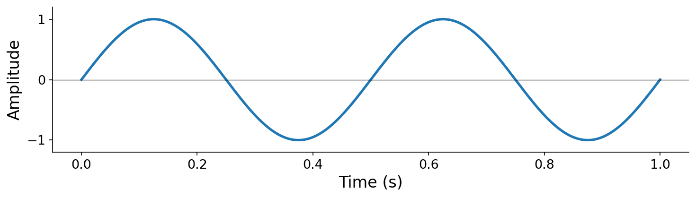
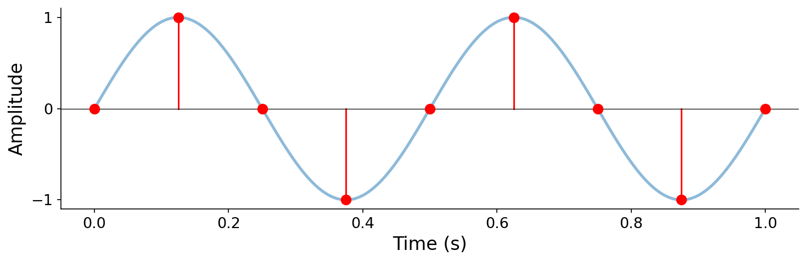
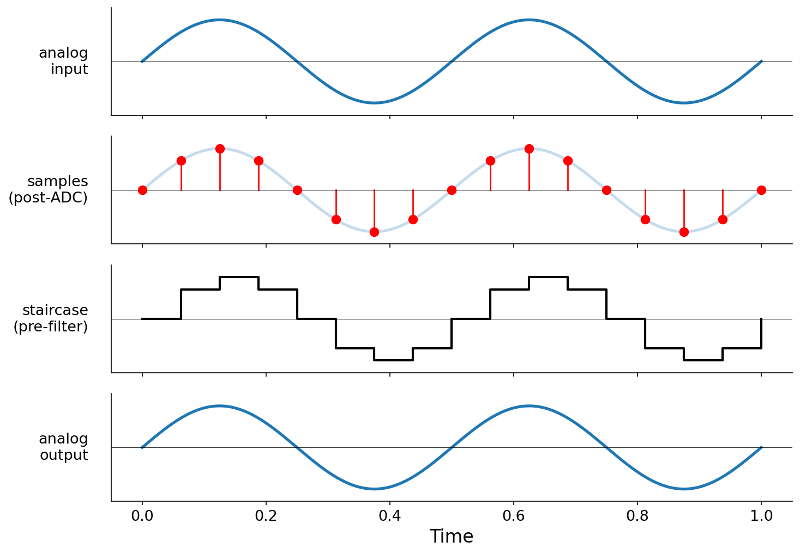

# Sound and Digital Audio

Here we first characterize what sound is in the physical world, then build up the standard way that computers represent sound as _digital audio_. By the end, you'll synthesize your first sound from scratch with a few lines of Python, and you'll have the vocabulary to talk precisely about waveforms, sampling, quantization, frequency, and amplitude.

## What is sound, physically?

Sound is what happens when something in the world moves and disturbs the air around it. Pluck a guitar string, snap your fingers, or blow air through a reed, and you set the surrounding air molecules into motion. These disturbances propagate outward as alternating regions of higher and lower pressure (compressions and rarefactions) that we call _sound waves_.

Sound propagates in all directions in three dimensional space. However, a microphone, or your eardrum, sits at one fixed point in this traveling pressure field. If we measure the local air pressure at that point as a function of time, we get a one-dimensional signal. In this signal, pressure goes up, pressure goes down, and pressure passes through ambient atmospheric pressure on its way between the two. We call this measurement _analog sound_.

(sec-waveforms)=

## Waveforms: sound as a continuous function

Formally, we describe an analog sound by a function

$$p(t) : \mathbb{R} \to \mathbb{R},$$

mapping a real-valued time $t$ (seconds) to a real-valued pressure $p(t)$. We refer to such a function as a _waveform_, or more generally as a (continuous-time) _signal_.

:::{figure}

:::

:::{margin} Why [-1, 1]?
Normalizing to a unitless range is hardware-agnostic — the same code works across different bit depths, file formats, and audio systems.
:::

To represent natural sound, $p(t)$ characterizes the air pressure at a fixed point in space over time. Pressure can be measured in physical units like Pascals, but in computer music we usually work with a unitless, normalized representation. Once a sound is recorded through a microphone (or otherwise scaled to a known range), we refer to the measured quantity as _amplitude_, and we linearly rescale it so that the recording system's full dynamic range maps to the interval $[-1, 1]$:

$$x(t) : \mathbb{R} \to [-1, 1]$$

:::{figure}

:::

**A key aspect of this rescaling is that amplitude is _proportional_ to pressure**. Concretely, $x(t) = p(t) / p_{\max}$, where $p(t)$ is the underlying pressure signal (e.g., in Pascals) and $p_{\max} = \max_{t \in \mathbb{R}} |p(t)|$ is the maximum pressure magnitude the recording system can represent. Unless otherwise specified, you should henceforth imagine the vertical axis of a waveform plot as a unitless amplitude in $[-1, 1]$: $+1$ is the maximum positive deviation the system can represent, $-1$ is the maximum negative deviation, and $0$ is silence.

## From analog to digital

Computers cannot store an analog signal $x(t)$ directly. The function takes real-valued inputs and produces real-valued outputs, so even a one-second clip carries an infinite amount of information. To bring sound into the digital world, we have to approximate $x(t)$ with a finite amount of data. The pipeline that performs this approximation is called _analog-to-digital conversion_ (ADC).

Transforming this _continuous sound_ to _digital audio_ involves discretizing both time and amplitude:

1. _Sampling_ in time: measure the signal amplitude at discrete, evenly spaced points known as _samples_.
2. _Quantizing_ in amplitude: latch each amplitude to its nearest neighbor in a finite set of amplitude values.

(sec-sampling)=

### Sampling

:::{margin} Why these rates?
44.1 kHz is the CD standard (1982); 48 kHz is the film and video standard. Both safely exceed twice the ~20 kHz upper limit of human hearing.
:::

:::{prf:definition} Sampling
:label: def-sampling
To _sample_ a continuous signal means to measure or evaluate it at a sequence of discrete time points, uniformly spaced at some interval $\Delta t$.
:::

We call $\Delta t$ the _sampling period_; its units are ${unit}`seconds,sample`$. Its reciprocal $f_s$, in units of ${unit}`samples,second`$, is called the _sample rate_. The sample rate represents the number of samples captured per second, and the units reveal that $f_s = 1 / \Delta t$. Sample rates of 44,100 Hz and 48,000 Hz are common values of $f_s$ in practice; that is, **digital audio usually involves tens of thousands of samples per second**.

We index samples by an integer $n$ and adopt the convention

$$x[n] = x(n \Delta t) = x(n / f_s),$$

so $x[0]$ is the signal at time $t = 0$, $x[1]$ is its value at time $t = 1 \cdot \Delta t$, and so on. Continuous-time signals get parentheses ($x(t)$); discrete-time sample sequences get square brackets ($x[n]$). This distinction will matter throughout the book. **You should grow very accustomed to converting between ${unit}`samples`$ and ${unit}`seconds`$** by dividing or multiplying by $f_s$.

:::{figure}

:::

After sampling, an infinite continuous function has been replaced by a finite ordered sequence of real numbers. Specifically, for some duration $T$, $x$ is now a array of numbers of length $T \cdot f_s$, i.e., $x \in \mathbb{R}^{T \cdot f_s}$. But the values $x[n]$ are still real-valued, and we still cannot store real numbers exactly.

(sec-quantization)=

### Quantization

Sampling shrank time from a continuum to a finite grid, but we have an analogous problem in amplitude. The values $x[n] \in \mathbb{R}$ are still real-valued, and a computer cannot store an arbitrary real number exactly.

:::{prf:definition} Quantization
:label: def-quantization
To _quantize_ a sample is to latch its amplitude to a nearby element of a finite set of amplitude values.
:::

:::{margin} PCM
Pulse-code modulation has been the dominant digital audio format since the 1970s — lossless and trivially reversible.
:::

A common quantization convention in digital audio is _signed pulse-code modulation_ (PCM). We pick an integer _bit depth_ $b$ and define

$$\mathbb{Z}_b = \{-2^{b-1},\, -2^{b-1}+1,\, \ldots,\, 2^{b-1}-1\}$$

as the set of $2^b$ integers representable in $b$ bits using two's complement. We then map each amplitude $x[n] \in [-1, 1]$ to its quantized integer counterpart by scaling and truncating:

$$\hat{x}[n] = \lfloor (2^{b-1} - 1) \cdot x[n] \rfloor \in \mathbb{Z}_b.$$

For example, at $b = 16$ ("CD quality"), $\mathbb{Z}_{16}$ contains the $2^{16} = 65{,}536$ integers between $-32{,}768$ and $32{,}767$, and amplitudes of $\{-1.0, 0.0, 1.0\}$ correspond to integers $\{-32767, 0, 32767\}$ respectively ($-32768$ is unused).

:::{figure}

:::

Quantization is _lossy_: any two amplitudes that floor to the same integer become indistinguishable in $\hat{x}[n]$. We will study and quantify the impacts of amplitude quantization when we cover {ref}`quantization and decibels <sec-quantization-decibels>` in more detail.

A signal sampled at $f_s$ samples per second and quantized to $b$ bits per sample has a _bitrate_

$$\text{bitrate} \left[{unit}`bits,seconds`\right] = f_s \left[ \frac{\cancel{\text{samples}}}{\text{second}} \right] \cdot b \left[ \frac{\text{bits}}{\cancel{\text{sample}}} \right].$$

For so-called "CD-quality" audio ($f_s = 44{,}100$, $b = 16$), that is $44{,}100 \cdot 16 = 705{,}600 \left[{unit}`bits,seconds`\right]$. To get a more intuitive sense of file size, we can convert to kilobytes per second by chaining the standard relationships $8\,\text{bits} = 1\,\text{byte}$ and $1000\,\text{bytes} = 1\,\text{kilobyte}$:

$$705{,}600 \left[\frac{\cancel{\text{bits}}}{\text{seconds}}\right] \cdot \frac{1}{8} \left[\frac{\cancel{\text{byte}}}{\cancel{\text{bits}}}\right] \cdot \frac{1}{1000} \left[\frac{\text{kilobyte}}{\cancel{\text{byte}}}\right] \approx 88 \left[{unit}`kilobytes,seconds`\right].$$

A three-minute song therefore occupies roughly $88 \cdot 180 \approx 16$ megabytes on disk in this uncompressed form.

Most music is stored and reproduced in _stereo_, meaning there are two arrays or _channels_ (one for each of our ears) that allow us to perceive basic music spatialization. This doubles the storage size, resulting in $1{,}411{,}200 \left[{unit}`bits,seconds`\right]$ for stereo CD-quality audio. Note that, unless otherwise specified, we are usually referring to _mono_ (single channel) digital audio in this text.

### Digital audio is just an array of numbers!

The punchline here is that, when stored on disk in formats like WAV, **digital audio is basically just an array of numbers (samples) together with the sample rate**.

When stored on disk, these numbers are usually integers. Why integers and not floats? A 32-bit floating-point number reserves a large fraction of its 32 bits for representing very large and very small magnitudes, i.e., values far outside $[-1, 1]$ that audio simply never uses. The audible range $[-1, 1]$ is a thin sliver of float's representable range, so most of those bits go to waste on every sample. Integer PCM, by contrast, packs every bit into uniform amplitude resolution _inside_ $[-1, 1]$, giving more precision per bit of storage.

When synthesizing or manipulating samples in memory, the conventions differ. When you write computer music programs, you'll almost always manipulate $x[n]$ as a floating-point number in $[-1, 1]$ for arithmetic convenience: mixing, filtering, and synthesis all involve multiplication, addition, and transcendental functions that are awkward and lossy in integer space. **Quantization typically only enters the picture at the boundary**, when reading samples from a sound file or writing them out.

## Digital-to-analog conversion

To actually _hear_ digital audio, the discrete sample sequence has to be converted back into a continuous voltage that can drive a loudspeaker. This is the job of a _digital-to-analog converter_ (_DAC_), a piece of hardware in every phone, laptop, and audio interface.

A DAC takes the integer samples, produces a piecewise-constant ("staircase") voltage signal, and then applies a _reconstruction filter_ that smooths the staircase back into a continuous waveform (more on filters later in [Chapter 9](../09-filters)). The whole round-trip pipeline (analog input, through ADC and DAC, back to analog output) looks like this:

:::{figure}

:::

The big idea is that, under conditions we will formalize in a later chapter, this reconstruction can be perceptually identical to the original analog signal $x(t)$, provided $f_s$ is high enough and $b$ is large enough. For now, trust that the DAC is doing the right thing, and focus on producing nice integer arrays for it to play.

## Clipping

One last practical concern. The DAC has to take the $[-1, 1]$ amplitude values and scale them back to $[-p_{\text{max}}, p_{\text{max}}]. Accordingly, when you hand it samples whose absolute values exceed $1$, it will simply _clip_ them to avoid exceeding $|p_{\text{max}}$|:

$$
y[n] = \begin{cases}
+1 & \text{if } x[n] > +1, \\
x[n] & \text{if } x[n] \in [-1, +1], \\
-1 & \text{if } x[n] < -1.
\end{cases}
$$

:::{figure}

:::

Clipping is extremely intrusive: it introduces a harsh, raspy character into the sound, and at high amplitudes can damage speakers as well as ears. For example, multiplying a clean 440 Hz sine wave by 2 saturates the DAC and produces a signal that's close to a square wave. Compare them directly:

:::{audio}
[Clean 440 Hz sine](./assets/audio-sine-440.wav)

Clean reference: 440 Hz sine, attenuated for safe playback.
:::

:::{audio}
[Clipped 440 Hz sine](./assets/audio-clipped-sine.wav)

440 Hz sine multiplied by 2, hard-clipped to $[-1, 1]$, then attenuated for safe playback.
:::

A simple defensive habit while developing synthesis code is to _normalize_ your output to lie within $[-1, 1]$ before sending it to the DAC, e.g.,

$$y[n] = x[n] / x_{\text{max}}, \text{where}~ x_{\text{max}} = \max_{n \in \{0, \ldots, N-1\}} |x[n]|.$$

:::{warning}
**A critical safety note.** When experimenting with synthesis code, **do not wear headphones** until you know the output is bounded. It is very easy to write a one-line bug that produces a much louder sound than you intended, and a sudden loud signal directly against your eardrums can cause real damage. Listen through external speakers at low volume while you debug, then _cautiously_ put headphones on once the output is well-behaved.
:::

## Summary

- Physical sound is a traveling pattern of air-pressure variation. Analog sound is a continuous signal $x(t) : \mathbb{R} \to \mathbb{R}$ describing the time-varying pressure measured at a single point.
- _Amplitude_ is, by convention, a unitless quantity in $[-1, 1]$, proportional to the underlying pressure: $x(t) = p(t) / p_{\max}$.
- _Analog-to-digital conversion_ (ADC) discretizes time and amplitude: _sample_ at rate $f_s$, then _quantize_ each amplitude to a $b$-bit signed integer in $\mathbb{Z}_b$ via $\hat{x}[n] = \lfloor (2^{b-1} - 1) \cdot x[n] \rfloor$.
- The bitrate $f_s \cdot b$ tells you how much disk space uncompressed audio takes (CD-quality mono is about $88 {unit}`kilobytes,seconds`$).
- The discrete representation $x[n] = x(n / f_s)$ is what computers manipulate; we use parentheses for continuous time, square brackets for sample indices. In memory we use floats for arithmetic convenience; quantization shows up at the storage boundary.
- A _DAC_ reconstructs an analog signal by smoothing the discrete samples back into a continuous voltage; under conditions we will study later, this reconstruction can be made perceptually indistinguishable from the original.
- Be wary of values outside $[-1, 1]$, which will clip. Keep headphones off until your output is bounded.

## Questions for the reader

::::{exercise}
**Bit depth arithmetic.** You are designing a recording format that uses 24 bits per sample at a sample rate of 48,000 Hz.

1. What is the uncompressed bitrate (bits per second) for a single channel?
1. How large is the set of discrete amplitude levels for each sample?

:::{solution}

1. $24 \times 48{,}000 = 1{,}152{,}000$ bits per second.
1. The set of discrete amplitude levels has size $2^{24} = 16{,}777{,}216$.

:::
::::

::::{exercise}
**Sample count.** Write a one-line Python expression that computes the number of samples needed to store $T$ seconds of audio at sample rate $f_s$. Be explicit about how you handle a non-integer product of $T$ and $f_s$.

:::{solution}
`int(T * f_s)` or `round(T * f_s)`
:::
::::

:::{exercise}
**Quantization noise.** Write Python code to synthesize a 440 Hz sine wave to $b = 4$ bits at $f_s = 44{,}100$ Hz. Next, manually quantize the samples to 4 bits using $\hat{x}[n] = \lfloor (2^{b-1} - 1) \cdot x[n] \rfloor$. Finally, unquantize the samples back to floating point. Write to a WAV file, and listen. Describe in words how it differs from the un-quantized version, and explain why.
:::

:::{exercise}
**Open.** Pick a sound file and inspect its file data on your operating system (you can download [this one](./assets/audio-sine-440.wav) if you don't have one). Write down anything you see about file format, sample rate, bit depth, channels, or other digital-audio parameters. Which terms do you now understand, and which still feel mysterious?
:::
