# Additive Synthesis

In Chapter 2, we synthesized our first sounds, but they were all sine waves. A sine wave is a useful starting point, but it sounds thin and featureless compared to richer sounds we encounter in music:

:::{audio}
[A bare sine wave at 220 Hz](./assets/audio-intro-sine.wav)

A sine wave at 220 Hz.
:::

:::{audio}
[A richer tone at 220 Hz](./assets/audio-intro-rich.wav)

A richer tone, also at 220 Hz.
:::

Hopefully you agree that the second has a fuller, brighter quality. How do we get from one to the other? Here we will explore _additive synthesis_, a technique for synthesizing richer tones by summing multiple sine waves together. It is the first synthesis technique we'll study that's capable of producing non-trivial, musically interesting tones.

This chapter develops additive synthesis end-to-end, from mathematical principles to algorithmic implementation. We start with the sine wave as an elementary building block, formalize the mathematical result (the _Fourier series_) that lets us decompose any periodic sound into sine waves, and then introduce _wavetable synthesis_, an efficient algorithm that makes additive synthesis practical.

## Periodicity, period, and frequency

**Periodicity is the foundation of musical sound.** Sounds that we recognize as having a definite "pitch" — a plucked guitar string, a sustained vowel, a flute tone — are periodic in nature. Their waveforms repeat, more or less, at a regular rate. Consider what happens when you pluck a guitar string: the string oscillates back and forth, and the resulting air pressure variations create a waveform whose shape recurs over and over:

:::{audio}
[Classical guitar F3, plucked](./assets/154030__carlos_vaquero__classical-guitar-f-3-plucked-non-vibrato.wav)

Classical guitar, F3, plucked without vibrato. [154030](https://freesound.org/s/154030/) by Carlos_Vaquero, License: [Attribution NonCommercial 4.0](https://creativecommons.org/licenses/by-nc/4.0/).
:::

:::{figure}
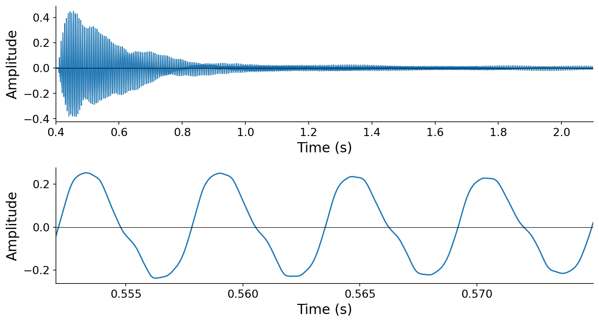

A plucked guitar string (F3). Top: the pluck and decay over roughly 1.7 seconds. Bottom: zoomed in to about 23 milliseconds, where the quasi-periodic repetition of the waveform shape is clearly visible.
:::

The waveform in the zoomed view above is not _perfectly_ repetitive. Instead, it's what acousticians call _quasi-periodic_, meaning the shape changes slowly over time as the note decays. But over short time scales, the repetition is strikingly regular.

### Periodicity

Here we formalize the notion of periodicity, following notational conventions from {cite}`mcfee2023digital`. A continuous signal $x(t)$ is {vocab}`periodic` with period $T$ if

$$x(t + T) = x(t) \quad \text{for all } t \in \mathbb{R}.$$

The {vocab}`fundamental period` $t_0$ is the smallest strictly positive $T$ satisfying this condition.

:::{prf:definition} Periodicity
:label: def-periodicity
A signal $x(t) : \mathbb{R} \to \mathbb{R}$ is _periodic_ if there exists a finite $T > 0$ such that $x(t + T) = x(t)$ for all $t \in \mathbb{R}$. The _fundamental period_ $t_0$ is the smallest such $T$.
:::

If $t_0$ is the fundamental period, then all integer multiples of $t_0$ must also be periods:

$$x(t) = x(t + t_0) = x(t + 2 \cdot t_0) = x(t + 3 \cdot t_0) = \ldots$$

More generally, $x(t) = x(t + k \cdot t_0)$ for any $k \in \mathbb{Z}$.

### Frequency

One full repetition of a periodic waveform is referred to as a _cycle_. The fundamental period $t_0$ tells us how long one cycle takes, in units of ${unit}`seconds,cycle`$. Its reciprocal is {vocab}`frequency` — how many cycles fit in one second, in units of ${unit}`cycles,second`$:

$$f_0 = \frac{1}{t_0}.$$

This relationship follows directly from the units: if $t_0$ has units ${unit}`seconds,cycle`$, then $1/t_0$ has units ${unit}`cycles,second`$.

:::{prf:definition} Fundamental frequency
:label: def-fundamental-frequency
The _fundamental frequency_ of a signal $x(t)$ with fundamental period $t_0$ is $f_0 = 1 / t_0$.
:::

Frequency is measured in {vocab}`Hertz` (Hz), where 1 Hz = 1 ${unit}`cycle,second`$.

:::{figure}
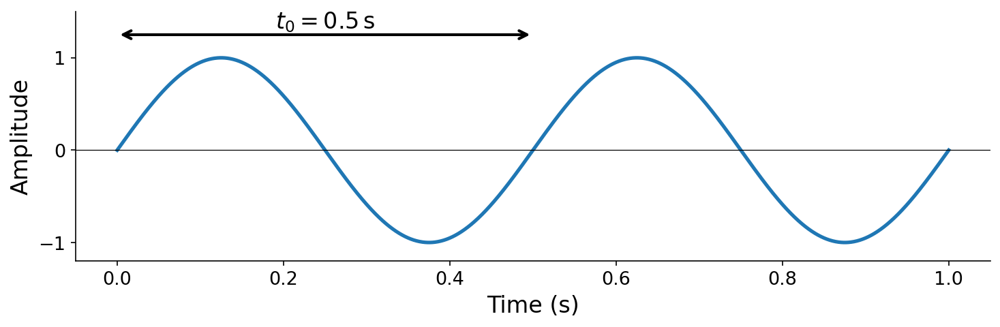

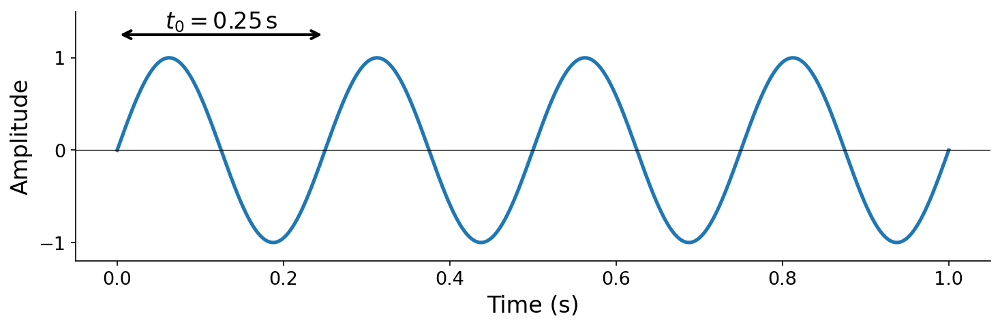

A waveform with $t_0 = 0.5\,\mathrm{s}$ has $f_0 = 2\,\mathrm{Hz}$ (top). Compressing the same shape into a quarter of a second gives $t_0 = 0.25\,\mathrm{s}$ and $f_0 = 4\,\mathrm{Hz}$ (bottom).
:::

**Frequency is the property most strongly associated with our perception of musical _pitch_**: higher frequencies sound higher in pitch, lower frequencies sound lower. Accordingly, periods follow the opposite rule: the shorter the period, the higher the perceived pitch. If you've studied music, each line on a musical staff corresponds to a specific fundamental frequency. We will have more to say about pitch perception in later chapters.

## The basic sinusoid

The most elementary periodic function is the {vocab}`basic sinusoid`:

$$x(t) = a \sin(2 \pi f t + \phi).$$

It sounds like a "pure tone" — a smooth, featureless hum with no timbral complexity. As we'll see later in this chapter, the basic sinusoid is a fundamental building block: **all periodic sound, no matter how complex, can be expressed as a sum of basic sinusoids**.

The basic sinusoid has three parameters: {vocab}`frequency` $f$, {vocab}`amplitude` $a$, and {vocab}`initial phase` $\phi$.

:::{figure}
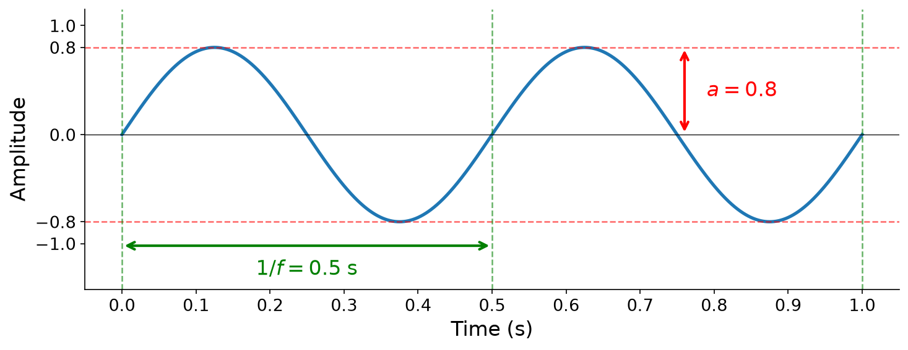

The sinusoid $x(t) = 0.8 \sin(2\pi \cdot 2 \, t)$ with $a = 0.8$, $f = 2$ Hz, $\phi = 0$. The dashed red lines mark the amplitude bounds $\pm a$, and the green dashed lines and arrow mark the period boundaries at $1/f$.
:::

(sec-angular-frequency)=

### Frequency and angular frequency

**Frequency determines pitch.** Listen to pure tones at three different frequencies — each sounds higher in pitch than the last:

:::{audio-figure}
{audio}`220 Hz sine <./assets/audio-sine-220.wav>` 

{audio}`330 Hz sine <./assets/audio-sine-330.wav>` 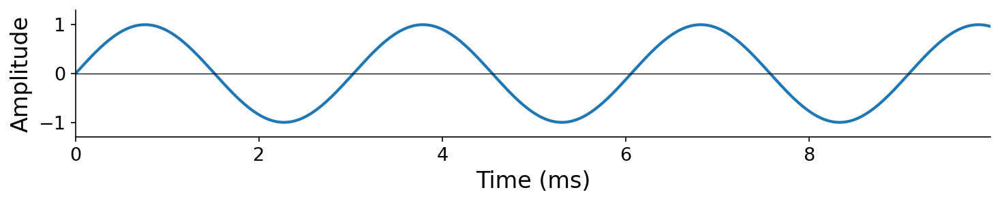

{audio}`440 Hz sine <./assets/audio-sine-440.wav>` 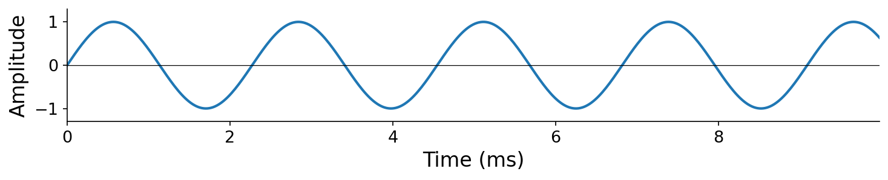

Pure tones at 220, 330, and 440 Hz. Higher frequency means more cycles per second and a higher perceived pitch.
:::

Why does the basic sinusoid with parameter $f$ complete exactly $f$ cycles per second? We can reason about this from the units, building up from what we know about $\sin$.

Recall from trigonometry that $\sin$ repeats itself with period $2\pi$ ${unit}`radians,cycle`$. In our basic sinusoid, at $t = 1$ second, the argument to $\sin$ will have accumulated $2\pi f$ radians. This gives us the {vocab}`angular frequency`:

$$\omega = 2\pi f \quad \left[{unit}`radians,second`\right].$$

To convert back to frequency in Hertz, we divide by $2\pi$ ${unit}`radians,cycle`$:

$$f = \frac{\omega}{2\pi} \quad \left[{unit}`cycles,second`\right].$$

:::{prf:definition} Angular frequency
:label: def-angular-frequency
The _angular frequency_ of a sinusoid with frequency $f$ ${unit}`cycles,second`$ is $\omega = 2\pi f$ ${unit}`radians,second`$. Equivalently, $f = \omega / (2\pi)$.
:::

Angular frequency lets us write the basic sinusoid more compactly as $x(t) = a\sin(\omega t + \phi)$. You will see both forms throughout this book — familiarize yourself with converting between $f$ and $\omega$.

:::{note}
**A more formal proof that the basic sinusoid has period $1/f$.**

For the mathematically inclined, we can derive this directly. Recall that $\sin(x) = \sin(x + 2\pi)$:

$$
\begin{aligned}
x(t) &= a \sin(2\pi f t + \phi) \\
      &= a \sin(2\pi f t + \phi + 2\pi) \\
      &= a \sin(2\pi [ft + 1] + \phi) \\
      &= a \sin(2\pi f [t + 1/f] + \phi) \\
      &= x(t + 1/f).
\end{aligned}
$$

Therefore $x(t) = x(t + 1/f)$, confirming that $x(t)$ is periodic with period $1/f$. This holds regardless of the values of $a$ and $\phi$.
:::

### Amplitude

Amplitude is a comparatively straightforward property. Recall from trigonometry that $\sin(x) \in [-1, 1]$, so $\sin$ has a maximum amplitude deviation of 1. Accordingly, $a \sin(x) \in [-a, a]$, meaning our basic sinusoid has an amplitude of $a$.

**Amplitude determines loudness.** Listen to the same 220 Hz tone at three different amplitudes:

:::{audio-figure}
{audio}`220 Hz sine, amplitude 0.5 <./assets/audio-sine-amp-0p5.wav>` 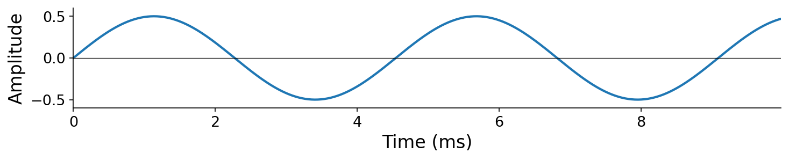

{audio}`220 Hz sine, amplitude 0.05 <./assets/audio-sine-amp-0p05.wav>` 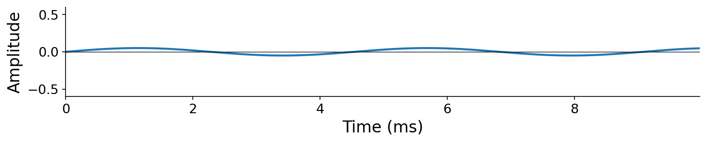

{audio}`220 Hz sine, amplitude 0.005 <./assets/audio-sine-amp-0p005.wav>` 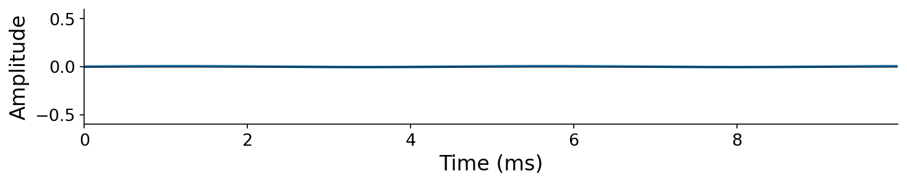

The same frequency (220 Hz) at three amplitudes. The relationship between amplitude and our perception of "volume" is more nuanced than it appears here — we will formalize this when we study decibels.
:::

### Initial phase and instantaneous phase

At a high level, {vocab}`phase` characterizes our position within a cycle. In the basic sinusoid, phase appears in two forms:

1. The {vocab}`initial phase` $\phi$ — a constant offset in radians that shifts the waveform's starting point.
1. The {vocab}`instantaneous phase` $\theta(t) = 2\pi f t + \phi = \omega t + \phi$ — the total phase of the sinusoid at time $t$, in radians.

The instantaneous phase at time $t$ equals the radians elapsed based on angular frequency $\omega$ ${unit}`radians,second`$ plus the initial offset $\phi$ ${unit}`radians`$. We can rewrite the basic sinusoid as $x(t) = a \sin(\theta(t))$.

:::{prf:example} Instantaneous phase
:label: ex-instantaneous-phase
Consider our working example: $f = 2$ Hz, $\phi = \pi/2$. The angular frequency is $\omega = 4\pi$ ${unit}`radians,second`$, so $\theta(t) = 4\pi t + \pi/2$. At a few specific times:

- $\theta(0) = \pi/2$ radians (the initial phase)
- $\theta(0.5) = 4\pi \cdot 0.5 + \pi/2 = 5\pi/2$ radians (one full period later)
- $\theta(1) = 4\pi \cdot 1 + \pi/2 = 9\pi/2$ radians (two full periods later)

Notice that $\theta$ increases by $2\pi$ radians each period — exactly one full cycle.
:::

**Our perception of phase differs from that of frequency and amplitude.** Listen to a 220 Hz tone at three different initial phases:

:::{audio-figure}
{audio}`Phase = 0 <./assets/audio-sine-phase-0.wav>` 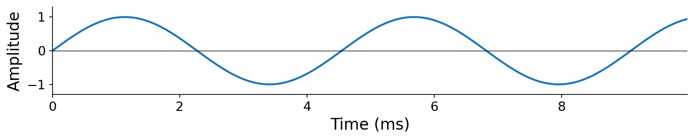

{audio}`Phase = pi/2 <./assets/audio-sine-phase-1.wav>` 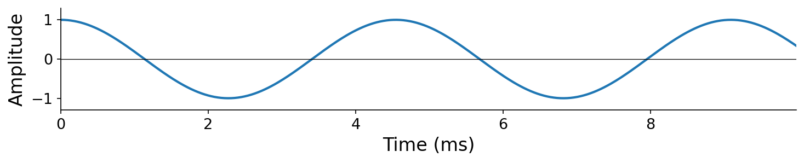

{audio}`Phase = pi <./assets/audio-sine-phase-2.wav>` 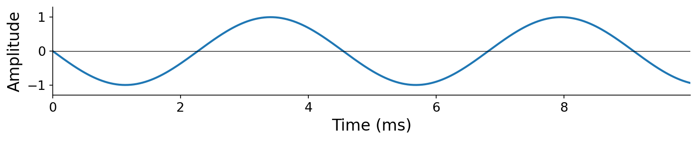

The same frequency (220 Hz) and amplitude at three initial phases. The waveforms are visually shifted in time, but they sound nearly identical.
:::

Aside from slightly different "clicks" at the onset and offset of the waveform (caused by the signal's value at the very first and last sample), **these tones sound essentially the same**. This is a general property of human hearing: we are largely insensitive to the absolute phase of a sound. This perceptual insensitivity will become important when we discuss additive synthesis below.

## Additive synthesis

### The Fourier series

We claimed above that all periodic sound can be expressed as a sum of basic sinusoids. This is a profound result from mathematics known as the {vocab}`Fourier series`:

:::{prf:definition} Fourier series
:label: def-fourier-series
If $x(t)$ is periodic with fundamental period $t_0$ and fundamental frequency $f_0 = 1/t_0$, then $x(t)$ can be represented as

$$x(t) = a_0 + \sum_{k=1}^{K} a_k \sin(2\pi [k \cdot f_0] \, t + \phi_k),$$

where the frequencies are constrained to integer multiples of $f_0$.
:::

The proof is beyond the scope of this book, but the implications are central to everything that follows. Some periodic signals require infinitely many terms (e.g., a "perfect" square wave), while others are exact with finitely many (e.g., a sine wave itself is a Fourier series with $K = 1$). The key constraint is that the frequencies in the sum are _not_ arbitrary — they must be integer multiples of the fundamental frequency $f_0$. The $k$-th sinusoidal component has frequency $k \cdot f_0$.

### Harmonics

:::{prf:definition} Harmonic
:label: def-harmonic
In the Fourier series expansion, each sinusoidal component is called a _harmonic_. Harmonic $k$ has frequency $f_k = k \cdot f_0$, amplitude $a_k$, and initial phase $\phi_k$.
:::

It follows that the first harmonic ($k = 1$) has frequency equal to the fundamental $f_0$, the second harmonic ($k = 2$) has frequency $2 f_0$, the third has $3 f_0$, and so on.

:::{figure}
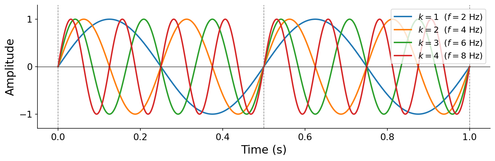

The first four harmonics of a $f_0 = 2$ Hz fundamental, all at unit amplitude. Each harmonic $k$ completes exactly $k$ cycles per fundamental period. Notice that all harmonics pass through zero together at the fundamental period boundaries (dashed lines) — this is a consequence of the integer frequency constraint.
:::

:::{note}
If you have studied music before, you may have heard "harmonic" and "overtone" used somewhat interchangeably. Despite common conflation, these are not equivalent concepts. Technically, an [overtone](https://en.wikipedia.org/wiki/Overtone) can take on arbitrary frequencies above the fundamental, not necessarily integer multiples. In this book, we use precise terminology: harmonic $k$ has frequency $k \cdot f_0$.
:::

### Additive synthesis

In computer music, the Fourier series serves not only as a mathematical expansion but also as a synthesis technique. {vocab}`Additive synthesis` builds complex tones by summing sinusoidal harmonics:

:::{prf:definition} Additive synthesis
:label: def-additive-synthesis
_Additive synthesis_ constructs a periodic tone by summing $K$ sinusoidal _harmonics_. Harmonic $k$ has frequency $k \cdot f_0$ (an integer multiple of the fundamental frequency $f_0$), amplitude $a_k$, and initial phase $\phi_k$:

$$x(t) = \sum_{k=1}^{K} a_k \sin(2\pi [k \cdot f_0] \, t + \phi_k)$$
:::

Though the constant $a_0$ is required for mathematical completeness of the Fourier series, it represents a static offset that is not relevant to our perception of sound, so we ignore it henceforth.

:::{note}
You can think of $x(t) = a_0$ as a basic sinusoid at $0$ Hz — the "zeroth harmonic." We will revisit this when we study the frequency domain.
:::

### Synthesis parameters

Synthesis algorithms are often associated with _parameters_, the constant factors that can be changed to achieve a particular acoustic or creative goal. Additive synthesis has a few parameters:

- $K$: the highest harmonic number present
- $f_0$: the fundamental frequency
- $\mathbf{a} = [a_1, a_2, \ldots, a_K]$: the amplitude coefficients of each harmonic
- $\boldsymbol{\phi} = [\phi_1, \phi_2, \ldots, \phi_K]$: the initial phase coefficients of each harmonic

:::{figure}
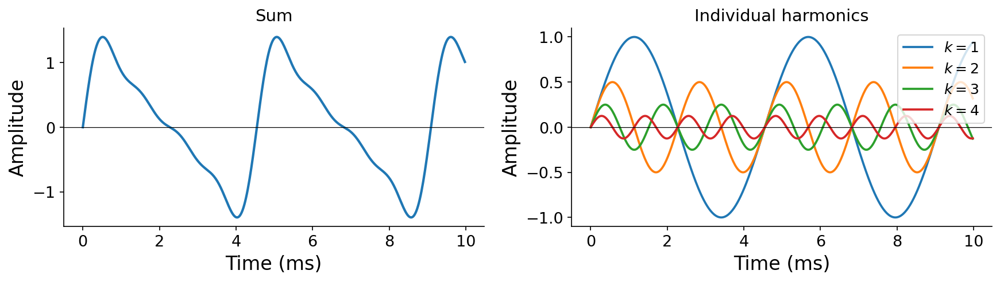

Additive synthesis with $K = 4$, $f_0 = 220$ Hz, $\mathbf{a} = [1, 1/2, 1/4, 1/8]$. Left: the resulting sum. Right: each harmonic plotted individually — note how each successive harmonic has higher frequency and lower amplitude.
:::

Let's examine how we perceive each parameter. We'll use a default tone with $K = 4$, $f_0 = 220$ Hz, $\mathbf{a} = [1, 1/2, 1/4, 1/8]$, and $\boldsymbol{\phi} = [0, 0, 0, 0]$:

:::{audio}
[Default additive tone](./assets/audio-additive-default.wav)

Additive synthesis with $K = 4$, $f_0 = 220$ Hz, geometric amplitude decay.
:::

**Varying $f_0$ (pitch)**: Changing the fundamental frequency shifts all harmonics proportionally and changes the perceived pitch. These four examples all use the same amplitude pattern $\mathbf{a} = [1, 1/2, 1/4, 1/8]$ but different random fundamental frequencies between 220 and 440 Hz:

:::{audio-list}
{audio}`Random f0, example 1 <./assets/audio-additive-f0-0.wav>`

{audio}`Random f0, example 2 <./assets/audio-additive-f0-1.wav>`

{audio}`Random f0, example 3 <./assets/audio-additive-f0-2.wav>`

{audio}`Random f0, example 4 <./assets/audio-additive-f0-3.wav>`

Four random fundamental frequencies with the same harmonic amplitude pattern — perceived as different pitches.
:::

**Varying amplitudes $\mathbf{a}$ (timbre)**: Changing the relative amplitudes of the harmonics changes the {vocab}`timbre` — the tonal "color" of a sound. All four examples below have the same pitch ($f_0 = 220$ Hz) and the same number of harmonics ($K = 4$), but different random amplitude patterns produce perceptibly different timbres:

:::{audio-list}
{audio}`Random timbre 1 <./assets/audio-additive-timbre-0.wav>`

{audio}`Random timbre 2 <./assets/audio-additive-timbre-1.wav>`

{audio}`Random timbre 3 <./assets/audio-additive-timbre-2.wav>`

{audio}`Random timbre 4 <./assets/audio-additive-timbre-3.wav>`

Four random amplitude patterns at the same pitch — perceived as different timbres.
:::

**Varying phases $\boldsymbol{\phi}$**: Consistent with what we observed for the basic sinusoid, changing the initial phases has very little perceptible effect. The following four examples use the same amplitudes $\mathbf{a} = [1, 1/2, 1/4, 1/8]$ but different random phases:

:::{audio-list}
{audio}`Random phase 1 <./assets/audio-additive-phase-0.wav>`

{audio}`Random phase 2 <./assets/audio-additive-phase-1.wav>`

{audio}`Random phase 3 <./assets/audio-additive-phase-2.wav>`

{audio}`Random phase 4 <./assets/audio-additive-phase-3.wav>`

Four random phase patterns with the same amplitudes — sound essentially identical.
:::

These should sound essentially identical, confirming that **phase has negligible perceptual effect in additive synthesis**. The amplitude coefficients $\mathbf{a}$ are what matter.

**Varying $K$ (number of harmonics)**: Adding more harmonics produces a richer, brighter tone. With $K = 1$ we hear a bare sine wave; as $K$ grows, the timbre gains complexity:

:::{audio-board}
{audio}`K = 1 <./assets/audio-additive-K1.wav>`

{audio}`K = 2 <./assets/audio-additive-K2.wav>`

{audio}`K = 4 <./assets/audio-additive-K4.wav>`

{audio}`K = 8 <./assets/audio-additive-K8.wav>`

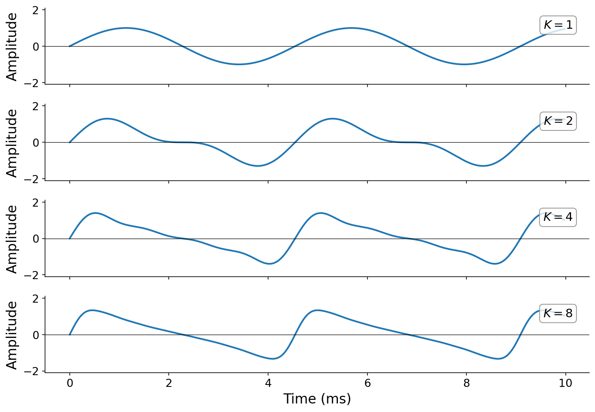

Additive synthesis at $f_0 = 220$ Hz with $K \in \{1, 2, 4, 8\}$ harmonics (amplitude pattern $a_k = 1/2^{k-1}$). As $K$ increases, the waveform shape grows more complex and the timbre becomes richer.
:::

The full code for these examples is in [code/additive.py](./code/additive.py).

## Basic waveform shapes

If you've played with synthesizers before, you may have encountered periodic waveform _shapes_ besides sine waves: sawtooth, square, and triangle waves. These are ubiquitous in synthesis, and each has a distinctive sonic character.

Because these are all periodic, the Fourier series guarantees that they live within the parameter space of additive synthesis — each is defined by a particular pattern of harmonic amplitudes. The key idea for each waveform is **how the harmonic amplitudes scale with harmonic number $k$**:

**Sawtooth wave.** A bright, buzzy tone. All harmonics are present, and the amplitudes fall off as $1/k$. This slow decay means upper harmonics remain strong, giving the sawtooth its characteristic brightness.

**Square wave.** A hollow, clarinet-like tone. Only _odd_ harmonics are present ($k = 1, 3, 5, \ldots$), and the amplitudes also fall off as $1/k$. The missing even harmonics give the square wave its hollow character.

**Triangle wave.** A softer, more muted tone. Like the square, only odd harmonics are present, but the amplitudes decrease much faster — as $1/k^2$. This rapid decay makes the triangle the smoothest of the three.

:::{note}
The exact Fourier coefficients include constant factors and signs that affect scaling and orientation. For the sawtooth: $a_k = 2(-1)^{k+1} / (\pi k)$. For the square: $a_k = 4/(\pi k)$ for odd $k$, $0$ for even. For the triangle: $a_k = 8(-1)^{(k-1)/2}/(\pi^2 k^2)$ for odd $k$, $0$ for even. The proportional relationships ($1/k$ vs. $1/k^2$, all harmonics vs. odd only) are more important to learn than these specifics.
:::

:::{audio-board}
{audio}`Sawtooth wave <./assets/audio-sawtooth.wav>`

{audio}`Square wave <./assets/audio-square.wav>`

{audio}`Triangle wave <./assets/audio-triangle.wav>`

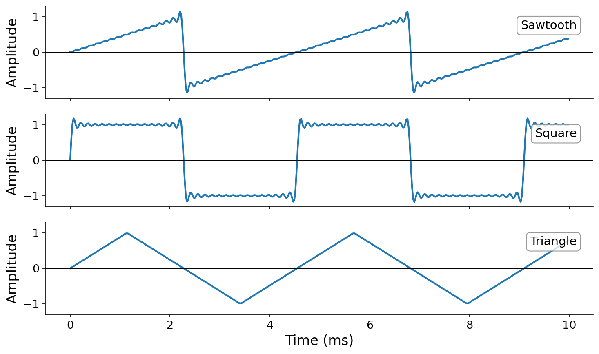

Sawtooth, square, and triangle waves at 220 Hz, built from $K = 32$ harmonics. The waveform shapes emerge from the particular amplitude patterns of their harmonics.
:::

Notice the sonic differences: the sawtooth is the brightest (strongest upper harmonics), the square has a distinctive hollow quality (missing even harmonics), and the triangle is the smoothest (harmonics die off quickly). These perceptual differences arise entirely from the amplitude coefficients.

The full code is in [code/waveforms.py](./code/waveforms.py).

(sec-wavetable-synthesis)=

## Wavetable synthesis

### An algorithmic perspective

We've now established additive synthesis as a powerful technique grounded in the Fourier series. But how efficient is it computationally? Let's think about this from a computer science perspective.

To synthesize $N$ samples of a tone with $K$ harmonics, we compute:

$$x[n] = \sum_{k=1}^{K} a_k \sin(2\pi k f_0 \, [n / f_s] + \phi_k) \quad \text{for } n = 0, 1, \ldots, N-1.$$

This requires $K$ calls to `sin` per sample, or $K \cdot N$ total evaluations. For one second of audio at $f_s = 44{,}100$ with $K = 32$ harmonics, that's $32 \times 44{,}100 \approx 1.4$ million `sin` evaluations. Modern computers may be able to keep up with this demand in real time, but what if you need to run many synthesizers in parallel (e.g., in a DAW), or what if you're working on hardware with limited compute?

What structure can we exploit to make additive synthesis more efficient? Here's the key insight: the output of additive synthesis is periodic. The waveform repeats every $t_0 = 1/f_0$ seconds, or equivalently every $f_s / f_0$ samples. **So we only need to compute one cycle of the waveform, then cache the result and repeat it.**

### Building the wavetable

This insight leads to {vocab}`wavetable synthesis`. The first step is to compute a a {vocab}`wavetable`: a single cycle of the waveform stored as an array of $M$ samples:

$$\texttt{table}[m] = \sum_{k=1}^{K} a_k \sin\!\left(2\pi k \cdot \frac{m}{M}\right) \quad \text{for } m = 0, 1, \ldots, M - 1.$$

Here $m / M$ maps the table index to the range $[0, 1)$, covering exactly one period. In code:

```python
def build_wavetable(a: list[float], M: int = 2048) -> np.ndarray:
    K = len(a)
    a = np.array(a)
    k = 1 + np.arange(K)
    m = np.arange(M)
    # Broadcasting: (M, 1) * (K,) -> (M, K)
    table = (a * np.sin(2 * np.pi * k * m[:, np.newaxis] / M)).sum(axis=1)
    return table
```

Building the table costs $O(K \cdot M)$ operations, but it runs only _once_ for a given waveform shape.

### Reading the wavetable

To produce output at frequency $f_0$, we need to read from the table at the right rate. The table spans one period, and we want the output to complete $f_0$ cycles per second. Working from the units:

- The table has $M$ ${unit}`indices,cycle`$.
- We want $f_0$ ${unit}`cycles,second`$.
- The output sample rate is $f_s$ ${unit}`samples,second`$.

The {vocab}`phase increment` — how far we advance through the table per output sample — is:

$$\Delta m = f_0 \cdot \frac{M}{f_s} \quad \left[\frac{\text{table indices}}{\text{output sample}}\right].$$

After $n$ output samples, we've accumulated a phase of $n \cdot \Delta m$ table indices. To read the table, we wrap this phase modulo $M$:

$$x[n] = \texttt{table}\!\left[\; (n \cdot \Delta m) \bmod M \;\right].$$

:::{figure}
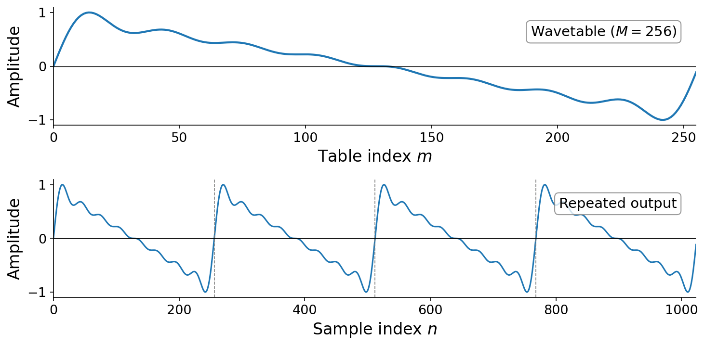

Top: a single-cycle wavetable of $M = 256$ indices. Bottom: the output signal produced by repeating this table. The dashed lines mark cycle boundaries.
:::

### Nearest-neighbor lookup

The simplest implementation truncates $n \cdot \Delta m$ to an integer before indexing:

:::{interactive}[notebooks/wavetable-naive.ipynb]
:::

This works, but when $\Delta m$ is not an integer (which is common — e.g., $f_0 = 440$, $M = 2048$, $f_s = 44{,}100$ gives $\Delta m \approx 20.43$), we always round down to the nearest table entry, introducing quantization error. The effect is especially audible with a small table. Compare an exact sine wave to nearest-neighbor wavetable lookup with $M = 8$:

:::{audio-list}
{audio}`Exact sine wave at 440 Hz <./assets/audio-wt-exact.wav>`

{audio}`Nearest-neighbor wavetable, M = 8 <./assets/audio-wt-naive-8.wav>`

Exact vs. nearest-neighbor wavetable sine at 440 Hz. The coarse table produces audible stepping artifacts.
:::

### Linear interpolation

A better approach is to _interpolate_ between adjacent table entries. Given a fractional index $p = n \cdot \Delta m$, we split it into an integer part $\lfloor p \rfloor$ and a fractional part $\alpha = p - \lfloor p \rfloor$, then blend:

$$x[n] = (1 - \alpha) \cdot \texttt{table}\!\left[\lfloor p \rfloor \bmod M\right] + \alpha \cdot \texttt{table}\!\left[(\lfloor p \rfloor + 1) \bmod M\right].$$

In code:

:::{interactive}[notebooks/wavetable-interp.ipynb]
:::

Linear interpolation adds negligible computational cost (a multiply and an add per sample) but dramatically reduces the error, especially when $M$ is small. Compare the same $M = 8$ table with interpolation:

:::{audio-list}
{audio}`Exact sine wave at 440 Hz <./assets/audio-wt-exact.wav>`

{audio}`Interpolated wavetable, M = 8 <./assets/audio-wt-interp-8.wav>`

Exact vs. linear interpolation wavetable sine at 440 Hz. Even with only 8 table entries, interpolation produces a much smoother result.
:::

In practice, most wavetable synthesizers use at least linear interpolation; some use higher-order schemes (cubic, sinc) for even better quality.

:::{audio}
[Wavetable sawtooth](./assets/audio-wavetable-saw-interp.wav)

Sawtooth wave at 220 Hz synthesized via wavetable lookup with linear interpolation, using the same $K = 32$ harmonic recipe.
:::

### Complexity

Direct additive synthesis costs $O(K \cdot N)$ to synthesize $N$ samples: $K$ `sin` evaluations per sample. Wavetable synthesis costs $O(K \cdot M)$ to build the table once, then $O(N)$ to read it — for a total of $O(K \cdot M + N)$, where $M << N$. Since $M$ is a fixed constant (typically 2048 or 4096), the table-building step is a one-time cost that does not grow with the output length.

The key implication: **once the wavetable is computed, the per-sample cost of synthesis is $O(1)$ regardless of how many harmonics $K$ went into the table**. A 4-harmonic triangle wave and a 64-harmonic sawtooth are equally cheap to synthesize once their tables are built. This is in stark contrast to direct additive synthesis, where doubling $K$ doubles the cost.

:::{tip}
On a modern machine with NumPy, the wavetable version of a 32-harmonic sawtooth runs roughly 20–40x faster than the direct additive computation. The speedup grows with $K$: the more harmonics in your recipe, the more work you avoid by precomputing the table.
:::

The full implementation and timing comparison is in [code/wavetable.py](./code/wavetable.py).

## Summary

- **Periodicity** is the foundation of pitched sound. A periodic signal satisfies $x(t + t_0) = x(t)$, where $t_0$ is the fundamental period and $f_0 = 1/t_0$ is the fundamental frequency.
- The **basic sinusoid** $x(t) = a \sin(2\pi f t + \phi)$ is the simplest periodic function, parameterized by frequency $f$ (or angular frequency $\omega = 2\pi f$), amplitude $a$, and initial phase $\phi$.
- Frequency determines **pitch**, amplitude determines **loudness**, and phase is largely **imperceptible**.
- The **Fourier series** guarantees that any well-behaved periodic signal can be decomposed into a sum of sinusoidal harmonics at integer multiples of $f_0$.
- **Additive synthesis** uses this decomposition as a synthesis technique: $\sum_{k=1}^{K} a_k \sin(2\pi k f_0 t + \phi_k)$. The harmonic amplitudes $\mathbf{a}$ determine the timbre.
- Classic waveform shapes — **sawtooth** ($a_k \propto 1/k$, all harmonics), **square** ($a_k \propto 1/k$, odd only), and **triangle** ($a_k \propto 1/k^2$, odd only) — are specific patterns of harmonic amplitudes.
- **Wavetable synthesis** precomputes one cycle of a waveform and reuses it via table lookup. The per-sample cost drops from $O(K)$ to $O(1)$, independent of the number of harmonics. Linear interpolation during lookup reduces quantization artifacts.

## Questions for the reader

::::{exercise}
**Angular frequency conversion.** A sinusoid has angular frequency $\omega = 1000\pi$ ${unit}`radians,second`$.

1. What is its frequency in Hertz?
1. What is its period in seconds?

:::{solution}

1. $f = \omega / 2\pi = 500$ Hz
1. Period $T = 1/f = 0.002$ s (2 ms).

:::
::::

::::{exercise}
**Phase periodicity.** Is the instantaneous phase $\theta(t) = \omega t + \phi$ a periodic function of $t$? Why or why not?

:::{solution}
No. It grows without bound as $t$ increases, so it never repeats.
:::
::::

::::{exercise}
**Waveform identification.** Given a periodic waveform whose Fourier coefficients are $a_k = 0$ for even $k$ and $a_k \propto 1/k$ for odd $k$, identify which classic waveform shape this most closely resembles. What would change perceptually if the amplitudes were instead $a_k \propto 1/k^2$ for odd $k$?

:::{solution}
A square wave. With $a_k \propto 1/k^2$ it would resemble a triangle wave, sounding mellower with weaker high harmonics.
:::
::::

::::{exercise}
**Harmonic frequencies.** A tone has fundamental frequency $f_0 = 330$ Hz. What are the frequencies of its first five harmonics?

:::{solution}
$330, 660, 990, 1320, 1650$ Hz.
:::
::::

::::{exercise}
**Fundamental frequency of a sum.** Consider the periodic waveform $x(t) = \sin(8\pi t) + \tfrac{1}{2}\cos(16\pi t) + \tfrac{1}{4}\sin(24\pi t)$. Give the frequency in Hz of each of the three components. Then state the fundamental frequency $f_0$ of the combined waveform, and explain your reasoning. (Hint: $f_0$ is the largest frequency for which every component is a harmonic, that is, an integer multiple, of $f_0$.)

:::{solution}
Harmonics at $4$, $8$, and $12$ Hz; the fundamental is $f_0 = 4$ Hz.
:::
::::

::::{exercise}
**Phase increment.** A wavetable has $M = 2048$ entries and you want to synthesize a tone at $f_0 = 261.63$ Hz (middle C) with sample rate $f_s = 44{,}100$ Hz.

1. What is the phase increment $\Delta m$?
1. After 100 output samples, at what table index would you be reading?

:::{solution}

1. $\Delta m = M f_0 / f_s \approx 12.15$ table indices per sample
1. After 100 samples you are near index $1215$.

:::
::::

::::{exercise}
**Wavetable complexity.** Suppose you need to synthesize 10 different notes simultaneously, each using a sawtooth waveform with $K = 8$ harmonics. Compute the total number of `sin` evaluations needed to synthesize one second of audio at $f_s = 1000$ Hz using (1) direct additive synthesis, and (2) wavetable synthesis with a table size of $512$ (assuming all notes share the same table).

:::{solution}
Direct additive: $80000$. Wavetable synthesis: $4096$
:::
::::

## Musical examples

### Daphne Oram - _Tumble Wash_ (1962)

Daphne Oram co-founded the BBC Radiophonic Workshop and then invented _Oramics_, a system that let her draw waveforms and control curves directly onto strips of 35mm film. Reading a hand-drawn single cycle back as a repeating tone is essentially wavetable synthesis done by hand, defining a timbre by its shape decades before the technique was digitized. _Tumble Wash_ is a short study made with the Oramics machine.

<iframe width="560" height="315" src="https://www.youtube-nocookie.com/embed/O6DxtcaGNaE" title="YouTube video player" frameborder="0" allow="accelerometer; autoplay; clipboard-write; encrypted-media; gyroscope; picture-in-picture; web-share" referrerpolicy="strict-origin-when-cross-origin" allowfullscreen></iframe>
