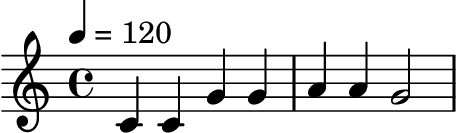
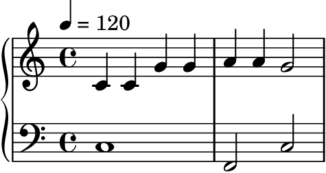
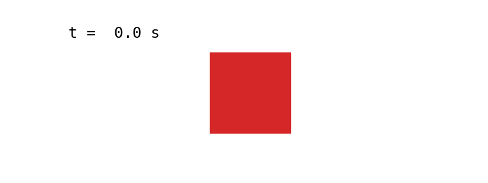
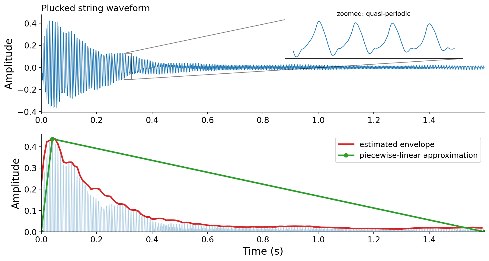
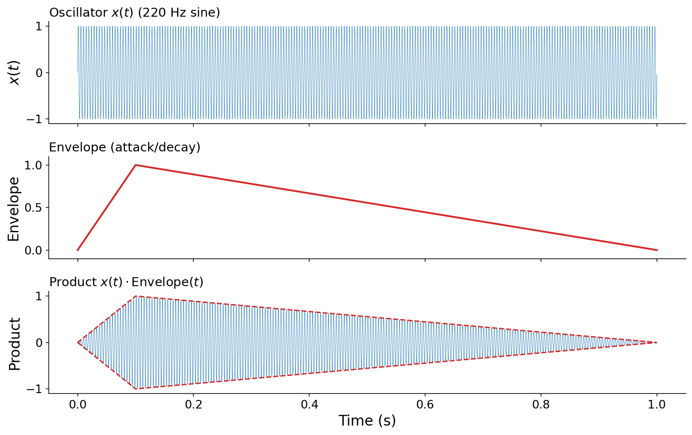
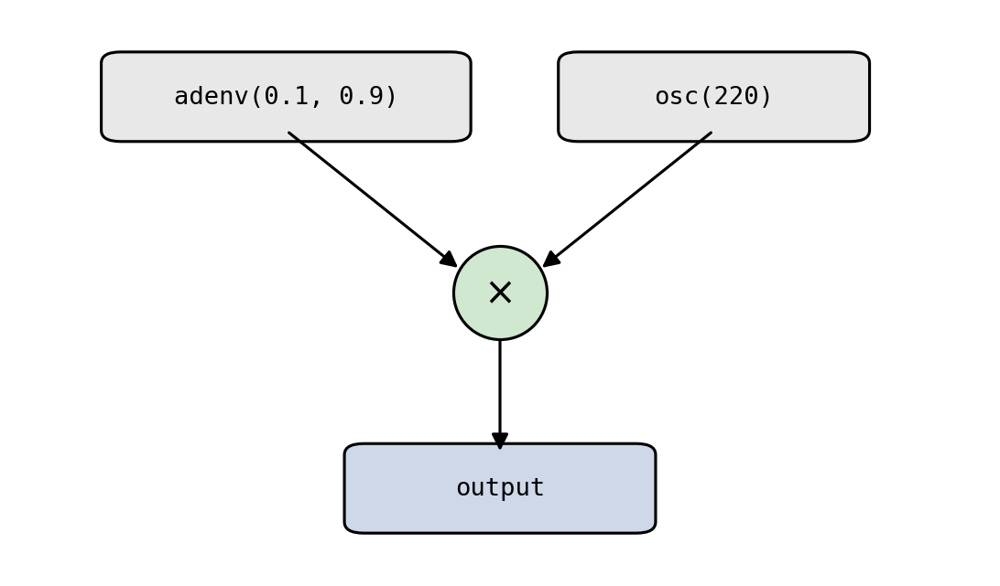
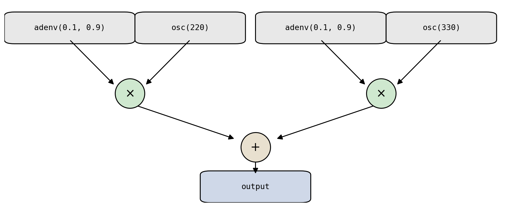
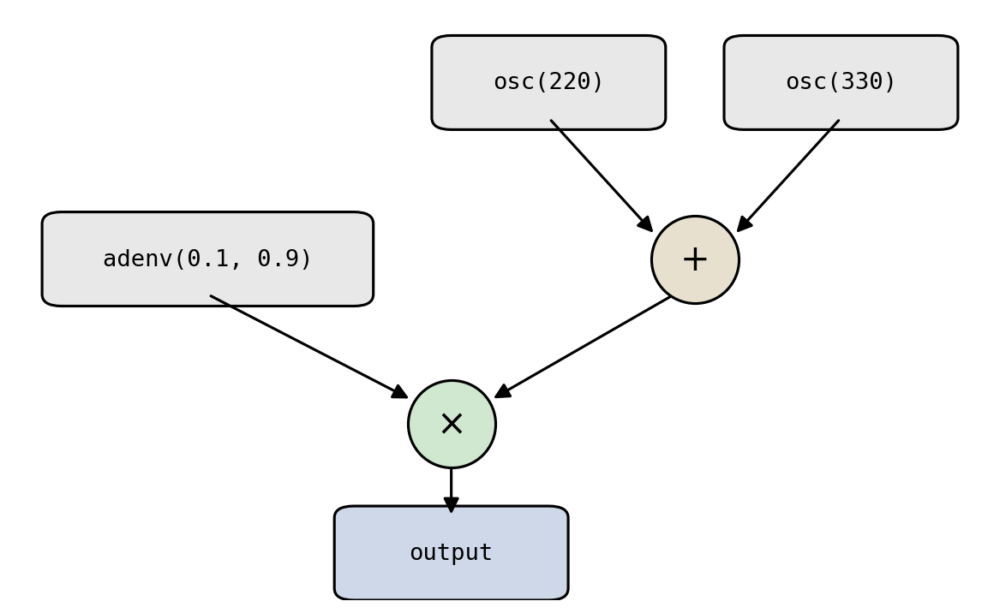

# Scores and Timbre

So far, we have focused on the basics of musical _sound_: the periodic phenomena that characterize a single tone, and the synthesis techniques that produce it. But a tone in isolation is not yet music. Music unfolds in time as a sequence of events: notes that start, stop, and overlap to form melody, rhythm, and harmony.

In this chapter, we will focus on _scores_, and their relationship to other aspects of music. Music is often compared to language. Language exhibits a duality of acoustic and symbolic properties: acoustic speech is characterized by an underlying symbolic text representation. Analogously, underlying a music recording is a _score_: a high-level, sparse, and discrete description of the events that make up the music. We will study scores, how to represent them on a computer, and how to combine them with the other elements of musical sound we've studied previously.

## Scores

If you've studied music before, you're likely familiar with musical scores written in standard Western notation:

:::{figure}


The first phrase of "Twinkle, Twinkle, Little Star", consisting of seven _notes_ with musical pitches C C G G A A G. Written in standard Western notation: quarter notes in 4/4 time, treble clef. The tempo marking ♩ = 120 (120 quarter-note beats per minute) means each quarter note lasts half a second.
:::

:::{audio}
[The melody above, synthesized](./assets/audio-twinkle-melody.wav)

The same melody, synthesized so you can hear it without reading notation.
:::

:::{note}
**You will not need to read music notation in this class.** The staff above is included only for demonstration, and to ground the discussion for those who _have_ studied music notation. Everything we do with scores will be expressed in code.
:::

Standard notation was designed for human music comprehension. But here we're studying computer music, so we should ask: how should we represent a score on a _computer_?

Across many musical practices and cultures (including but not limited to Western music), musical scores can be characterized by a set of {vocab}`events`: each occurring at a specific point in time and carrying parameters that describe it {cite}`dannenberg2024intro`. This is exactly how Pyquist represents a score. A {vocab}`score` is a list of {vocab}`event`s, where each event is a pair of a `time` and a Python `dict` of keyword arguments (_kwargs_ for short, following Python conventions).

:::{margin}
Pyquist's design of {pyquist}`Score` was heavily inspired by Roger Dannenberg's Nyquist {cite}`dannenberg1997implementation`.
:::

A natural way to translate Western notation into a {pyquist}`Score` is to map each _note_ into one event. Doing so for the melody above:

```python
import pyquist as pq

melody = pq.Score([
    (0.0, {"pitch": "C4", "duration": 0.5}),
    (0.5, {"pitch": "C4", "duration": 0.5}),
    (1.0, {"pitch": "G4", "duration": 0.5}),
    (1.5, {"pitch": "G4", "duration": 0.5}),
    (2.0, {"pitch": "A4", "duration": 0.5}),
    (2.5, {"pitch": "A4", "duration": 0.5}),
    (3.0, {"pitch": "G4", "duration": 1.0}),
])
```

:::{note}
Pyquist leaves the meaning of an event up to you. You decide what units `time` is in (seconds, beats, ...) and which keyword arguments each event carries. Unless otherwise noted, `time` is in seconds in this book. Here we use the keys `pitch` and `duration`, and at ♩ = 120 each quarter note is 0.5 s.
:::

For the seven notes in our running example, we've encoded three dimensions into the corresponding events:

1. The _horizontal_ position of each note becomes the `time` of its event.
1. The _vertical_ position of each note becomes a `pitch` (fundamental frequency) in its kwargs.
1. The _color_ (filled vs. hollow, flags, etc.) of each note, which indicates rhythmic value, becomes a `duration` in its kwargs.

### Contemporaneous events

One difference between language and music is that language is typically "single stream": one speaker utters one word at a time. Music, in contrast, is routinely {vocab}`polyphonic`: many notes sound at the same time. A score captures this by allowing events that occur at the same time, which we encode simply as multiple events sharing a timestamp. Here, a bass line is layered beneath the melody, with the first bass note beginning at the same instant as the first melody note:

:::{figure}


The same melody (treble clef) harmonized with a bass line (bass clef). The bass C and the first melody C both begin at $t = 0$, so they sound simultaneously.
:::

Because a {pyquist}`Score` is just a list of events, harmonizing the melody is as simple as adding two scores together. Adding two {pyquist}`Score` objects yields a new {pyquist}`Score`:

```python
bass = pq.Score([
    (0.0, {"pitch": "C3", "duration": 2.0}),
    (2.0, {"pitch": "F2", "duration": 1.0}),
    (3.0, {"pitch": "C3", "duration": 1.0}),
])
harmonized = melody + bass
```

:::{audio}
[The harmonized score, synthesized](./assets/audio-twinkle-harmonized.wav)

The melody and bass line rendered together. The full code is in [code/score_render.py](./code/score_render.py).
:::

:::{tip}
A {pyquist}`Score` provides many useful methods beyond list operations. Check out the documentation for {pyquist}`Score.segment` (extract a time range), {pyquist}`Score.render` (turn a score into audio), and {pyquist}`Score.from_midi` (load a score from a MIDI file).
:::

### A general score type

With the goal of accomodating many different musical practices, Pyquist adopts a deliberately _general_ definition of a score. You decide what a score means, what arguments each event carries, and how those arguments are interpreted. The only commonality is that a score represents **things occurring at certain points in time**.

Nothing about this definition is even specific to music or even sound! The same structure can describe any time-varying content, such as visual events in an animation:

```python
shapes = pq.Score([
    (0.0, {"color": "red", "shape": "square"}),
    (2.0, {"color": "blue", "shape": "star"}),
    (3.0, {"color": "green", "shape": "circle"}),
])
```

:::{figure}


The `shapes` score above, interpreted visually. Each event swaps the displayed shape and color at its timestamp; the counter in the top-left shows the current time as the four-second loop repeats.
:::

## Scores vs. timbre

In [Chapter 3](../03-additive-synthesis), we studied additive synthesis, with a goal of combining harmonics into richer sounds, or {vocab}`timbre`s (pronounced like the first two syllables of "tambourine").

:::{prf:definition} Timbre
:label: def-timbre
_Timbre_ is the set of attributes of a musical sound that let us recognize it as a distinct musical component or instrument, independent of its pitch and loudness.
:::

Timbre and scores are complementary, equally critical dimensions of how we perceive music. Together, they capture the _acoustic_ and _symbolic_ aspects of music, respectively. The artform of music consists of **independently manipulating the two**: a score says _when_ and _with what parameters_, and a timbre says _what it sounds like_.

As a concrete example, imagine a jazz trio playing a jazz standard notated as sheet music. The three instruments (piano, bass, drums) supply three acoustically distinct timbres, and the sheet music is the score informing which notes they play and when.

### A formal view

Let's make this a bit more precise. We bring together two ingredients, then define how to combine them.

:::{prf:definition} Rendering a score
:label: def-render
A _score_ is a set of $N$ sound events $\{E_1, E_2, \ldots, E_N\}$, where each event $E_i = (t_i, \theta_i)$ pairs an onset time $t_i$ (in seconds) with a dictionary of sound-producing parameters $\theta_i$.

An _instrument_ (or timbre) is a function $T_\theta(t) : \mathbb{R} \to \mathbb{R}$ that turns parameters $\theta$ into a waveform.

_Rendering_ the score produces a single waveform: the sum of every event's sound, each shifted to its onset time:

$$x(t) = \sum_{i=1}^{N} T_{\theta_i}(t - t_i).$$
:::

The shift $t - t_i$ places event $i$'s sound at its onset $t_i$. In practice, $T_\theta(t)$ is nonzero only for a finite window, so on a computer we compute only those nonzero samples and mix them into the output.

:::{note}
This definition is also very general. If $\theta$ carries a parameter like `{"instrument": "bass"}`, then a single instrument function $T_\theta$ can dispatch to entire _collections_ of instruments (e.g., the jazz trio above), choosing how to synthesize each event based on its parameters.
:::

In Pyquist, the method {pyquist}`Score.render` executes exactly this formula. It takes an instrument as input, i.e., a callable that maps an event's kwargs to {pyquist}`Audio`. It then shifts each rendered event to its onset and sums them into a single output {pyquist}`Audio`. Here is a basic sine-wave instrument and the call that renders our melody:

:::{interactive}[notebooks/sine-instrument.ipynb]
:::

The instrument is called once per event, with that event's kwargs (`pitch` and `duration`); `render` handles the time-shifting and mixing.

### Perception: timbre vs. score

When we studied additive synthesis, we learned that _adding_ harmonics together produces different timbres. In the formal view above, we just learned that _adding_ is also the basis of rendering a score. So where does the dividing line lie between the two?

The dividing line between timbre and score can be surprisingly thin. In Western music, a score is usually a collection of notes, each with a pitch (a fundamental frequency). When several frequencies sound at once, our ear may interpret them as a single unified _timbre_ or as multiple distinct _events_, depending on the relationships between those frequencies.

We can probe this with two scores. Each has four sound events, played by pure sine tones at different fundamental frequencies, that enter 0.1 seconds apart and then sustain together. The **only difference between the two is the set of frequencies**:

:::{interactive}[notebooks/timbre-vs-score.ipynb]
:::

:::{audio-list}
{audio}`Tones at 220, 440, 660, 880 Hz <./assets/audio-timbre-harmonic.wav>`

{audio}`Tones at 220, 277.18, 329.63, 392 Hz <./assets/audio-timbre-inharmonic.wav>`

Left (`group_a`): frequencies that are integer multiples of 220 Hz. Right (`group_b`): frequencies that are not integer multiples of a common value. Each set runs for eight seconds.
:::

At first, in both examples, you hear four distinct tones as each frequency enters one by one. Over time, however, you may start to perceive the left example as a single, "fused" tone, while the right example continues to sound like four distinct tones occurring simultaneously.

**The key distinguishing feature between perceiving _timbre_ or _score_ is whether the frequencies are _harmonics_ of one another** (integer multiples of a common fundamental). When they are, as on the left, our ear fuses them into one timbre. When they are not, as on the right, our ear separates them into distinct events. This is precisely why {ref}`additive synthesis <sec-additive-synthesis>` constrains its components to integer multiples of $f_0$: that constraint is what makes the result sound like a single tone.

## Envelopes

We've seen that we can combine scores with timbres to produce richer music. But there's one problem. In a musical score, events are _finite_ in duration: you pluck a string, and the sound decays away after some time. The synthesis techniques of Chapter 3, however, produce tones of theoretically _infinite_ duration: a sum of sinusoids just keeps going. {vocab}`Envelopes` bridge this gap, taking us from infinite sustained tones to finite sound events.

:::{figure}


A plucked guitar string (from Chapter 3). Top: the raw waveform, with a zoomed inset revealing its quasi-periodic oscillation. Bottom (upper half only): a smooth curve tracing the waveform's peak amplitude, its _envelope_, alongside a piecewise-linear approximation of that envelope.
:::

Consider the plucked string above. The zoomed inset reveals the quasi-periodic behavior we'd expect from the synthesis of Chapter 3. But zoomed out, the waveform has a distinct _shape_: its peak amplitude rises sharply, then decays. If we trace an outline around the waveform's peak amplitude, we get a curve that "envelopes" the oscillation within. If we could synthesize such a curve and multiply it by an oscillator, we could turn an infinite tone into a finite event. As the bottom panel suggests, even a simple piecewise-linear shape captures the essence.

### A formal view

If sound is a function $x(t) : \mathbb{R} \to \mathbb{R}$ mapping time to amplitude, an envelope is a function

$$\text{Envelope}(t) : \mathbb{R} \to [0, 1]$$

specifying an amplitude attenuation factor at each point in time, where 0 means silence and 1 means no attenuation. Crucially, an envelope is zero outside some finite window $(a, b)$:

$$
\text{Envelope}(t) \begin{cases}
\in (0, 1] & \text{if } a < t < b, \\
= 0 & \text{otherwise.}
\end{cases}
$$

We _apply_ an envelope to a sound by simple multiplication: $x(t) \cdot \text{Envelope}(t)$. Because the envelope is zero outside $(a, b)$, the product is also zero there, regardless of how $x(t)$ behaves. This accomplishes our goal of turning a potentially infinite sound into a finite one.

:::{audio-list}
{audio}`Oscillator alone <./assets/audio-env-demo-sine.wav>`

{audio}`Oscillator times envelope <./assets/audio-env-demo-enveloped.wav>`

A 220 Hz sine before and after applying an attack/decay envelope.
:::

:::{figure}


Top: the oscillator $x(t)$, a 220 Hz sine. Middle: an attack/decay envelope ($a_\text{dur} = 0.1$ s, $d_\text{dur} = 0.9$ s). Bottom: their product. The product's amplitude is bounded by the envelope (dashed), and it fades to silence at both ends.
:::

### Piecewise-linear envelopes

Envelopes are often described by piecewise-linear functions, parameterized by a set of {vocab}`control points` $(t_1, a_1), (t_2, a_2), \ldots, (t_P, a_P)$. Between consecutive control points, the envelope interpolates linearly. Outside the first and last control points, it typically is assumed to take on the edge values: $a_1$ if $t \leq a_1$, or $a_P$ if $t \geq t_P$. Accordingly, for most envelopes, $a_1 = a_P = 0$.

The simplest useful envelope has two segments and a single interior control point: an _attack_ that rises linearly from 0 to a peak, followed by a _decay_ that falls back to 0. We can write it with control points $(0, 0)$, $(a_\text{dur}, 1)$, and $(a_\text{dur} + d_\text{dur}, 0)$:

$$
\text{adenv}(t) = \begin{cases}
\dfrac{t}{a_\text{dur}} & \text{if } 0 \le t < a_\text{dur}, \\[2mm]
1 - \dfrac{t - a_\text{dur}}{d_\text{dur}} & \text{if } a_\text{dur} \le t \le a_\text{dur} + d_\text{dur}, \\[2mm]
0 & \text{otherwise.}
\end{cases}
$$

In code, we can express any piecewise-linear envelope compactly with `np.interp`, which handles the segment-by-segment interpolation for us:

```python
def adenv(a_dur: float, d_dur: float, N: int, n: int = 0) -> np.ndarray:
    t = (n + np.arange(N)) / F_S
    env = np.interp(
        t, [0.0, a_dur, a_dur + d_dur], [0.0, 1.0, 0.0]
    )
    return env[:, np.newaxis]
```

:::{margin}
Note that `adenv` returns an `np.ndarray`, not a {pyquist}`Audio`. This is a deliberate choice: an envelope is an amplitude-shaping curve, not something we intend to _listen_ to as audio.
:::

The trailing `[:, np.newaxis]` reshapes the result to `(N, 1)` so that, recalling the `(num_samples, num_channels)` convention from [Chapter 2](../02-synthesis-vectorized), the envelope broadcasts cleanly across the channels of a {pyquist}`Audio` when we multiply by `adenv(...)`. Extending this to an arbitrary number of control points is left as an exercise to the reader.

:::{figure}


The output of `adenv(0.1, 0.9, ...)` over one second: a 0.1 s attack to the peak, then a 0.9 s decay. The three control points are marked.
:::

:::{audio}
[An enveloped 220 Hz tone](./assets/audio-enveloped-note.wav)

A 220 Hz sine multiplied by `adenv(0.1, 0.9, ...)`, producing a finite note. The full code is in [code/envelope.py](./code/envelope.py).
:::

## Unit generators and block-based computing

Creating an enveloped tone involved multiplying an oscillator by an envelope. More generally, compelling musical results come from representing synthesis and processing building blocks as reusable functions, called {vocab}`unit generators` {cite}`mathews1969technology`, and combining them into more complex topologies.

These topologies can be drawn as {vocab}`signal flow diagrams` (visualized directed graphs), or written as nested function calls. The enveloped tone above is the topology `mul(adenv(0.1, 0.9), osc(220))`:

:::{figure}


A unit-generator topology for an enveloped tone: an envelope and an oscillator feed a multiply (the circled ×), which feeds the output.
:::

Summing two enveloped tones yields a small degree of polyphony, `add(mul(adenv(0.1, 0.9), osc(220)), mul(adenv(0.1, 0.9), osc(330)))`:

:::{figure}


A larger topology: two enveloped oscillators summed into one output.
:::

:::{audio-list}
{audio}`mul(adenv, osc(220)) <./assets/audio-topology-mul.wav>`

{audio}`add of two enveloped tones <./assets/audio-topology-add.wav>`

The two topologies above, rendered to audio.
:::

The same musical result can often be expressed by different topologies, and some are more _efficient_ than others. Since multiplication distributes over addition, $\text{adenv} \cdot \text{osc}_1 + \text{adenv} \cdot \text{osc}_2 = \text{adenv} \cdot (\text{osc}_1 + \text{osc}_2)$. The right-hand side, `mul(adenv(0.1, 0.9), add(osc(220), osc(330)))`, computes the _identical_ signal with one fewer envelope and one fewer multiply:

:::{figure}


An equivalent but cheaper topology: factoring out the shared envelope replaces two multiplies and two envelopes with one of each.
:::

Full-fledged computer music programming languages (Nyquist, Csound, Pure Data, Max/MSP, etc.) ship with comprehensive libraries of unit-generator primitives. Some will even attempt to compile your topology into a more efficient implementation. Pyquist takes a more hands-off approach: **you implement your own unit generators**, as functions that take parameters or audio as input and produce sound.

Across many frameworks, unit generators are at the core of computer music programming. So how do we implement them _efficiently_?

### Efficient unit generators via block-based computing

We run unit generators by calling and combining functions. But synthesis must produce many thousands, even millions, of samples, so we need an execution strategy that is efficient in both memory and compute. The key points of tension are that **audio samples can take up a lot of memory** (a single channel of `float32` audio at 44.1 kHz is about $1.4$ ${unit}`megabits,second`$), and **function calls have overhead**.

There are three natural strategies for computing the outputs of several unit generators across many samples. To compare them, suppose our topology has $M$ unit generators and we want to synthesize $N$ total samples. Our running example will be `mul(adenv(0.1, 0.9), osc(220))`, with $M = 3$ unit generators: the envelope, the oscillator, and the multiply.

**Ugen-by-ugen.** Run each unit generator once to synthesize _all_ of its samples, then combine.

```python
ugen_a = adenv(0.1, 0.9, N)         # a full N-sample env array
ugen_b = osc(220.0, N)              # a full N-sample osc array
ugen_by_ugen = mul(ugen_a, ugen_b)  # ...and a third for the product
```

This makes only $O(M)$ function calls (good!). But every unit generator allocates a full $N$-sample array, and all of them are alive at once, so it costs $O(M \cdot N)$ memory (bad!). Notice the three live arrays above for just this tiny network.

**Sample-by-sample.** For each output sample, run every unit generator for that one sample, then combine.

```python
sample_by_sample = []
for n in range(N):
    sample_by_sample.append(mul(adenv(0.1, 0.9, 1, n), osc(220.0, 1, n)))
sample_by_sample = pq.Audio.concatenate(sample_by_sample)
```

This is the mirror image scenario: only $O(M)$ samples are ever held at once (good!), but it makes $O(M \cdot N)$ function calls (bad!).

**Block-by-block.** Process the signal in fixed-size blocks of $B$ samples, running each unit generator once per block.

```python
B = 441  # block size in samples (0.01 s)
block_by_block = []
for n in range(0, N, B):
    block_by_block.append(mul(adenv(0.1, 0.9, B, n), osc(220.0, B, n)))
block_by_block = pq.Audio.concatenate(block_by_block)
```

This is the sweet spot: $O(M \cdot B)$ memory and $O(M \cdot N / B)$ function calls. By choosing $B$, we trade off between the two extremes. The full runnable comparison is in [code/block_based.py](./code/block_based.py), which verifies all three produce identical output.

These call counts only matter because each call carries overhead. The actual cost depends on hardware, language, and the unit generator itself, so rather than measure it, let's just **suppose for illustration that one function call costs about as much as computing 100 samples**. Plugging in $N = 44{,}100$ (one second), $M = 3$, and $B = 441$ makes the tradeoff concrete:

:::{list-table} Cost of each strategy for one second of our three-ugen network
:header-rows: 1
:name: tbl-block-costs

- - Strategy
  - Function calls
  - Overhead (sample-equiv.)
  - Peak memory (samples)
- - Ugen-by-ugen
  - 3
  - ~300
  - ~132,300
- - Sample-by-sample
  - 132,300
  - ~13,230,000
  - ~3
- - Block-by-block ($B = 441$)
  - 300
  - ~30,000
  - ~1,323
:::

Sample-by-sample wastes enormous effort on call overhead; ugen-by-ugen consumes a very large amount of memory; block-by-block keeps both modest.

**Most computer music software computes audio in blocks** {cite}`puckette2007theory`. You will see blocks throughout the computer music stack, and block-based computing will be essential again when we discuss {ref}`real-time, interactive audio <sec-realtime-processing>` later in the book. It's a good habit to practice. That said, you don't _always_ need it: with modern hardware, ugen-by-ugen is often perfectly practical when working in pyquist, and even sample-by-sample has its place.

### Idioms for implementing unit generators

A unit generator must produce successive blocks while remembering where it left off (here, the oscillator's phase). Python offers several idioms for managing that state, each with different tradeoffs:

1. As a pure **function of the global sample index**, with the caller tracking position.
1. As a **function that passes state in and out** explicitly.
1. As an **iterator** that yields successive blocks, hiding the state in its local scope.
1. As a **stateful object** that remembers its own phase between calls.

```python
# (1) Function of the global sample index n
def osc(f_0: float, N: int, n: int = 0) -> pq.Audio:
    t = (n + np.arange(N)) / F_S
    return pq.Audio(np.sin(2.0 * np.pi * f_0 * t), F_S)

# (2) Passes phase state in and out
def osc_stateless(f_0: float, N: int, phase: float = 0.0) -> tuple[pq.Audio, float]:
    d_phase = 2.0 * np.pi * f_0 / F_S
    phases = phase + np.arange(N) * d_phase
    return pq.Audio(np.sin(phases), F_S), phase + N * d_phase

# (3) Iterator over blocks
def osc_iter(f_0: float, B: int) -> Iterator[pq.Audio]:
    phase = 0.0
    while True:
        block, phase = osc_stateless(f_0, B, phase)
        yield block

# (4) Stateful object
class Osc:
    def __init__(self, f_0: float) -> None:
        self.d_phase = 2.0 * np.pi * f_0 / F_S
        self.phase = 0.0

    def __call__(self, N: int) -> pq.Audio:
        phases = self.phase + np.arange(N) * self.d_phase
        self.phase += N * self.d_phase
        return pq.Audio(np.sin(phases), F_S)
```

These idioms produce identical output but suit different situations; [code/unit_generators.py](./code/unit_generators.py) runs all four and confirms they agree. We do not make a particular recommendation of one over the others. Experiment and find what works best for your application and your programming taste.

## Summary

- A {vocab}`score` is the symbolic "language" of music: a sparse, discrete set of timed events. In Pyquist, a {pyquist}`Score` is a list of {pyquist}`Event`s, each a `(time, kwargs)` pair, and you decide what the time units and kwargs mean.
- Simultaneous events are encoded as multiple events sharing a timestamp. The score structure is general enough to describe any timed content, not just sound.
- {vocab}`Timbre` and scores are complementary: a score says _when_, an instrument says _what it sounds like_. Rendering sums each event's sound shifted to its onset: $x(t) = \sum_i T_{\theta_i}(t - t_i)$, which {pyquist}`Score.render` computes.
- Whether simultaneous frequencies are heard as one timbre or as separate notes depends on whether they are **harmonics** of a common fundamental.
- An {vocab}`envelope` $\text{Envelope}(t) : \mathbb{R} \to [0, 1]$ is zero outside a finite window. Multiplying a sustained tone by an envelope produces a finite event. Piecewise-linear envelopes are defined by control points.
- {vocab}`Unit generators` are reusable functions that produce or process sound, combined into topologies (directed graphs / nested calls).
- Because function calls have overhead, synthesis is usually computed **block-by-block**, balancing the memory cost of ugen-by-ugen against the call overhead of sample-by-sample.

## Questions for the reader

::::{exercise}
**Reading a score.** Consider the score `pq.Score([(0.0, {"pitch": "C4", "duration": 2.0}), (1.0, {"pitch": "E4", "duration": 2.0})])`. At time $t = 1.5$ seconds, how many notes are sounding, and which? Explain why, referring to each event's onset time and duration.

:::{solution}
Two notes: C4 (sounding on $[0, 2)$) and E4 (sounding on $[1, 3)$).
:::
::::

::::{exercise}
**Timbre or score?** You synthesize four simultaneous sustained sinusoids at $200$, $400$, $600$, and $800$ Hz. Are you more likely to hear a single fused tone or four separate tones? What if the frequencies were $200$, $283$, $327$, and $412$ Hz instead? Justify your answers in terms of harmonic relationships.

:::{solution}
$200, 400, 600, 800$ Hz are all harmonics of $200$ Hz and fuse into one tone. $200, 283, 327, 412$ Hz are inharmonic and are heard as four separate tones.
:::
::::

::::{exercise}
**Envelope values.** An attack/decay envelope has control points $(0, 0)$, $(0.2, 1)$, and $(0.5, 0)$, where each control point is time / amplitude pairs $(t_i, a_i)$. What is the envelope's value at $t = 0.1$ s? At $t = 0.35$ s? At $t = 0.8$ s?

:::{solution}
$0.5$ at $t = 0.1$ s; $0.5$ at $t = 0.35$ s; $0$ at $t = 0.8$ s.
:::
::::

::::{exercise}
**Designing an ADSR envelope.** Many synthesizers use a four-parameter _attack-decay-sustain-release_ (ADSR) envelope, where attack $A$, decay $D$, and release $R$ are _durations_ (in seconds) and sustain $S$ is a _level_ (in $[0, 1]$). The envelope rises from 0 to a peak of 1.0 over $A$, falls from 1.0 to the level $S$ over $D$, holds at $S$ for some sustain duration, then falls from $S$ to 0 over $R$. Write down a set of control points $(t_i, a_i)$ that implement an ADSR envelope with $A = 0.05$ s, $D = 0.1$ s, $S = 0.7$, a 0.5 s sustain, and $R = 0.2$ s.

:::{solution}
$(0, 0),\ (0.05, 1),\ (0.15, 0.7),\ (0.65, 0.7),\ (0.85, 0)$.
:::
::::

::::{exercise}
**Reading a topology.** A synthesis patch is built from four unit generators with the following "spec":

- Generator $A$ takes a single input $X$.
- Generator $B$ takes two inputs: $Y$ and the output of $A$.
- Generator $C$ takes two inputs: the output of $A$ and $Z$.
- Generator $D$ takes two inputs, the outputs of $B$ and $C$, and produces the final output.

1. Write this topology as a single nested function-call expression of the form $D(\ldots)$.
1. Why does the output of $A$ appear twice in your expression, and what does that tell you about how many times $A$ must be computed?

:::{solution}

1. $D\big(B(Y, A(X)),\ C(A(X), Z)\big)$.
1. $A(X)$ appears twice, so $A$ must be computed twice unless its output is computed once and reused.

:::
::::

::::{exercise}
**Block-based bookkeeping.** You synthesize 5 seconds of audio at $f_s = 44{,}100$ Hz using a network of $M = 3$ unit generators, processed block-by-block and ugen-by-ugen with a block size of $B = 512$ samples.

1. How many blocks are processed?
1. How many total unit-generator calls are made?
1. Compute the call count for the sample-by-sample strategy instead of ugen-by-ugen.

:::{solution}

1. $431$ blocks (or $430$ if you drop incomplete blocks)
1. $1293$ calls (ugen-by-ugen)
1. $661{,}500$ calls (sample-by-sample)

:::
::::

::::{exercise}
**Choosing a block size.** Suppose you halve the block size $B$. What happens to (1) the peak memory used and (2) the total function-call overhead? Though we haven't yet discussed real-time computer music systems, why might such systems benefit from block-based computing, and why might a small block size be preferred there despite the overhead?

:::{solution}
Peak memory roughly halves; total function-call overhead roughly doubles.
:::
::::

## Musical examples

### Max Mathews et al. - _Daisy Bell_ (1961)

An early landmark of computer music: an IBM 704 sang _Daisy Bell (Bicycle Built for Two)_ over an additive-synthesis accompaniment arranged by Max Mathews, among the first times a computer produced both a musical accompaniment and a singing voice. The demonstration was later immortalized when HAL 9000 sings the same song while being shut down in Kubrick's _2001: A Space Odyssey_.

<iframe width="560" height="315" src="https://www.youtube-nocookie.com/embed/ZFUVR-clo8g" title="YouTube video player" frameborder="0" allow="accelerometer; autoplay; clipboard-write; encrypted-media; gyroscope; picture-in-picture; web-share" referrerpolicy="strict-origin-when-cross-origin" allowfullscreen></iframe>

### Kyle Gann - _Andromeda Memories_ (2018)

_Andromeda Memories_ comes from Gann's _Hyperchromatica_, a suite for three computer-controlled player pianos retuned to a 33-note-per-octave just-intonation scale. It shows how scores can be configured to address pitches that lie outside standard Western tuning, letting the composer shape harmony and timbre together in novel configurations.

<iframe width="560" height="315" src="https://www.youtube-nocookie.com/embed/l7JH-rA2g-Q" title="YouTube video player" frameborder="0" allow="accelerometer; autoplay; clipboard-write; encrypted-media; gyroscope; picture-in-picture; web-share" referrerpolicy="strict-origin-when-cross-origin" allowfullscreen></iframe>
