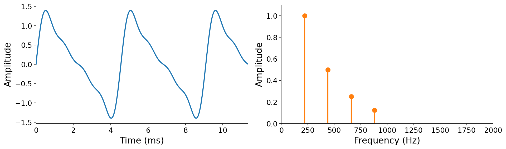

# The Frequency Domain

So far, we have seen several scenarios where _combinations of frequencies_ lead to interesting musical results. In additive synthesis ([Chapter 3](../03-additive-synthesis)), mixing basic sinusoids at integer multiples (harmonics) of a fundamental frequency gave rise to different timbres. In our study of scores ([Chapter 4](../04-score-timbre)), combining notes at different fundamental frequencies (pitches) turned out to be a primary axis of musical composition. Both observations point to the same conclusion: **variation in frequency is a fundamental property of musical expression**.

But how should we reason about these variations? Are there mathematical tools to formalize them? And if we are handed a new sound that we know nothing about, how can we determine what frequencies it contains? This chapter develops the {vocab}`frequency domain` and the {vocab}`Fourier transform`, the central tool for answering these questions.

## Time and frequency

Until now, we have looked at sound in the {vocab}`time domain`: a waveform $x(t) : \mathbb{R} \to \mathbb{R}$ that maps each instant in time to an amplitude (see {ref}`sec-waveforms`). The time domain is intuitive because it mirrors how sound physically propagates: the form it is in when it reaches our ears or microphones. But it is not the only way to reason about sound.

:::{margin}
Why $|X(f)|$, with the absolute-value bars, rather than just $X(f)$? It turns out that the frequency-domain representation is intrinsically complex-valued, and taking the absolute value extracts amplitudes. We will build up to this over the course of the chapter.
:::

We now introduce a complementary view: the frequency domain. Here we describe a sound by a function $|X(f)| : \mathbb{R} \to \mathbb{R}$ that reports the _amplitude_ associated with each frequency $f$, in other words, **how much of frequency $f$ is present** in the sound.

To make this concrete, recall the time-domain definition of additive synthesis from {prf:ref}`def-additive-synthesis`:

$$x(t) = \sum_{k=1}^{K} a_k \sin(2\pi [k \cdot f_0] \, t + \phi_k).$$

By summing harmonics, we produce a familiar dense, continuous picture in the time domain. But what would the same sound look like in the frequency domain? Pause and think about it before reading on.

The key insight is that **the coefficients of additive synthesis already answer the question of "how much of each frequency"**. The $k$-th harmonic, at frequency $k \cdot f_0$, contributes amplitude $a_k$. Every other frequency contributes nothing. Plotting amplitude against frequency for the four-harmonic recipe $\mathbf{a} = [1, \tfrac{1}{2}, \tfrac{1}{4}, \tfrac{1}{8}]$ at $f_0 = 220$ Hz:

:::{figure}

The same sound in two domains. Left: the time-domain waveform $x(t)$, dense and continuous. Right: the frequency-domain amplitude $|X(f)|$, sparse and discontinuous, with a spike at each harmonic.
:::

More formally, the amplitude spectrum of an additively synthesized tone is zero at every frequency except the harmonics, where it takes the value of the corresponding amplitude coefficient:

$$
|X(f)| = \begin{cases}
a_k & \text{if } f = k \cdot f_0 \text{ for some } k \in \{1, 2, \ldots, K\}, \\
0 & \text{otherwise.}
\end{cases}
$$

This reveals a key contrast between the two domains. While the time-domain waveform is dense and continuous, the frequency-domain representation is **sparse and discontinuous**: almost every frequency has amplitude zero, with energy concentrated into infinitesimally narrow "spikes" at integer multiples of $f_0$. Those spikes still encode almost the entire recipe: the fundamental $f_0$ (their spacing), the number of harmonics $K$ (their count), and the amplitudes $\mathbf{a}$ (their heights). The one ingredient they discard is the _initial phases_ $\boldsymbol{\phi}$. That loss is acceptable for now because, as we saw in Chapter 3, our ear is largely insensitive to phase. We will return to where the phase information goes later in this chapter.

:::{audio}
[The four-harmonic recipe](./assets/audio-recipe.wav)

The tone whose two representations are shown above, included as a reminder of what this recipe sounds like.
:::

To reinforce this new perspective, consider the basic waveform shapes from Chapter 3, now viewed through the same lens. Each is just a particular pattern of harmonic amplitudes, so each has a distinctive frequency-domain fingerprint:

:::{audio-board}
{audio}`Sawtooth <./assets/audio-saw.wav>`

{audio}`Square <./assets/audio-square.wav>`

{audio}`Triangle <./assets/audio-triangle.wav>`

The sawtooth, square, and triangle waves in both domains. Top: the familiar time-domain shapes. Bottom: their amplitude spectra (normalized so the fundamental is 1). The sawtooth contains all harmonics ($a_k \propto 1/k$), while the square and triangle contain only odd harmonics ($1/k$ and $1/k^2$ respectively). Each shape's character comes entirely from its pattern of harmonic amplitudes.
:::

There is a catch. We could draw these frequency-domain plots only because we already had access to the sound-producing algorithm (additive synthesis) and its recipe (the coefficients). What if you were handed a sound for which you knew _nothing_ about how it was made?

This is a bit like cooking. If you already know the recipe, reproducing a dish is easy. But if you order a dish at a restaurant, you do not get the recipe. You would have to reverse-engineer it from the dish itself. How can we uncover the "recipe" of frequencies from a sound alone?

Remarkably, it turns out that uncovering the recipe is easier for sound than it is for food! **Every sound has a unique recipe of frequency information that can be recovered in closed form from the sound itself**. The tool that recovers it is the Fourier transform. To build it, we first need to brush up on the complex plane.

## A review of the complex plane

Sound exists in the real world, so why are we suddenly invoking the complex plane, with its "imaginary" numbers? The answer is that the complex plane is an exceptionally convenient _analytical tool_ for modeling periodic phenomena, even thoroughly real-world ones like audio signals. The key connection, which we will make precise shortly, is that **rotation is the fundamental periodic phenomenon, and multiplication in the complex plane models rotation** {cite}`mcfee2023digital`.

This book assumes complex numbers as background knowledge, but we revisit the essentials here in case you are rusty, which is perfectly fine.

:::{tip}
In this book, prefer to think of $j$ as an _analytical tool_ for better understanding real-valued signals, rather than as an "imaginary number". This framing demystifies much of what follows.
:::

We write the imaginary unit as $j = \sqrt{-1}$, rather than $i$, following the convention in engineering and digital signal processing (where $i$ often denotes other quantities, such as electric current). A complex number $z$ can be written in {vocab}`rectangular form` (also called _Cartesian form_) as a pair of real coordinates $(x, y)$:

$$z = x + jy,$$

where $x$ is the real part and $y$ is the imaginary part.

Two complex numbers in rectangular form are added componentwise, and multiplied using the single rule $j^2 = -1$. We collect both operations here for reference:

:::{prf:definition} Complex addition and multiplication (rectangular form)
:label: def-complex-arithmetic
For $z_1 = x_1 + j y_1$ and $z_2 = x_2 + j y_2$,

$$z_1 + z_2 = (x_1 + x_2) + j(y_1 + y_2),$$

$$z_1 \cdot z_2 = (x_1 x_2 - y_1 y_2) + j(x_1 y_2 + x_2 y_1).$$
:::

Addition simply adds the real and imaginary parts separately. The multiplication rule looks more involved, but it follows from expanding the product like any pair of binomials and then applying $j^2 = -1$:

$$
\begin{aligned}
z_1 \cdot z_2 &= (x_1 + j y_1)(x_2 + j y_2) \\
&= x_1 x_2 + j x_1 y_2 + j y_1 x_2 + j^2 y_1 y_2 \\
&= x_1 x_2 + j x_1 y_2 + j y_1 x_2 - y_1 y_2 && (j^2 = -1) \\
&= (x_1 x_2 - y_1 y_2) + j(x_1 y_2 + x_2 y_1).
\end{aligned}
$$

A complex number can equivalently be written in {vocab}`polar form` as a pair $(r, \theta)$, giving its magnitude (distance from the origin) $r$ and its angle $\theta$ from the real axis. Rectangular and polar are just two coordinate systems for the same point, related by basic trigonometry:

:::{figure}

A complex number $z$ in the complex plane. Rectangular form $(x, y)$ gives its horizontal and vertical coordinates. Polar form $(r, \theta)$ gives its distance from the origin and its angle from the real axis.
:::

$$
r = \sqrt{x^2 + y^2}, \qquad
\theta = \tan^{-1}\!\left(\frac{y}{x}\right),
$$

and in the other direction,

$$
x = r\cos\theta, \qquad
y = r\sin\theta.
$$

Polar form is especially convenient for multiplication, where **magnitudes multiply and angles add**. For $z_1 = (r_1, \theta_1)$ and $z_2 = (r_2, \theta_2)$ in polar form,

$$z_1 \cdot z_2 = (r_1 r_2, \; \theta_1 + \theta_2).$$

This is the precise sense in which multiplication models rotation: multiplying by a number of magnitude 1 and angle $\theta$ rotates a point by $\theta$ without changing its distance from the origin. Hold onto this idea, as it is the engine of everything that follows.

Finally, polar form connects back to rectangular form through one of the most important identities in all of mathematics, {vocab}`Euler's formula`:

$$e^{j\theta} = \cos\theta + j\sin\theta.$$

Reading it as a complex number, $e^{j\theta}$ has real part $\cos\theta$ and imaginary part $\sin\theta$, so it is exactly the point on the unit circle at angle $\theta$. A general complex number in polar form is therefore $z = r e^{j\theta}$.

(sec-phasor)=

## The phasor

Now we bring the complex plane back into a sound context. Recall the basic sinusoid, the most elementary periodic sound. In Chapter 1 we wrote it as $a\sin(\omega t + \phi)$, but here we will use the cosine form

$$x(t) = a\cos(\omega t)$$

for reasons that will become clear momentarily. These forms are interchangeable: $\cos(\omega t) = \sin(\omega t + \pi/2)$, so switching to cosine just fixes a particular initial phase.

:::{tip}
Here $\omega$ is angular frequency, in units of ${unit}`radians,second`$. If you're rusty on angular frequency, revisit {ref}`sec-angular-frequency`. We will use angular frequency regularly from here on, since it spares us from writing $2\pi f$ everywhere.
:::

Suppose we want to transform this basic sinusoid so that it operates in the complex plane. How might we do that? We apply Euler's formula. Starting from $e^{j\theta} = \cos\theta + j\sin\theta$, we multiply both sides by $a$ and then let the angle vary with time as $\theta(t) = \omega t$:

$$
\begin{aligned}
e^{j\theta} &= \cos\theta + j\sin\theta \\
a\, e^{j\theta} &= a\cos\theta + j\, a\sin\theta \\
a\, e^{j\omega t} &= \underbrace{a\cos(\omega t)}_{\text{basic sinusoid (real)}} + \underbrace{j\, a\sin(\omega t)}_{\text{analytical tool (imaginary)}}.
\end{aligned}
$$

What have we accomplished? Two things:

1. We brought our basic sinusoid into the complex plane by complementing it with an _analytical tool_, the term $j\, a\sin(\omega t)$. Where the basic sinusoid is always real-valued, this tool is always imaginary-valued, and it is always exactly $\pi/2$ radians out of phase with the basic sinusoid.
1. We used Euler's formula to fold the two real sinusoids into a single, compact {vocab}`complex sinusoid`, $a\, e^{j\omega t}$.

What does a complex sinusoid look like? It is a vector of length $a$ that rotates counterclockwise, tracing the outline of a circle of radius $a$ in the complex plane. As it rotates, its real part traces a cosine and its imaginary part traces a sine:

:::{figure}

A complex sinusoid, or _phasor_, $a\, e^{j\omega t}$ at one instant (here $a = 1$). Left: in the complex plane it is a rotating vector. Middle and right: its real and imaginary parts, projected out over time, are a cosine and a sine. The phasor completes one full rotation every $1/f$ seconds, where $f = \omega / 2\pi$.
:::

A complex sinusoid is very commonly called a {vocab}`phasor`. Plainly, a phasor is just a fancy way to draw a circle over and over.

:::{prf:definition} Phasor (complex sinusoid)
:label: def-phasor
A _phasor_ is a complex sinusoid: a function of time parameterized by an amplitude $a$ and an angular frequency $\omega$,

$$\text{phasor}_{a, \omega}(t) = a\, e^{j\omega t} = a\cos(\omega t) + j\, a\sin(\omega t) : \mathbb{R} \to \mathbb{C}.$$

It traces a circle of radius $a$ in the complex plane, completing one revolution every $1/f$ seconds (where $f = \omega / 2\pi$). Its real part is a cosine and its imaginary part is a sine.
:::

The subscripts $a$ and $\omega$ are fixed parameters that pick out _which_ phasor we mean, exactly as $a$ and $f$ parameterize the basic sinusoid. The lone input to the function is still time $t$.

:::{important}
Like the basic sinusoid, a phasor is a function of _time_, not of frequency. The only difference is that it rotates in the complex plane rather than oscillating along a single real axis.
:::

:::{interactive}[notebooks/phasor-rotation.ipynb]
:::

Take time to study this. Deriving the phasor is the main reason we reviewed the complex plane. **The complex sinusoid is perhaps the single most important expression in computer music.** It captures the periodic essence of sound in the basic sinusoid, and, as we will now see, it gives rise to the Fourier transform that uncovers a unique sinusoidal recipe for any sound.

(sec-fourier-transform)=

## The Fourier transform

We are finally ready to define the {vocab}`Fourier transform` of a signal $x(t)$:

:::{prf:definition} Fourier transform
:label: def-fourier-transform
The _Fourier transform_ of a signal $x(t)$ is

$$X(\omega) = \int_{-\infty}^{\infty} x(t)\, e^{-j\omega t}\, dt.$$

It maps an angular frequency $\omega$ to a single complex number, $X(\omega) : \mathbb{R} \to \mathbb{C}$.
:::

At last, a function of _frequency_. Frequency is the input, and the output is a single complex number summarizing how much of that frequency is present in $x(t)$ (and at what phase).

:::{note}
Calculus is not a focus of this book. The Fourier transform does contain an integral, but you will not be asked to work through tricky integration here. Later, we will derive a _discrete_ version of the transform that replaces the integral with a finite sum, turning it into a concrete computational tool rather than a mathematical one.
:::

This definition is the direct payoff of the previous section. Look closely at the integrand: the term $e^{-j\omega t}$ is a phasor at frequency $\omega$, rotating clockwise (the minus sign reverses the direction). The transform **multiplies the sound $x(t)$ by this phasor**, rotating the signal in the complex plane, and then integrates the result over all time. That multiply-by-a-phasor step is the central operating principle of the Fourier transform, and it is why we spent so long building up the complex sinusoid. We will develop the intuition for why this isolates the amount of frequency $\omega$ shortly. First, let us rewrite the transform in a more concrete form.

Although $X(\omega)$ is complex, we can split it into two real-valued integrals using Euler's formula. Since $e^{-j\omega t} = \cos(\omega t) - j\sin(\omega t)$,

$$
X(\omega) = \int_{-\infty}^{\infty} x(t)\big[\cos(\omega t) - j\sin(\omega t)\big]\, dt = R(\omega) + j\, I(\omega),
$$

where we name the real and imaginary parts $R(\omega) \coloneqq \Re\big(X(\omega)\big)$ and $I(\omega) \coloneqq \Im\big(X(\omega)\big)$:

$$
R(\omega) = \Re\big(X(\omega)\big) = \int_{-\infty}^{\infty} x(t)\cos(\omega t)\, dt,
\qquad
I(\omega) = \Im\big(X(\omega)\big) = -\int_{-\infty}^{\infty} x(t)\sin(\omega t)\, dt.
$$

That is the full definition. It probably still feels mysterious, which is completely expected. We will spend the rest of the chapter unpacking what it means and why it works.

## Amplitude and phase spectra

Our goal at the start of the chapter was to answer the question "how much of a given frequency is present in some unknown sound?" The Fourier transform almost gives us this, but its output is a complex number rather than a plain amplitude. How do we extract the amplitude?

The answer is simple: convert from rectangular to polar form. The magnitude of $X(\omega)$ is the amplitude at frequency $\omega$, and its angle is the phase. These define the {vocab}`amplitude spectrum` and {vocab}`phase spectrum`:

$$
|X(\omega)| = \sqrt{R^2(\omega) + I^2(\omega)},
\qquad
\angle X(\omega) = \tan^{-1}\!\left(\frac{I(\omega)}{R(\omega)}\right).
$$

Both are real-valued functions of frequency. The amplitude spectrum is always non-negative, and it is the answer to our original question. This is also where the phase information from earlier "went": the phases are not lost, they live in the phase spectrum $\angle X(\omega)$, separate from the amplitudes.

Recall from Chapter 3 that our ear is far more sensitive to amplitude than to phase. For this reason, the amplitude spectrum is by far the more commonly used of the two. The phase spectrum becomes important mainly when we want to _reconstruct_ a signal from its frequency-domain representation, using the inverse Fourier transform that we will meet later.

You may already have encountered the amplitude spectrum if you have ever opened a "spectrum analyzer" in a digital audio workstation:

:::{figure}

An amplitude spectrum of a rich musical tone, displayed the way a DAW spectrum analyzer would show it (amplitude in decibels, frequency on a logarithmic axis). Each harmonic appears as a peak. Notice that the peaks are not the infinitely narrow spikes our idealized analysis predicted, but have a finite width. We will learn why this happens when we study practical frequency analysis using the discrete Fourier transform later in the book.
:::

## What is the Fourier transform doing?

:::{margin}
The intuition presented here was largely inspired by [this excellent 3Blue1Brown video](https://www.youtube.com/watch?v=spUNpyF58BY).
:::

The definition of the Fourier transform above can feel like it appears out of nowhere. That is okay. Let us unpack it more intuitively.

How can a single integral possibly pick out the amount of one specific frequency $\omega$ hiding inside an arbitrary signal? Look again at the transform, $X(\omega) = \int x(t)\, e^{-j\omega t}\, dt$, and read it in three steps:

1. **Synthesize a phasor at $-\omega$.** The term $e^{-j\omega t}$ is a complex sinusoid rotating at frequency $\omega$, just in the clockwise direction (the minus sign reverses the direction of rotation).
1. **Multiply to measure similarity.** Multiplying the signal $x(t)$ by this phasor "winds" the signal around the complex plane at rate $\omega$. Wherever the signal's own oscillation matches the winding rate, the product reinforces in a consistent direction.
1. **Integrate to sum over time.** The integral adds up the wound signal across all time, accumulating that reinforcement (or lack of it) into a single complex number.

Intuitively, we are measuring the _correlation_ between $x(t)$ and a phasor probing at frequency $\omega$. The cleanest way to see this is to look at the wound-up signal in the complex plane and track its **center of mass** (the average of all the wound points). When the probe frequency matches a frequency present in the signal, the winding lines up and the center of mass is pulled far from the origin, yielding a large $|X(\omega)|$. When the probe frequency does not match, the winding smears symmetrically around the origin, the contributions cancel, and the center of mass sits near zero:

:::{figure}

Winding a signal (here a 3 Hz oscillation) around the complex plane at three probe frequencies. The red dot is the center of mass. Only at the matching probe of 3 Hz (middle) is the center of mass pulled away from the origin, signaling a large amplitude at that frequency. At non-matching probes (2 and 4 Hz), the contributions cancel and the center of mass stays near zero.
:::

The center of mass is an average, and the integral in the Fourier transform is a (continuous) sum, so the two are proportional. The Fourier transform sweeps this probe across every frequency $\omega$ and records, for each one, how far off-origin the center of mass lands.

:::{animation}[notebooks/fourier-winding.ipynb]
:::

## Where we are going next

We now have a complete mathematical picture of the frequency domain. But several practical problems stand between this picture and a tool we can run on a computer:

- The Fourier transform is defined over _continuous_ signals, whereas digital audio is sampled.
- It integrates over _infinite time_, from $-\infty$ to $\infty$, which we can never do in practice.
- It is defined over a _continuum_ of frequencies, infinitely many of them.

In the coming chapters, we will resolve each of these. We will derive the _discrete_ Fourier transform, which replaces the integral with a finite sum over samples and turns the Fourier transform from a mathematical object into a tractable computation. We will also see how to preserve a notion of _time_, so that instead of one spectrum for an entire signal, we can watch how its frequencies evolve from moment to moment, which is how tools like spectrograms are built.

## Summary

- The {vocab}`frequency domain` describes a sound by how much of each frequency it contains, complementing the {vocab}`time domain` waveform $x(t)$.
- For additive synthesis, the frequency-domain amplitude is read directly off the recipe: a spike of height $a_k$ at each harmonic frequency $k \cdot f_0$. The time domain is dense and continuous, while the frequency domain is sparse and discontinuous.
- The complex plane is an analytical tool for periodic phenomena. A complex number has a {vocab}`rectangular form` $z = x + jy$ and a {vocab}`polar form` $z = r e^{j\theta}$. Under multiplication, magnitudes multiply and angles add, so multiplication models rotation. {vocab}`Euler's formula` $e^{j\theta} = \cos\theta + j\sin\theta$ links the two forms.
- A {vocab}`complex sinusoid` or {vocab}`phasor` $a\, e^{j\omega t} : \mathbb{R} \to \mathbb{C}$ is a rotating vector whose real and imaginary parts are a cosine and a sine. It is a function of time, and it is the central building block of frequency analysis.
- The {vocab}`Fourier transform` $X(\omega) = \int_{-\infty}^{\infty} x(t)\, e^{-j\omega t}\, dt : \mathbb{R} \to \mathbb{C}$ is a function of frequency. It probes a signal with a phasor at each frequency, multiplies to measure similarity, and integrates over time.
- Converting the complex output to polar form gives the real-valued {vocab}`amplitude spectrum` $|X(\omega)|$ and {vocab}`phase spectrum` $\angle X(\omega)$. Because the ear is largely insensitive to phase, the amplitude spectrum is the more commonly used.
- Intuitively, the transform winds a signal around the complex plane at a probe frequency and measures the center of mass: large when the probe matches a frequency in the signal, near zero otherwise.

## Questions for the reader

::::{exercise}
**Reading a spectrum.** A tone is synthesized with additive synthesis using $f_0 = 100$ Hz, $K = 3$ harmonics, and amplitudes $\mathbf{a} = [1, 0, \tfrac{1}{3}]$. Sketch or describe its amplitude spectrum $|X(f)|$.

1. At which frequencies are the spikes, and what are their heights?
1. Which classic waveform shape does this amplitude pattern (odd harmonics only, falling off with harmonic number) most resemble?

:::{solution}

1. Spikes at $100$ Hz (height $1$) and $300$ Hz (height $\tfrac{1}{3}$), with nothing at $200$ Hz.
1. Odd harmonics falling off with harmonic number resemble a square wave.

:::
::::

::::{exercise}
**Rectangular and polar.** Consider the complex number $z = 1 + j\sqrt{3}$.

1. Find its magnitude $r$ and angle $\theta$, and write it in polar form $r e^{j\theta}$.
1. Using the rule that magnitudes multiply and angles add, compute $z^2$ in polar form and convert back to rectangular form.

:::{solution}

1. $r = 2$, $\theta = \pi/3$, so $z = 2e^{j\pi/3}$
1. $z^2 = 4e^{j2\pi/3} = -2 + j \cdot 2\sqrt{3}$.

:::
::::

::::{exercise}
**Phasor projections.** A phasor is given by $2\, e^{j\omega t}$ with frequency $f = 5$ Hz.

1. Write expressions for its real and imaginary parts as functions of time.
1. What is the radius of the circle it traces in the complex plane, and how long does it take to complete one full rotation?

:::{solution}

1. Real part $2\cos(10\pi t)$, imaginary part $2\sin(10\pi t)$
1. Radius $2$; one full rotation every $0.2$ s.

:::
::::

::::{exercise}
**Interpreting the transform's output.** Suppose that for some signal, the Fourier transform at a particular frequency $\omega_0$ evaluates to $X(\omega_0) = 3 - 4j$.

1. What is the amplitude $|X(\omega_0)|$ at that frequency?
1. What is the phase $\angle X(\omega_0)$?
1. Which of these two numbers would have a larger effect on what the sound is perceived to be, and why?

:::{solution}

1. $|X(\omega_0)| = 5$
1. $\angle X(\omega_0) = \arctan(-4/3) \approx -0.93$ rad.
1. The amplitude matters more perceptually, since hearing is relatively insensitive to phase.

:::
::::

::::{exercise}
**Which signals have energy at $\omega$?** Fix a single frequency $\omega > 0$. For each of the following signals $f(t)$, state whether its Fourier transform has _nonzero_ amplitude $|F(\omega)|$ at that particular frequency, and briefly justify each answer:

1. $f(t) = 3\cos(\omega t - \tfrac{\pi}{4})$
1. $f(t) = \cos(3\omega t)$
1. $f(t) = -2\sin(\omega t)$
1. $f(t) = \cos(-\omega t) + \cos(2\omega t)$

:::{solution}

1. Nonzero
1. Zero
1. Nonzero
1. Nonzero

:::
::::

## Musical examples

### Jean-Claude Risset - _Computer Suite from Little Boy: Flight and Countdown_ (1968)

Risset analyzed the spectra of real instrument tones with Fourier methods and resynthesized them from their individual partials, pioneering the additive analysis-and-resynthesis approach.

<iframe width="560" height="315" src="https://www.youtube-nocookie.com/embed/B4uvD6FNv-A" title="YouTube video player" frameborder="0" allow="accelerometer; autoplay; clipboard-write; encrypted-media; gyroscope; picture-in-picture; web-share" referrerpolicy="strict-origin-when-cross-origin" allowfullscreen></iframe>
