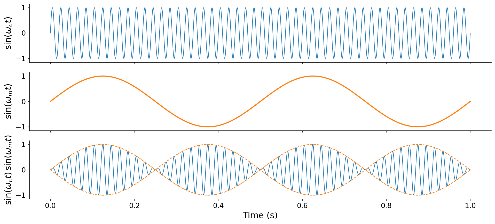
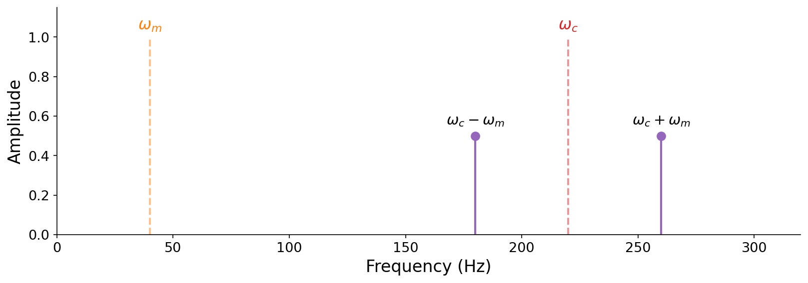
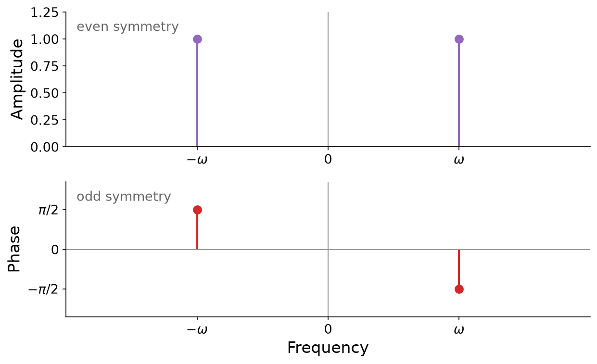
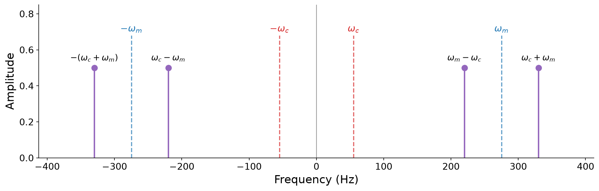
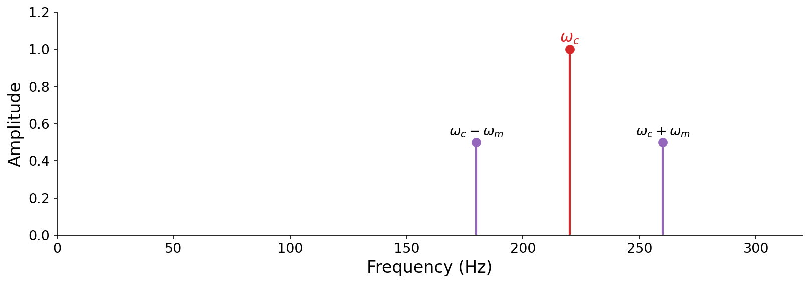
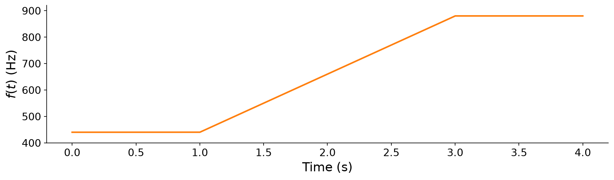
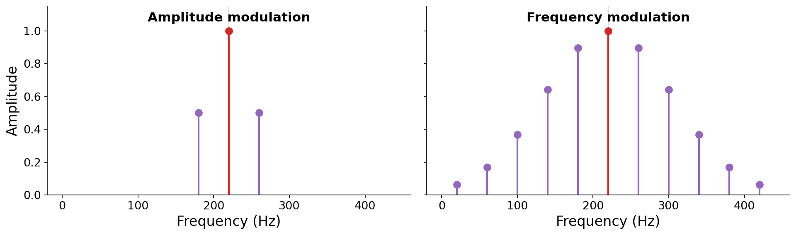

# Modulation Synthesis

In this chapter we explore {vocab}`modulation synthesis`, a family of techniques for synthesizing richer and more dynamic musical sounds than the methods we have studied so far.

The word _modulation_ here means **affecting a property of one signal with another signal**. We have already seen this idea twice without naming it: multiplying a tone by an envelope ([Chapter 4](../04-score-timbre)) modulates its amplitude, and multiplying a signal by a complex sinusoid inside the Fourier transform ([Chapter 5](../05-frequency-domain)) modulates it to measure frequency content. Here, both of the signals involved will themselves be oscillating sinusoids.

When we studied additive synthesis ([Chapter 3](../03-additive-synthesis)), we saw that richer frequency-domain spectra ([Chapter 5](../05-frequency-domain)) give rise to more interesting musical material. Wavetable synthesis lets us synthesize rich _static_ spectra efficiently. But real musical sounds are not static. Their character changes _dynamically over time_, and often in a periodic fashion:

CLAUDE: there are supposed to be sound _and_ spectrograms for each here. Use pyquist plot_spec and see other chapters where sound and images are colocated in one figure
:::{audio}
[Cello with tremolo](./assets/audio-cello-tremolo.wav)

A cello note with _tremolo_: the amplitude of the sound pulses periodically over time. [358372](https://freesound.org/s/358372/) by MTG, License: [Attribution 3.0](http://creativecommons.org/licenses/by/3.0/).
:::

:::{audio}
[Guitar with vibrato](./assets/audio-guitar-vibrato.wav)

A guitar note with _vibrato_: the fundamental frequency itself wavers periodically over time. [52080](https://freesound.org/s/52080/) by guitarguy1985, License: [CC0 1.0](http://creativecommons.org/publicdomain/zero/1.0/).
:::

:::{audio}
[Trumpet](./assets/audio-trumpet.wav)

A trumpet note. The balance of harmonics shifts continuously as the note evolves, a much more intricate kind of change over time. [636487](https://freesound.org/s/636487/) by KhalDrogo12, License: [CC0 1.0](http://creativecommons.org/publicdomain/zero/1.0/).
:::

How would we synthesize these kinds of effects? When we studied the frequency domain, we learned that every sound has a unique recipe of frequency information. In principle, then, we could recreate any of these sounds by adding together a large number of sinusoids, each with its own time-varying amplitude. But this would be extraordinarily inefficient, potentially requiring hundreds of oscillators for a single note. **Modulation synthesis lets us emulate these complex dynamics with just a small number of oscillators.** We will build up from the simplest case (modulating amplitude) to the most powerful (modulating frequency).

## Ring modulation

Let us start with {vocab}`tremolo`, a musical performance technique that periodically varies the _amplitude_ of a note over time.

:::{audio}
[Cello with tremolo](./assets/audio-cello-tremolo.wav)

The cello tremolo again. Focus on the periodic swelling and fading of loudness.
:::

How might we synthesize this effect? In [Chapter 4](../04-score-timbre) we studied amplitude envelopes, where we multiplied a sustained tone by a piecewise-linear function to shape its loudness. Tremolo is similar, except that the amplitude change is _periodic_ over time rather than a one-shot attack and decay. This suggests an idea: to emulate tremolo, we can "envelope" a periodic sound with a second sinusoid that oscillates slowly. Multiplying two sinusoids in this way is called {vocab}`ring modulation`.

:::{prf:definition} Ring modulation
:label: def-ring-modulation
Given a {vocab}`carrier frequency` $\omega_c$ and a {vocab}`modulating frequency` $\omega_m$, _ring modulation_ is the product of two sinusoids at those frequencies:

$$\text{RingMod}(t) = \sin(\omega_c t) \cdot \sin(\omega_m t).$$
:::

:::{margin}
Ring modulation takes its name from its original analog implementation, in which the circuit that multiplied the two signals was built from a _ring_ of four diodes.
:::

When the modulating frequency is low (below roughly 10 Hz), we perceive the result exactly as tremolo: a tone at the carrier frequency whose loudness pulses at the modulating rate. The following figure shows why. The fast carrier is shaped by the slow modulator, so the modulator traces out an amplitude envelope around the carrier:

:::{figure}


CLAUDE: the final subfigure here should have the carrier as the same color (blue) as first subfigure, not green

Ring modulation in the time domain. The fast carrier $\sin(\omega_c t)$ (top) is multiplied by the slow modulator $\sin(\omega_m t)$ (middle). In the product (bottom), the modulator acts as an envelope (dashed), pinching the amplitude to zero and swelling it back four times per second (twice per modulator cycle).
:::

Listen to ring modulation at a few carrier and modulating frequencies. Each is a pure carrier tone with a slow tremolo:

:::{audio-list}
{audio}`Carrier 220 Hz, modulator 1 Hz <./assets/audio-rm-220x1.wav>`

{audio}`Carrier 220 Hz, modulator 2 Hz <./assets/audio-rm-220x2.wav>`

{audio}`Carrier 330 Hz, modulator 1 Hz <./assets/audio-rm-330x1.wav>`

{audio}`Carrier 330 Hz, modulator 2 Hz <./assets/audio-rm-330x2.wav>`

Ring modulation with slow modulators. The carrier sets the pitch, the modulator sets the tremolo rate. Note that the amplitude pulses at _twice_ the modulating frequency, since the envelope is $|\sin(\omega_m t)|$.
:::

CLAUDE: Need explanation here of number of "perceived" pulses for ring modulation. A modulation frequency of 1 Hz is perceived as _2_ pulses per second, because ...

By replacing the pure carrier sinusoid with a more complex sound, ring modulation becomes a general-purpose audio _effect_ that adds tremolo to any input. The modulator simply multiplies whatever signal we feed in.

CLAUDE: what happened to the example sound you were supposed to make here? sourcing from https://freesound.org/people/Tristan/sounds/19460 . see OUTLINE

Ring modulation is an intuitive way to add tremolo, and its time-domain mechanics are clear. But something more subtle is happening in the frequency domain. To see it, let us listen to what happens next as we steadily _increase_ the modulating frequency.

## Sidebands

Here is a fixed carrier at 240 Hz ring-modulated by a modulator whose frequency climbs from 6 Hz to 48 Hz:

:::{audio-list}
CLAUDE: Add 3 Hz here as well

{audio}`Modulator 6 Hz <./assets/audio-rm-240x6.wav>`

{audio}`Modulator 12 Hz <./assets/audio-rm-240x12.wav>`

{audio}`Modulator 24 Hz <./assets/audio-rm-240x24.wav>`

{audio}`Modulator 48 Hz <./assets/audio-rm-240x48.wav>`

A fixed 240 Hz carrier, ring-modulated at increasing rates.
:::

An interesting perceptual shift emerges. At 3 Hz we clearly hear a _single_ tone with fast tremolo. But by 48 Hz, we no longer hear tremolo at all. Instead we hear _two distinct tones_. Why does modulating a single frequency produce what sounds like multiple frequencies?

The answer is that ring modulation has a striking effect in the frequency domain. From two "input" sinusoids at frequencies $\omega_c$ and $\omega_m$, it produces two _completely different_ "output" sinusoids, at the sum and difference frequencies $\omega_c + \omega_m$ and $\omega_c - \omega_m$. The original input frequencies vanish from the spectrum entirely. These new frequencies are called {vocab}`sidebands`, a general term for the frequency content that modulation creates on either side of a carrier. We will see sidebands emerge from _every_ modulation technique in this chapter.

This behavior follows directly from a trigonometric identity. Recall the angle-sum and angle-difference identities for cosine:

$$
\begin{aligned}
\cos(A + B) &= \cos A \cos B - \sin A \sin B, \\
\cos(A - B) &= \cos A \cos B + \sin A \sin B.
\end{aligned}
$$

Subtracting the first from the second cancels the cosine terms and leaves $\cos(A - B) - \cos(A + B) = 2 \sin A \sin B$. Rearranging gives a _product-to-sum_ identity that turns a product of sines into a sum:

$$\sin A \sin B = \tfrac{1}{2}\big[\cos(A - B) - \cos(A + B)\big].$$

Substituting $A = \omega_c t$ and $B = \omega_m t$, we can rewrite ring modulation as a _sum_ of two sinusoids:

$$\sin(\omega_c t)\,\sin(\omega_m t) = \tfrac{1}{2}\cos\big((\omega_c - \omega_m)\,t\big) - \tfrac{1}{2}\cos\big((\omega_c + \omega_m)\,t\big).$$

There they are: two sinusoids, at $\omega_c - \omega_m$ and $\omega_c + \omega_m$, each with amplitude $\tfrac{1}{2}$. The carrier and modulator frequencies themselves are nowhere to be found.

:::{figure}


CLAUDE: \omega_m should be blue, \omega_c should be red, and sidebands should be purple. change y-ticks to {1/2, 1} w/ a horizontal dashed like for each

The frequency-domain view of ring modulation. The input frequencies $\omega_m$ and $\omega_c$ (dashed) disappear, replaced by two sidebands at $\omega_c - \omega_m$ and $\omega_c + \omega_m$ (solid), each with amplitude $\tfrac{1}{2}$.
:::

:::{note}
The minus sign on the upper sideband, $-\tfrac{1}{2}\cos((\omega_c + \omega_m)t)$, does not change its _amplitude_. Since $-\cos(\theta) = \cos(\theta + \pi)$, the sign is just a phase shift of $\pi$ radians, which we cannot hear. Both sidebands have amplitude $\tfrac{1}{2}$ in the amplitude spectrum. We will return to this connection between signs and phase in a moment.
:::

CLAUDE: change numbers to 3 Hz example

This explains the perceptual shift we heard. When $\omega_m$ is small, the two sidebands $\omega_c \pm \omega_m$ sit very close together (for the 6 Hz example, at 234 and 246 Hz), and our ear fuses them into a single tone that seems to beat, or pulse. As $\omega_m$ grows, the sidebands spread apart (for the 48 Hz example, to 192 and 288 Hz), far enough that our ear resolves them as two separate tones. The underlying mathematics are the same in both cases, but our perception differs! Past a certain threshold of modulation frequency, our perception shifts from tremolo to _polyphony_.

## Negative frequencies

The sideband picture raises a subtle puzzle. Ring modulation is a product of two sinusoids, and multiplication is commutative, so $\sin(\omega_c t)\,\sin(\omega_m t)$ and $\sin(\omega_m t)\,\sin(\omega_c t)$ must be the exact same signal. Yet if we apply our product-to-sum identity to each, the first gives sidebands at $\omega_c \pm \omega_m$, while the second gives sidebands at $\omega_m \pm \omega_c$. The sum frequencies agree ($\omega_c + \omega_m = \omega_m + \omega_c$), but the difference frequencies do not: in general, $\omega_c - \omega_m \neq \omega_m - \omega_c$. How can the same signal have two different spectra?

CLAUDE: This paragraph doesn't logically follow. This is not the "resolution" to the conundrum above. This is a different perspective on the same issue.
The resolution is that our examples so far quietly assumed $\omega_m < \omega_c$, so that the lower sideband $\omega_c - \omega_m$ came out positive. But nothing stops us from choosing $\omega_m > \omega_c$, and then **the lower sideband $\omega_c - \omega_m$ is a _negative_ frequency**.

CLAUDE: Chapter 5 is the wrong pedagogical reference to past material. Yes it's true, but students are likely to not understand complex sinusoids at a super intuitive level yet. Instead, if we have to evoke a previous section, we should evoke our previous discussion of phase in 3.1, connecting to students pre-existing knowledge of trig identities.
This is the first time we have _explicitly_ confronted negative frequencies, but it is not the first time they have been present. Recall from [Chapter 5](../05-frequency-domain) that a real cosine can be built from two counter-rotating phasors, one spinning at $+\omega$ and one at $-\omega$. Every real sinusoid secretly contains both a positive and a negative frequency. Negative frequencies have been lurking in every sound we have studied.

What does a negative frequency _sound_ like? Exactly like its positive counterpart. This follows from the symmetry of the sinusoids. Cosine is an _even_ function and sine is an _odd_ function:

$$\cos(-\omega t) = \cos(\omega t), \qquad \sin(-\omega t) = -\sin(\omega t) = \sin(\omega t + \pi).$$

A negative-frequency cosine is _identical_ to its positive twin. A negative-frequency sine equals its positive twin flipped in sign, which is just a phase shift of $\pi$. Either way, the difference is at most a phase shift, and our ears are insensitive to absolute phase. We can confirm this by ear with a cosine at 220 Hz and one at -220 Hz:

:::{audio-list}
{audio}`Cosine at 220 Hz <./assets/audio-cos-pos220.wav>`

{audio}`Cosine at -220 Hz <./assets/audio-cos-neg220.wav>`

CLAUDE: These should be both audibly _and_ mathematically identical, yes?
A positive and a negative frequency that are audibly identical. Unlike the "imaginary" analytical tools of Chapter 5, negative frequencies are an audible, physical reality of sound.
:::

We can package this symmetry in terms of the amplitude and phase spectra from [Chapter 5](../05-frequency-domain). Because a negative frequency carries the same amplitude as its positive twin but the opposite phase, the amplitude spectrum of any real signal is **even** (symmetric about zero), and the phase spectrum is **odd** (antisymmetric):

$$|X(-\omega)| = |X(\omega)|, \qquad \angle X(-\omega) = -\angle X(\omega).$$

:::{figure}


CLAUDE: reduce the whitespace here a little. make the frequency \omega a bit closer to the origin

The spectra of a real sinusoid are symmetric about zero frequency. The amplitude spectrum (top) is even, and the phase spectrum (bottom) is odd. This is why every positive frequency is mirrored by a negative one.
:::

The high-level insight here: **any negative frequency can be interpreted as a phase-shifted positive frequency.** Phase shifts and negative frequencies are two sides of the same coin. This is not just an analytical concept like the imaginary unit $j$. It is a real, audible and mathematical phenomenon, and it will have important consequences when we study sampling theory in the [next chapter](../07-sampling-theory).

Now we can resolve the puzzle. When $\omega_m > \omega_c$, the difference sideband $\omega_c - \omega_m$ is negative, but by even symmetry it shows up in the amplitude spectrum at $|\omega_c - \omega_m| = \omega_m - \omega_c$, which is exactly the sideband the commuted expression predicted. The two derivations agree after all. Accounting for the negative frequencies that are always present, ring modulation really produces _four_ sidebands, symmetric about zero:

$$\{\,-(\omega_c + \omega_m),\; \omega_c - \omega_m,\; \omega_m - \omega_c,\; \omega_c + \omega_m\,\}.$$

:::{figure}


CLAUDE: Include w_c and w_m in this figure as well as dashed lines

The full spectrum of ring modulation, including negative frequencies, for a case where $\omega_m > \omega_c$. The four sidebands are symmetric about zero. The two positive-frequency sidebands are what we hear.
:::

Because the amplitude spectrum is symmetric, we can freely swap $\omega_c$ and $\omega_m$ with no audible change, which finally makes the commutativity of multiplication consistent with the frequency-domain picture.

## Amplitude modulation

Our original goal with ring modulation was simply to add a tremolo envelope. But in doing so, we accidentally _removed the carrier itself_ from the spectrum, replacing it with two sidebands. What if we want the tremolo effect while _keeping_ the original carrier tone?

The fix is intuitive: just add the carrier back in. Starting from ring modulation and adding an unmodulated copy of the carrier gives $\sin(\omega_c t) + \sin(\omega_c t)\,\sin(\omega_m t)$, which we can factor into a cleaner form that also conveniently reduces the number of sinusoids needed for computation. This is {vocab}`amplitude modulation`.

:::{prf:definition} Amplitude modulation
:label: def-amplitude-modulation
_Amplitude modulation_ (AM) multiplies a carrier by a modulator that oscillates around a nonzero average:

$$\text{AmpMod}(t) = \sin(\omega_c t)\,\big[1 + \sin(\omega_m t)\big].$$
:::

Expanding the product shows what AM does in the frequency domain. It is just ring modulation plus the original carrier:

$$\sin(\omega_c t)\big[1 + \sin(\omega_m t)\big] = \underbrace{\sin(\omega_c t)}_{\text{carrier}} + \underbrace{\sin(\omega_c t)\sin(\omega_m t)}_{\text{sidebands}}.$$

So the spectrum retains the carrier at $\omega_c$ with amplitude 1, and adds the two ring-modulation sidebands at $\omega_c \pm \omega_m$, each with amplitude $\tfrac{1}{2}$:

:::{figure}


CLAUDE: Same comment w/ this plot for y-ticks

The spectrum of amplitude modulation. Unlike ring modulation, the carrier at $\omega_c$ survives (amplitude 1), flanked by the two sidebands at $\omega_c \pm \omega_m$ (amplitude $\tfrac{1}{2}$).
:::

:::{audio}
[Amplitude modulation, carrier 220 Hz, modulator 55 Hz](./assets/audio-am-220x55.wav)

Amplitude modulation. Because the modulator is in the audible range, we hear the carrier at 220 Hz together with its two sidebands, rather than a tremolo.
:::

We can control the balance between the carrier and its sidebands with a ratio parameter $r$:

$$\text{AmpMod}(t) = \sin(\omega_c t)\,\Big[\tfrac{r}{2} + \sin(\omega_m t)\Big],$$

where $r$ is the ratio of the carrier's amplitude to each sideband's amplitude. Setting $r = 2$ recovers the definition above where the amplitude of $\omega_c$ is twice that of the sidebands. By carefully choosing $\omega_c$, $\omega_m$, and $r$, amplitude modulation can even be used to design specific harmonic spectra, an idea we will develop in the exercises.

## Modulating frequency over time

The modulation techniques so far all center on modulating _amplitude_ over time. They have interesting side effects in the frequency domain, but what if we want to modulate _frequency_ in a more direct way? For example, how would we synthesize {vocab}`vibrato`, where a performer wavers the fundamental frequency of their sound over time?

:::{audio}
[Guitar with vibrato](./assets/audio-guitar-vibrato.wav)

The guitar vibrato from the introduction. The pitch itself wavers periodically.
:::

Let us revisit the basic sinusoid from [Chapter 3](../03-additive-synthesis), taking unit amplitude and zero initial phase for simplicity:

$$x(t) = \sin(\omega t),$$

with angular frequency $\omega = 2\pi f$ in ${unit}`radians,second`$.

:::{tip}
As always, if you feel rusty with angular frequency, revisit [Chapter 3](../03-additive-synthesis). We work in angular frequency $\omega$ here to keep the expressions compact.
:::

To get vibrato, we want the frequency $\omega$ to change over time, so we replace the constant $\omega$ with a function $\omega(t)$. The tempting first attempt is to substitute it directly into the formula:

CLAUDE: samples should always be $x[n]$, not $x[i]$
$$x(t) = \sin\big(\omega(t)\cdot t\big) \quad \longrightarrow \quad x[i] = \sin\big(\omega[i]\cdot i \,\Delta t\big),$$

where $\Delta t = 1/f_s$ is the sample period. **This is wrong.** To hear why, let us drive it with a frequency that ramps from 440 Hz up to 880 Hz:

:::{figure}


A time-varying frequency control signal $f(t)$: 440 Hz held, ramped up to 880 Hz, then held. We will use it to drive both the wrong and the correct time-varying oscillators.
:::

:::{audio-list}
{audio}`The wrong way <./assets/audio-timevar-wrong.wav>`

{audio}`The correct way <./assets/audio-timevar-right.wav>`

The same frequency ramp, synthesized two ways. The wrong way has two discontinuous jumps in frequency at the start and end of the ramp up, while the right way ramps smoothly from 440 Hz to 880 Hz.
:::

Why does the naive version fail so badly? The problem is that $\sin(\omega(t)\cdot t)$ confuses _frequency_ with _phase_. The argument to $\sin$ should be the accumulated _instantaneous phase_, the total number of radians the oscillator has swept out so far. When $\omega$ is constant, that accumulation is exactly $\omega t$. But when $\omega$ changes over time, multiplying the _current_ frequency by the _total_ elapsed time erases history. It retroactively pretends the oscillator was always running at its current frequency.

The fix is to recognize that frequency is a _rate of change_ of phase, so to recover phase we must _accumulate_ (integrate) frequency over time. In continuous terms, we rewrite the basic sinusoid with an integral:

$$x(t) = \sin\!\left(\int_0^t \omega(\tau)\, d\tau\right).$$

:::{note}
Do not be alarmed by the integral sign. As we noted in [Chapter 5](../05-frequency-domain), working out closed-form integrals is not a focus of this book. Read the integral at a high level: it simply **sums up how much phase has elapsed** up to time $t$. When $\omega(\tau) = \omega$ is constant, the area under a flat line from $0$ to $t$ is just $\omega t$, recovering the familiar $\sin(\omega t)$. That equivalence is exactly why we "got away with" the simple form for constant-frequency tones.
:::

CLAUDE: Need smoother transition, decoupling (and mentioning) riemann sum first, and then talking about recursive efficient implementation. Use another $\longrightarrow$ conversion from integral to discrete here like above, before explaining the more efficient recurisve implementation

On a computer, we approximate the integral with a running sum. Each sample, we advance the phase by the amount that accrues over one sample period, $\omega[i]\,\Delta t$, and add it to a running total:

CLAUDE: same comment, always use n instead of x
$$\theta[i] = \theta[i-1] + \omega[i]\,\Delta t, \qquad x[i] = \sin(\theta[i]).$$

This is the same _accumulate-a-running-total_ trick that turns an $O(N^2)$ chain of sums into an $O(N)$ computation. In code, it is a short loop that carries the phase forward:

CLAUDE: I don't think we want to use `hzosc` here (nyquist relic), maybe just `osc`? go back to chapter 1 to see prior naming conventions

```python
def hzosc(freq: np.ndarray, f_s: int = 44100) -> pq.Audio:
    theta = 0.0
    x = np.zeros(len(freq), dtype=np.float32)
    for i in range(len(freq)):
        theta += 2 * np.pi * freq[i] / f_s   # accumulate phase
        x[i] = np.sin(theta)
    return pq.Audio(x, f_s)
```

The full runnable comparison of the wrong and correct oscillators, including a vectorized `np.cumsum` version, is in [code/modulation.py](./code/modulation.py). With a correct time-varying oscillator in hand, vibrato is just a matter of choosing $\omega(\tau)$ to waver gently around a center frequency. That choice is the gateway to frequency modulation.

## Frequency modulation

Vibrato wavers frequency slowly, by a few Hz. But what happens if we modulate the frequency _quickly_, at audio rates? The answer is {vocab}`frequency modulation` (FM) synthesis, one of the most important discoveries in the history of computer music. FM can conjure extraordinarily rich, evolving spectra from just two oscillators, which made it both musically striking and cheap enough to run on 1980s hardware.

The classic definition of FM looks like this:

$$\text{FreqMod}(t) = \sin\!\left(2\pi f_c t + \frac{D}{f_m}\sin(2\pi f_m t)\right).$$

This has roughly the shape we might expect for an implementation of vibrato: two sinusoids, with one nested inside the other. But it raises questions. Why does the modulating sinusoid appear to modulate the carrier's _phase_ rather than its frequency? And what happened to the integral from the previous section? To answer these questions, let us derive the formula from first principles using our time-varying oscillator.

We begin with the basic sinusoid with time-varying frequency, for which we now have a correct implementation:

$$\text{FreqMod}(t) = \sin\!\left(\int_0^t \omega(\tau)\, d\tau\right).$$

Now we design a time-varying frequency inspired by vibrato: a carrier frequency $f_c$ that wavers up and down by a {vocab}`depth` $D$ (in Hz) at a modulating frequency $f_m$:

$$\omega(\tau) = 2\pi\big[f_c + D\sin(2\pi f_m \tau)\big].$$

Substituting and integrating, the constant carrier term contributes $2\pi f_c t$, and the modulating term integrates from a sine into a cosine:

$$\int_0^t \omega(\tau)\, d\tau = 2\pi f_c t - \frac{D}{f_m}\cos(2\pi f_m t) + \frac{D}{f_m}.$$

The final $+\tfrac{D}{f_m}$ is a constant phase offset, which we cannot hear, so we drop it. The remaining $-\tfrac{D}{f_m}\cos(2\pi f_m t)$ is a cosine, but $-\cos(\theta) = \sin(\theta - \tfrac{\pi}{2})$, so it is just a sine with a phase offset that we also cannot hear. Replacing it with a plain sine yields the classic formula:

$$\text{FreqMod}(t) = \sin\!\left(2\pi f_c t + \frac{D}{f_m}\sin(2\pi f_m t)\right).$$

This answers our questions. The integral is still there, it has simply been _evaluated_ in closed form, which is why it disappears from the final expression. And the modulator appears to modulate phase because integrating a frequency gives a phase. The two views, modulating frequency and modulating phase, are equivalent up to the integral.

:::{audio}
[Vibrato via FM](./assets/audio-fm-vibrato.wav)

A gentle FM tone: carrier 440 Hz, modulator 6 Hz, small depth. With a slow, shallow modulator, FM is simply vibrato.
:::

## FM sidebands

Vibrato is FM with a slow, shallow modulator. But the real power of FM appears when the modulator runs at audio rates. Recall the trumpet from the introduction, whose harmonics shift in balance continuously over time. Reproducing that with additive synthesis would demand many oscillators, each with its own time-varying amplitude. FM offers a wildly more efficient route.

Just as with ring and amplitude modulation, FM produces sidebands. But where those techniques produced only two, FM produces a _theoretically infinite_ series of sidebands, spaced evenly around the carrier at

$$f_c \pm k \cdot f_m, \qquad k \in \mathbb{Z}^+.$$

This is the key to FM's efficiency. **Two oscillators can generate an arbitrarily rich spectrum.** The following figure shows the finite (three-line) spectrum of amplitude modulation with the infinite (many-line) spectrum of frequency modulation:

:::{figure}


Amplitude modulation (left) creates just two sidebands, while frequency modulation (right) creates an entire series of sidebands at $f_c \pm k f_m$. The FM spectrum shown is schematic. The next figure measures the real thing.
:::

Two parameters shape the FM spectrum. First, **the ratio $f_c / f_m$ determines the harmonicity** of the result. When $f_c / f_m$ is a simple rational number, the sidebands land on integer multiples of a common fundamental, producing a _harmonic_, pitched tone. When the ratio is irrational, the sidebands are inharmonic, producing bell-like or metallic timbres.

:::{audio}
[An inharmonic FM tone](./assets/audio-fm-bell.wav)

CLAUDE: Add corresponding harmonic example, and also include the parameters of each in the caption.

An FM tone with an inharmonic carrier-to-modulator ratio, giving a bell-like timbre.
:::

Second, **the number of _audible_ sidebands is controlled by the {vocab}`index of modulation`**

$$I = \frac{D}{f_m}.$$

As $I$ grows, energy spreads from the carrier out into more and more sidebands, and the tone brightens. A useful rule of thumb is that roughly $I + 1$ sidebands are audible on each side of the carrier. The following figure measures the actual FM spectrum (via the Fourier transform) as the index of modulation increases:

:::{figure}


The measured spectrum of an FM tone ($f_c = 440$ Hz, $f_m = 110$ Hz) as the index of modulation $I$ increases. At $I = 0$ there is only the carrier. As $I$ grows, sidebands appear at $f_c + k f_m$ and energy spreads outward, roughly $I + 1$ sidebands to a side.
:::

:::{audio-list}
{audio}`Index of modulation 1 <./assets/audio-fm-I1.wav>`

{audio}`Index of modulation 2 <./assets/audio-fm-I2.wav>`

{audio}`Index of modulation 4 <./assets/audio-fm-I4.wav>`

The same carrier and modulator ($f_c = 440$ Hz, $f_m = 110$ Hz) at increasing index of modulation. The tone grows brighter and richer as more sidebands become audible.
:::

The exact amplitudes of the FM sidebands are given by mathematical functions (Bessel functions) whose derivation is beyond the scope of this book. What matters here is the qualitative picture: **by carefully controlling $f_c$, $f_m$, and especially the index of modulation $I$ over the duration of a note, we can emulate sophisticated, evolving instrumental spectra with just two oscillators.** This is exactly how the FM synthesizers of the 1980s produced their signature sounds that were our source of inspiration in CLAUDE: ref to ch0.

## Implementing FM

The integrated FM formula, $\sin(2\pi f_c t + \tfrac{D}{f_m}\sin(2\pi f_m t))$, is easy to compute directly. But there is a more flexible and more general way to implement FM that connects the pieces we have built in this book:

1. In the previous sections we built a correct **time-varying oscillator** that accumulates phase, `hzosc(freq)`.
1. In [Chapter 3](../03-additive-synthesis) we built **wavetable synthesis** to make oscillators cheap.
1. FM is just a time-varying oscillator whose frequency signal happens to be _another oscillator_.

Combining these, we can write a general FM oscillator whose modulating signal can be **any sound at all**, not just a single sinusoid. This is far more expressive than the closed-form equation: the modulator can be a chord, a noise source, or even a recorded sample. The interactive example below lets you explore FM by editing the carrier frequency, modulating frequency, and index of modulation, then listening to and plotting the result. Try to reproduce a bright harmonic tone, then an inharmonic bell.

:::{interactive}[notebooks/frequency-modulation.ipynb]
:::

## Summary

- {vocab}`Modulation synthesis` affects a property of one signal (the carrier) with another (the modulator), letting us emulate rich, time-varying spectra with only a couple of oscillators.
- {vocab}`Ring modulation`, $\sin(\omega_c t)\sin(\omega_m t)$, multiplies two sinusoids. A product-to-sum identity shows it produces two {vocab}`sidebands` at $\omega_c \pm \omega_m$, each with amplitude $\tfrac12$. The original carrier and modulator frequencies disappear. Slow modulation is heard as tremolo, fast modulation as two separate tones.
- Every real sinusoid contains both a positive and a **negative frequency**. A negative frequency is audibly identical to a phase-shifted positive frequency. This makes the amplitude spectrum even and the phase spectrum odd, and it explains ring modulation's four symmetric sidebands.
- {vocab}`Amplitude modulation`, $\sin(\omega_c t)[1 + \sin(\omega_m t)]$, is ring modulation plus the carrier, so it keeps the carrier at $\omega_c$ alongside the two sidebands.
- A frequency that varies over time must be **integrated** (accumulated) into phase before being passed to $\sin$. Substituting $\omega(t)$ directly into $\sin(\omega t)$ is incorrect. The phase-accumulation recurrence $\theta[i] = \theta[i-1] + \omega[i]\Delta t$ implements this in $O(N)$.
- {vocab}`Frequency modulation`, $\sin(2\pi f_c t + \tfrac{D}{f_m}\sin(2\pi f_m t))$, follows from integrating a sinusoidally-varying frequency. It creates an infinite series of sidebands at $f_c + k f_m$. The ratio $f_c/f_m$ sets harmonicity, and the {vocab}`index of modulation` $I = D/f_m$ sets the number of audible sidebands (about $I + 1$ per side).

## Questions for the reader

:::{exercise}
**Ring-modulation sidebands.** Consider the ring-modulated signal $\cos(440\pi t) \cdot \sin(8\pi t)$. Identify the carrier and modulating frequencies in Hz. Then list the frequencies of _all_ of the sidebands it produces, remembering to include negative frequencies. Which sidebands would you actually hear, and at what frequencies?
:::

:::{exercise}
**Tremolo or two tones?** A 300 Hz carrier is ring-modulated by a modulator at frequency $f_m$. For which of $f_m = 3$ Hz, $f_m = 40$ Hz, and $f_m = 150$ Hz would you expect to hear a single tone with tremolo, and for which would you expect to hear two distinct tones? Justify your answer in terms of the sideband frequencies.
:::

:::{exercise}
**Designing a harmonic spectrum with AM.** Amplitude modulation can be used to build specific harmonic spectra. Show that the signal $\sin(2\omega_c t)\big[\tfrac{1}{2} + \sin(\omega_c t)\big]$ produces components at $\omega_c$, $2\omega_c$, and $3\omega_c$, all with equal amplitude. (Hint: expand the product and apply the product-to-sum identity, treating $2\omega_c$ as the carrier and $\omega_c$ as the modulator.)
:::

:::{exercise}
**Negative frequencies and phase.** A sine tone is written as $\sin(-660 \pi t)$. Rewrite it as a positive-frequency sinusoid, stating both its frequency in Hz and any phase shift. Would it sound any different from $\sin(660\pi t)$? Why or why not?
:::

:::{exercise}
**Why integrate?** A student implements a "siren" by evaluating $\sin(\omega(t)\cdot t)$ directly, where $\omega(t)$ sweeps linearly from a low to a high frequency. Explain conceptually why the resulting sound will not match the intended frequency sweep, and describe what must be computed instead.
:::

:::{exercise}
**FM parameters.** An FM tone has carrier frequency $f_c = 300$ Hz, modulating frequency $f_m = 100$ Hz, and depth $D = 400$ Hz. What is the index of modulation $I$? At which frequencies do the first three sidebands on each side of the carrier appear? Roughly how many sidebands per side would you expect to be audible? Is the resulting tone harmonic or inharmonic, and why?
:::

## Musical examples

- John Chowning - _Stria_ (1977): a landmark FM composition by the inventor of FM synthesis, whose pitches and timbres are both derived from the same set of frequency ratios.
- SND - _Atavism_ (2009): the duo Mark Fell and Mat Steel build a minimal electronic aesthetic around FM synthesis and algorithmic composition.
- Karlheinz Stockhausen - _Mantra_ (1970): a work for two pianos whose sound is transformed live by ring modulation, one of the most prominent uses of the technique in concert music.
