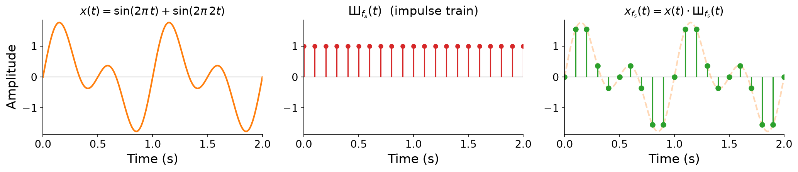
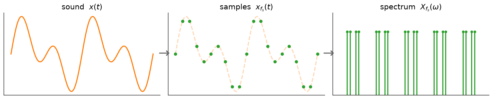
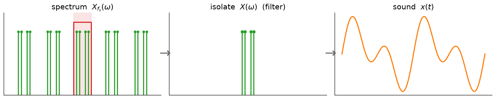
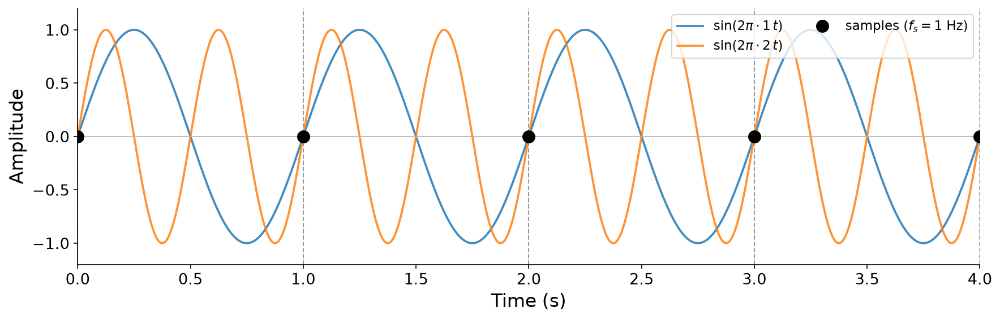
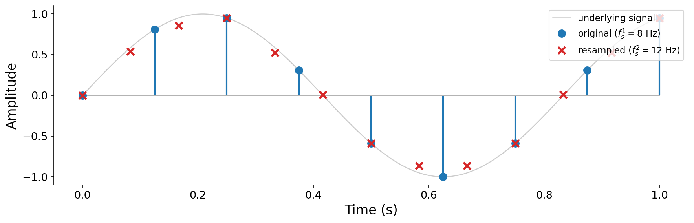

# Sampling Theory

In this chapter we seek a deeper understanding of the theory behind digital audio sampling, and its practical consequences. Back in {ref}`Chapter 1 <sec-sampling>`, we converted analog sound to digital audio in the _time domain_, through sampling and quantization. Since then we have gained crucial context about the _frequency domain_: in {ref}`Chapter 5 <sec-fourier-transform>` we developed the Fourier transform, and in {ref}`Chapter 6 <sec-negative-frequencies>` we uncovered the negative frequencies that lurk behind every positive one.

Armed with these tools, we can now study sampling from the perspective of the frequency domain. Our goal is to understand the _theory of sampling_ well enough to make principled choices about how to sample for a given audio application. Along the way we will answer three questions:

1. What, if anything, do we lose when we sample a sound?
1. Can we sample in a way that permits _perfect reconstruction_ of the original sound?
1. What sample rates and bit depths should we actually use?

(sec-sampling-and-frequency)=
## Sampling and the frequency domain

Let us briefly revisit sampling from {ref}`Chapter 1 <sec-sampling>`, setting quantization aside for now. To sample a continuous signal $x(t)$, we record its value at evenly spaced instants, at a {vocab}`sampling rate` of $f_s$ ${unit}`samples,second`$. The result is a sequence of samples

$$x[n] = x(n / f_s),$$

so that recording $T$ seconds of audio produces a vector $\mathbf{x} \in \mathbb{R}^{T \cdot f_s}$. That is the time-domain story. To bring in the frequency domain, we first need to look at the sampling operation from a slightly different angle.

### Sampling as multiplication

Here is a subtly different way to think about sampling. Instead of "reading off" values on a grid, imagine _multiplying_ the continuous signal $x(t)$ by a peculiar function that is 1 exactly on the sampling grid and 0 everywhere else. This function is called an {vocab}`impulse train`:

:::{margin}
The impulse train goes by many names, including the _Dirac comb_ and the _sampling function_. It is often written with the Cyrillic letter Ш ("sha"), whose shape evokes its comb-like graph.
:::

$$
\text{Ш}_{f_s}(t) = \begin{cases} 1 & \text{if } t \cdot f_s \in \mathbb{Z}, \\ 0 & \text{otherwise.} \end{cases}
$$

Multiplying our signal by this comb zeroes out everything between the sampling instants, while preserving the signal's value exactly at each instant $t = n/f_s$. In other words, sampling is multiplication by an impulse train:

$$x_{f_s}(t) = x(t) \cdot \text{Ш}_{f_s}(t).$$

The figure below shows this in the time domain, using the running example $x(t) = \sin(2\pi t) + \sin(2\pi 2 t)$. The continuous signal (left) is multiplied by an impulse train (middle) to produce a sampled signal (right) that is nonzero only on the grid.

:::{figure}


Sampling as multiplication in the time domain. The running example $x(t)$ (a sum of a 1 Hz and a 2 Hz sinusoid) is multiplied by the impulse train $\text{Ш}_{f_s}(t)$ to give the sampled signal $x_{f_s}(t) = x(t)\cdot\text{Ш}_{f_s}(t)$.
:::

### The frequency-domain view of sampling

Why bother reframing sampling as a multiplication? Because it lets us apply the Fourier transform. Recall from {ref}`Chapter 5 <sec-fourier-transform>` that the Fourier transform associates any time-domain signal $x(t)$ with a _unique_ frequency-domain representation $X(\omega)$. Crucially, **the Fourier transform makes no assumption that $x(t)$ is continuous or smooth**. It only requires that the signal be defined across all of $\mathbb{R}$. Our sampled signal $x_{f_s}(t)$, spiky and discontinuous as it is, still has a perfectly well-defined Fourier transform.

So what is the spectrum of the sampled signal? The bottom row of the figure below shows the answer, and it is striking. Multiplying by the impulse train in the time domain has the effect of **copying the original spectrum $X(\omega)$ around every integer multiple of the sampling rate $f_s$**. Where the original signal had frequency content only near zero, the sampled signal has infinitely many copies of that content, evenly spaced at $0, \pm f_s, \pm 2f_s, \ldots$

:::{figure}


Sampling as multiplication, viewed in both domains. Top (time): the running example $x(t)$ times the impulse train $\text{Ш}_{f_s}(t)$ gives the samples $x_{f_s}(t)$. Bottom (frequency): the spectrum $|X(\omega)|$ (spikes at $\pm 1$ and $\pm 2$ Hz) is _replicated_ around every integer multiple of $f_s$, producing $|X_{f_s}(\omega)|$. (All spectral amplitudes are drawn at 1 for clarity.)
:::

:::{prf:definition} Frequency-domain consequence of sampling
:label: def-sampling-copies
Sampling a signal at rate $f_s$ replicates its spectrum at every integer multiple of $f_s$. If $x(t)$ has spectrum $X(\omega)$, then the sampled signal $x_{f_s}(t)$ has spectrum

$$X_{f_s}(\omega) = \sum_{k=-\infty}^{\infty} X(\omega - k f_s).$$
:::

:::{note}
Why does multiplication in time produce _copies_ in frequency? Multiplying two signals in the time domain corresponds to an operation called _convolution_ in the frequency domain, and convolving a spectrum with a comb of spikes slides a copy of the spectrum to each spike. We will study convolution properly when we cover filtering in [Chapter 9](../09-filters). For now, the key takeaway is just the _result_: sampling creates infinitely many copies of the spectrum, spaced $f_s$ apart.
:::

### What this means in practice

We can now view the whole analog-to-digital and digital-to-analog pipeline in terms of the frequency domain. Analog-to-digital conversion (ADC) takes a continuous sound $x(t)$, multiplies it by an impulse train to produce samples $x_{f_s}(t)$, whose spectrum $X_{f_s}(\omega)$ consists of the infinite copies we just described:

:::{figure}


Analog-to-digital conversion. The continuous sound $x(t)$ is sampled into $x_{f_s}(t)$, whose spectrum $X_{f_s}(\omega)$ is the original baseband replicated at every multiple of $f_s$.
:::

Digital-to-analog conversion (DAC) has to run this backwards. From the copied spectrum $X_{f_s}(\omega)$, it must isolate the original baseband $X(\omega)$ (using a filter to discard the copies), and from that reconstruct the original sound $x(t)$:

:::{figure}


Digital-to-analog conversion. A filter isolates the central baseband $X(\omega)$ from among the copies, discarding the rest, and the continuous sound $x(t)$ is reconstructed from it.
:::

This leads to a genuinely counterintuitive insight:

:::{important}
As long as we can perfectly **identify and isolate** the original spectrum $X(\omega)$ among the shifted copies in $X_{f_s}(\omega)$, we can **perfectly reconstruct** $x(t)$ from its samples alone.
:::

This should feel surprising. Sampling is obviously throwing information away. It records the signal at a handful of instants and discards everything in between. In fact, infinitely many _different_ continuous signals pass through the exact same samples. The figure below shows three sinusoids at 1, 2, and 4 Hz that all cross zero at every integer, so sampled at $f_s = 1$ Hz they yield identical (all-zero) samples:

:::{figure}


Three different continuous signals that share identical samples. At $f_s = 1$ Hz, all three sinusoids are sampled at their zero crossings, so from the samples alone we cannot tell them apart.
:::

Given that many signals share the same samples, perfect reconstruction can only work under the right conditions. Understanding exactly when we can isolate the original spectrum is the heart of sampling theory.

## The Nyquist-Shannon sampling theorem

The conditions for perfect reconstruction are captured by one of the most important results in all of digital signal processing.

:::{prf:theorem} Nyquist-Shannon sampling theorem
:label: thm-nyquist-shannon
If a signal $x(t)$ contains no frequency content above $f_{\max}$ Hz, then it can be _perfectly reconstructed_ from its samples $x[n] = x(n/f_s)$, provided that

$$f_s > 2 f_{\max}.$$
:::

:::{margin}
The theorem is named after Harry Nyquist and Claude Shannon, who developed these ideas in different contexts in 1928 and 1948 respectively. Nyquist is also the namesake of the `pyquist` library, and the [`nyquist` programming language](https://www.cs.cmu.edu/~music/nyquist/) designed by Roger Dannenberg (the original designer of this course).
:::

Once we fix a sampling rate $f_s$, the theorem gives special significance to the frequency $f_s / 2$. We call it the {vocab}`Nyquist frequency`: the highest frequency that can be unambiguously represented in a signal sampled at $f_s$.

We can build intuition for the theorem directly from the copied-spectrum picture. Suppose $x(t)$ is _bandlimited_, containing no frequencies above $f_{\max}$, so its spectrum occupies the band $[-f_{\max}, f_{\max}]$. We call this central, un-shifted copy of the spectrum the {vocab}`baseband`. Remember from {ref}`Chapter 6 <sec-negative-frequencies>` that a real signal's spectrum is symmetric, so the baseband includes both positive frequencies up to $f_{\max}$ _and_ their negative-frequency mirror images down to $-f_{\max}$. Sampling copies this baseband around every multiple of $f_s$, and whether the copies stay out of each other's way depends entirely on $f_s$:

:::{figure}


Why the factor of two. Top: when $f_s > 2f_{\max}$, the shifted copies stay clear of the baseband, which can then be cleanly isolated and the signal perfectly reconstructed. Bottom: when $f_s < 2f_{\max}$, adjacent copies overlap the baseband, corrupting it.
:::

The factor of two comes directly from those negative frequencies. Each copy occupies a full bandwidth of $f_s$, spanning $[-f_s/2, f_s/2]$, because it has to hold the baseband's positive content _and_ its negative-frequency mirror. For neighboring copies not to overlap, that entire width must fit, which requires $f_{\max} < f_s/2$, or equivalently $f_s > 2f_{\max}$. When this holds, there is a gap between the baseband and its neighbors. A digital-to-analog converter can then isolate the baseband with a filter, discard the copies, and recover $x(t)$ exactly. But when $f_s < 2 f_{\max}$, the copies overlap and bleed into the baseband. The original spectrum is now contaminated by intruding copies, and it can no longer be separated out. This overlap is the source of the distortion we turn to next.

The practical implication of Nyquist-Shannon is wonderfully convenient for digital audio: **sampling does not degrade the sound in any way, as long as we sample fast enough** ($f_s > 2 f_{\max}$). All of the "gaps" between samples are, in a precise sense, redundant.

## Aliasing

What happens when we sample too slowly? Return to the three sinusoids that shared identical samples. From the samples alone, a 1 Hz signal and a 4 Hz signal are indistinguishable. When we undersample, high frequencies masquerade as lower ones. This phenomenon is called {vocab}`aliasing`, and the impostor frequencies are called _aliases_.

Every frequency has infinitely many aliases, spaced $f_s$ apart. For a frequency $f$, its aliases are the set

$$\text{Alias}_f = \{\, f + k \cdot f_s \mid k \in \mathbb{Z} \,\},$$

all the frequencies that differ from $f$ by an integer multiple of the sampling rate. This is exactly the copied-spectrum picture: each true frequency shows up again at every multiple of $f_s$. These aliases are not merely hard to tell apart, they are mathematically identical: a tone at $f$ and a tone at any of its aliases produce the _exact same samples_. So when the samples are reconstructed, the signal necessarily comes back at the single alias that falls within the Nyquist band $[0, f_s/2]$. We can compute that apparent frequency directly:

:::{prf:definition} Aliased frequency
:label: def-aliased-frequency
When a frequency $f$ is sampled at rate $f_s$, its apparent (aliased) frequency is

$$f_{\text{alias}} = \min\big(f \bmod f_s,\; f_s - (f \bmod f_s)\big),$$

which always lies in $[0, f_s/2]$. If $f$ is already in $[0, f_s/2]$, then $f_{\text{alias}} = f$ and no aliasing occurs. Otherwise $f_{\text{alias}} \neq f$.
:::

### Aliasing in practice

**Aliasing is a very real, audible phenomenon, not just a theoretical construct.** To hear it, we can synthesize a tone whose frequency slowly sweeps up from 220 Hz to 880 Hz and back, at a few different sample rates. The following clips were each synthesized directly at the given $f_s$ (then resampled purely for playback), so any aliasing is baked into the sound:

:::{audio-list}
{audio}`Sweep at f_s = 2000 Hz <./assets/audio-alias-2000.wav>`

{audio}`Sweep at f_s = 1000 Hz <./assets/audio-alias-1000.wav>`

{audio}`Sweep at f_s = 500 Hz <./assets/audio-alias-500.wav>`

The same 220-to-880 Hz pitch sweep synthesized at three sample rates. At $f_s = 2000$ Hz the sweep is clean. As $f_s$ drops, the upper part of the sweep exceeds the Nyquist frequency and folds back down, so the pitch audibly reverses direction.
:::

The figure below plots what is happening. The true frequency (blue) rises above the Nyquist frequency (red) once $f_s$ is small enough, and the frequency we actually hear (orange) folds back below it:

:::{figure}


The pitch sweep at three sample rates. When the true frequency (blue) crosses the Nyquist frequency $f_s/2$ (red), the heard frequency (orange) reflects back downward. The full sonification code is available as an interactive example below.
:::

For frequencies just above the Nyquist frequency, in the range $[f_s/2, f_s]$, this reflection is colloquially called {vocab}`foldover`, because the aliased frequencies mirror back across the Nyquist frequency as if it were a crease in a folded sheet of paper.

You can explore this yourself. The interactive example below lets you set the sample rate and the pitch contour, then synthesizes and plays the result so you can hear aliasing emerge as you lower $f_s$:

:::{interactive}[notebooks/aliasing.ipynb]
:::

### Aliasing beyond audio

Aliasing is not unique to digital audio. It arises whenever any signal is sampled too slowly, including the sampling of _light_ that our eyes and cameras perform. A classic example is the {vocab}`wagon-wheel effect`, in which the spoked wheels of a moving vehicle appear to slow down, stop, or even spin backwards on film. A camera captures frames at a fixed rate (its sampling rate). When a wheel rotates by nearly a full spoke-spacing between frames, its true rotation aliases to a much slower apparent rotation, and when it rotates by slightly more than a spoke-spacing, the alias runs backwards (a negative frequency):

:::{animation}[notebooks/wagon-wheel.ipynb]
:::

You may have experienced the same effect at a concert with a strobe light. The strobe flashes at a fixed rate, sampling the motion of the dancers, and this can make movements appear frozen, slowed, or reversed. The figure below shows a dancer bobbing up and down once per second (a 1 Hz motion). The leftmost panel is the continuous motion, and the other four "sample" it by holding whichever frame was most recently caught by a strobe at the labeled rate, while a shared clock advances:

:::{figure}


The same 1 Hz dance, continuous (left) and sampled at four rates. At $f_s = 4$ Hz the motion still looks correct (oversampled). At $f_s = 2$ Hz it collapses to just two alternating poses (critical sampling). At $f_s = 1$ Hz the dancer is caught at the same phase every time and appears frozen, aliased all the way to 0 Hz. At $f_s = \tfrac{4}{3}$ Hz the dancer appears to drift slowly _backwards_, the same foldover we saw with sound.
:::

### Critical sampling

The sampling theorem demands $f_s > 2 f_{\max}$, a _strict_ inequality. What happens right at the boundary, when $f_s = 2 f_{\max}$? This edge case is called {vocab}`critical sampling`, and it turns out to be genuinely ambiguous.

Consider a cosine at exactly the Nyquist frequency, $x(t) = \cos(2\pi t)$ with $f_{\max} = 1$ Hz, sampled at $f_s = 2$ Hz. The samples are

$$x[n] = \cos(\pi n) = [\,1, -1, 1, -1, \ldots\,],$$

a perfectly reasonable representation of a 1 Hz tone. But now consider a _sine_ at the same frequency, $x(t) = \sin(2\pi t)$, sampled at the same rate. Its samples are

$$x[n] = \sin(\pi n) = [\,0, 0, 0, 0, \ldots\,].$$

Every sample lands exactly on a zero crossing, so the sine vanishes completely. Those all-zero samples could equally well represent silence, a signal at 0 Hz. At critical sampling, then, a component at exactly $f_s/2$ may or may not survive, depending on its phase. This is precisely why the theorem requires a strict inequality: at the boundary, reconstruction is no longer guaranteed.

## Sampling in practice

Now that we understand the theorem, how should we choose $f_s$ for digital audio? The upper limit of human hearing is roughly 20 kHz. Treating $f_{\max} = 20$ kHz, the sampling theorem tells us we want

$$f_s > 2 \cdot 20\text{ kHz} = 40\text{ kHz}.$$

But there is a subtlety. Sound in the natural world routinely contains frequency content _above_ 20 kHz, even if we cannot hear it. If we simply sample such a sound at 40 kHz, that inaudible high-frequency content will alias down into the audible range and corrupt what we hear. We must remove it _before_ sampling, while it is still separable.

:::{margin} Why filter first?
Once a signal is sampled, aliased content is inextricably mixed into the baseband and cannot be removed. The filter has to come _before_ the sampler.
:::

The fix is an {vocab}`anti-aliasing filter`: a filter applied to the continuous signal, before sampling, that removes frequency content above the Nyquist frequency. With everything above $f_s/2$ stripped away, the signal is genuinely bandlimited and sampling is safe.

:::{figure}


An anti-aliasing filter removes content above the Nyquist frequency before sampling. The signal's energy above 20 kHz (hatched) would otherwise alias into the audible band. Removing it first keeps the sampled signal clean.
:::

This explains the standard audio sample rates of 44.1 kHz and 48 kHz. Both comfortably exceed the 40 kHz minimum, and they were chosen for two additional reasons:

1. They leave a little _headroom_ above the 40 kHz minimum to accommodate the fact that real anti-aliasing filters cannot cut off perfectly sharply at exactly 20 kHz.
1. They are convenient integer multiples of common video frame rates (like 50 and 60 Hz), which simplified building data formats that interleave video with its accompanying audio.

## Quantization and decibels

Sampling is only half the battle in converting continuous sound to digital audio. Recall from {ref}`Chapter 1 <sec-quantization>` that we must also _quantize_ the real-valued samples so they can be stored in a finite number of bits. Using signed pulse-code modulation with a bit depth of $b$, we round each amplitude to its nearest representable integer:

$$\hat{x}[n] = \lfloor (2^{b-1} - 1) \cdot x[n] \rfloor.$$

Here is the catch. While audio can be _perfectly_ reconstructed from real-valued samples under the Nyquist condition, quantization is a fundamentally _destructive_ operation. Rounding is many-to-one: distinct amplitudes that round to the same integer become indistinguishable. Quantization introduces an irreversible error, heard as {vocab}`quantization noise`.

:::{figure}


Quantizing a sine wave at two bit depths. With $b = 2$ bits (4 levels, left) the staircase is coarse and the error is large. With $b = 4$ bits (16 levels, right) the error shrinks. Each additional bit doubles the number of levels, halving the error.
:::

How much noise does quantization add, and how many bits do we need to make it inaudible? Answering this requires a way to reason about amplitude the way our ears do, which brings us to a short but essential detour.

### A detour: amplitude perception and the decibel

Human hearing spans an astonishing range of sound pressures. The quietest audible sound corresponds to a pressure fluctuation of about 20 μPa (the _threshold of hearing_), while the onset of pain occurs around 20 Pa (the _threshold of pain_). That is a factor of one million: **six orders of magnitude** between the softest and loudest sounds we can handle. This enormous range is precisely why our perception of loudness is roughly _logarithmic_ rather than linear. A logarithmic response lets us hear both rustling leaves and a roaring engine without any adjustment.

To reason about such a wide range, we need a logarithmic unit. That unit is the {vocab}`decibel` (dB). A decibel is one tenth of a _bel_, and it is fundamentally defined over _power_ $P$ (the rate at which sound energy is transmitted) relative to a reference power $P_0$:

$$\text{dB} = 10 \log_{10}\!\left(\frac{P}{P_0}\right).$$

In computer music we usually work with _amplitude_ $a$, which is proportional to pressure, rather than power. Since power is proportional to the square of amplitude ($P \propto a^2$), the square becomes a factor of 2 outside the logarithm:

$$\text{dB} = 10 \log_{10}\!\left(\frac{a^2}{a_0^2}\right) = 20 \log_{10}\!\left(\frac{a}{a_0}\right).$$

:::{prf:definition} Decibel (amplitude)
:label: def-decibel
The level of an amplitude $a$ relative to a reference amplitude $a_0$, expressed in _decibels_ (dB), is

$$\text{dB} = 20 \log_{10}\!\left(\frac{a}{a_0}\right).$$
:::

The decibel is a _relative_ unit: it always compares an amplitude $a$ to some reference $a_0$. Two conventions for that reference are common:

- {vocab}`dBFS` (decibels relative to full scale) uses $a_0 = 1$, the maximum amplitude before clipping. So $\text{dBFS} = 20\log_{10}(a)$. Because amplitudes are at most 1, dBFS values are normally negative, and a value of 0 dBFS means the signal is right at the clipping point.
- {vocab}`dB SPL` (sound pressure level) uses the physical reference $p_0 = 20$ μPa, the threshold of hearing, so $\text{dB SPL} = 20\log_{10}(p/p_0)$. This grounds the decibel in real-world pressure. It matters less for us in this book, but it connects our unitless amplitudes back to physical sound.

Because the decibel is logarithmic, _multiplying_ an amplitude corresponds to _adding_ decibels. Two relationships are worth committing to memory:

- Multiplying or dividing an amplitude by 10 is a change of $\pm 20$ dB (since $20\log_{10}(10) = 20$).
- Multiplying or dividing an amplitude by 2 is a change of about $\pm 6$ dB (since $20\log_{10}(2) \approx 6$).

With these, we can quickly estimate the dynamic range of human hearing: six orders of magnitude is $6 \times 20 = 120$ dB. In practice, ambient background noise usually limits the usable range to something closer to 100 dB.

To calibrate your ear to the scale, here is the same 440 Hz sine tone at a ladder of levels, each 20 dB (a factor of 10 in amplitude) below the last:

:::{audio-list}
{audio}`-6 dBFS <./assets/audio-db-6.wav>`

{audio}`-26 dBFS <./assets/audio-db-26.wav>`

{audio}`-46 dBFS <./assets/audio-db-46.wav>`

{audio}`-66 dBFS <./assets/audio-db-66.wav>`

{audio}`-86 dBFS <./assets/audio-db-86.wav>`

A 440 Hz sine at five levels, each 20 dB quieter than the previous (a tenfold drop in amplitude). Even the faintest, at $-86$ dBFS, is audible on most systems, hinting at the wide dynamic range our ears command. Be careful not to turn your volume up to hear the quiet ones, or the loud ones may surprise you.
:::

Pyquist provides helpers to convert between amplitudes and dBFS:

```python
import pyquist as pq

pq.helper.db_to_amplitude(-6.0)   # ~0.501  (halving amplitude)
pq.helper.db_to_amplitude(-20.0)  # ~0.1    (one tenth amplitude)
pq.helper.amplitude_to_db(0.125)  # ~-18.06 dB
```

### How many bits are enough?

We can now quantify quantization noise in perceptual terms. With $b$ bits spanning the full-scale range $[-1, 1]$, the spacing between adjacent quantization levels is roughly $1/2^{b-1}$. If we assume each sample falls at a random point between two levels, the typical rounding error is about half that spacing, or roughly $1/2^b$.

The key consequence follows immediately. Each time we add one bit, we double the number of levels, which halves the quantization error. And halving an amplitude, as we just learned, is a reduction of about 6 dB. Therefore:

:::{important}
**Each additional bit of depth reduces quantization noise by about 6 dB**, and so buys about 6 dB of {vocab}`dynamic range`.
:::

This gives us a simple rule for choosing a bit depth. At $b = 16$ bits, we get about $16 \times 6 = 96$ dB of dynamic range. That is close to the roughly 100 dB practical limit of human hearing, which is exactly why **16 bits per sample ("CD quality") is enough for transparent audio**. It is also conveniently a multiple of 8 bits, aligning with computer word sizes. Professional workflows sometimes use 24 bits to leave extra headroom during editing, but 16 bits is perceptually sufficient for final playback.

(sec-resampling)=
## Resampling

It is often useful to _change_ the sample rate of audio after it has already been sampled, perhaps to shrink a file for transmission, or to combine two recordings made at different rates. This operation is called {vocab}`resampling`. Its type signature maps one sample vector to another, generally of a different length:

$$\mathbf{x} = [x[0], \ldots, x[N-1]] \;\longrightarrow\; \mathbf{y} = [y[0], \ldots, y[M-1]].$$

### Changing the sample rate

Suppose we want to convert audio from a rate $f_s^1$ to a new rate $f_s^2$, keeping its duration in seconds unchanged. Since duration is $N / f_s^1 = M / f_s^2$, the new length must be

$$M = N \cdot \frac{f_s^2}{f_s^1}.$$

To fill in the new samples, we read the original signal at the corresponding fractional positions. The $m$-th output sample comes from position $p = m \cdot f_s^1 / f_s^2$ in the original, which generally falls _between_ two original samples:

$$y[m] = \text{Interpolate}\!\left(\mathbf{x}, \; p = m \cdot \frac{f_s^1}{f_s^2}\right).$$

We already met this idea in {ref}`Chapter 3 <sec-wavetable-synthesis>`, where wavetable synthesis read a table at fractional positions. The simplest choice is linear interpolation between the two neighboring samples:

$$y[m] = (1 - \alpha)\, x[\lfloor p \rfloor] + \alpha \, x[\lfloor p \rfloor + 1], \qquad \alpha = p - \lfloor p \rfloor.$$

A standalone linear resampler, along with the aliasing and quantization helpers from this chapter, is in [code/sampling.py](./code/sampling.py).

:::{figure}


Resampling from $f_s^1 = 8$ Hz to $f_s^2 = 12$ Hz. Each new sample (red) is read from a fractional position between the original samples (blue) by interpolation.
:::

There is one critical caveat. When we lower the sample rate ($f_s^2 < f_s^1$), we shrink the Nyquist frequency, and any content above the _new_ Nyquist $f_s^2/2$ will alias, just as in the analog case. So before downsampling, we must first filter out everything above $f_s^2/2$, an anti-aliasing step we will be equipped to implement after studying filters in [Chapter 9](../09-filters). In practice, high-quality resamplers combine this filtering with a more sophisticated interpolation than the linear scheme above. Pyquist's `Audio.resample` handles both:

```python
import pyquist as pq

audio = pq.Audio.from_file("drums.wav")   # 44.1 kHz
half = audio.resample(22050)              # bandlimited, anti-aliased
low = audio.resample(8000)
```

Listen to a recording resampled to progressively lower rates. As the sample rate drops, the Nyquist frequency falls below the signal's high-frequency content, and that content is (properly) removed, so the sound grows progressively duller:

:::{audio-list}
{audio}`Original (44.1 kHz) <./assets/audio-resample-orig.wav>`

{audio}`Resampled to 22.05 kHz <./assets/audio-resample-22050.wav>`

{audio}`Resampled to 8 kHz <./assets/audio-resample-8000.wav>`

A recording resampled to lower rates. The 8 kHz version has a Nyquist frequency of only 4 kHz, so everything above that is gone and the sound is noticeably muffled. [666866](https://freesound.org/s/666866/) by MrJmix, License: [Attribution 4.0](https://creativecommons.org/licenses/by/4.0/).
:::

### Changing playback speed

We have actually seen resampling in one other guise already. When wavetable synthesis reads a table faster or slower to change its pitch, that is resampling. The same idea lets us change the _speed_ of a recording, and with it, its pitch.

Here the goal is to change a clip's duration from $T^1$ to $T^2$ while keeping the sample rate fixed. The new length is

$$M = N \cdot \frac{T^2}{T^1},$$

and we read the original at interpolated positions exactly as before, now with the ratio $T^1/T^2$:

$$y[m] = \text{Interpolate}\!\left(\mathbf{x}, \; p = m \cdot \frac{T^1}{T^2}\right).$$

Stretching or squeezing the signal in time shifts every frequency it contains by the factor $T^1/T^2$. Playing a clip at twice the speed halves its duration and raises every frequency by an octave, chipmunk-style.

Notice that changing the sample rate and changing the speed are fundamentally the _same_ operation. The only difference is the ratio used to convert between sample indices, and whether we play the result back at a new sample rate or the original one. In Pyquist, we can change speed by reinterpreting the sample rate and then resampling back:

```python
ratio = 2.0                                       # 2x speed, up an octave
sped_up = pq.Audio(audio.samples, int(audio.sample_rate * ratio))
sped_up = sped_up.resample(audio.sample_rate)
```

:::{audio-list}
{audio}`Original speed <./assets/audio-speed-1.wav>`

{audio}`Half speed (down an octave) <./assets/audio-speed-0p5.wav>`

{audio}`Double speed (up an octave) <./assets/audio-speed-2.wav>`

The same recording played at three speeds. Changing speed also changes pitch, because stretching the signal in time scales all of its frequencies.
:::

## Summary

- Sampling can be viewed as **multiplying** a signal by an {vocab}`impulse train`. In the frequency domain, this **replicates the signal's spectrum** at every integer multiple of $f_s$.
- Perfect reconstruction is possible whenever we can isolate the original baseband spectrum from its copies. The {vocab}`Nyquist-Shannon sampling theorem` guarantees this when $f_s > 2 f_{\max}$. The frequency $f_s/2$ is the {vocab}`Nyquist frequency`.
- When $f_s \le 2 f_{\max}$, the spectral copies overlap and high frequencies **alias** to lower ones. The apparent frequency is $f_{\text{alias}} = \min(f \bmod f_s,\, f_s - (f \bmod f_s))$. Aliasing is audible, and it appears throughout nature (the wagon-wheel effect, strobe lights).
- For audio, human hearing tops out near 20 kHz, so $f_s > 40$ kHz suffices. Standard rates of 44.1 and 48 kHz add headroom for a real {vocab}`anti-aliasing filter`, which must remove content above the Nyquist frequency **before** sampling.
- {vocab}`Quantization`, unlike sampling, is **lossy**: it adds {vocab}`quantization noise`. The {vocab}`decibel`, $20\log_{10}(a/a_0)$, is the logarithmic unit for amplitude. Each additional bit halves the noise, worth about 6 dB of {vocab}`dynamic range`, so 16 bits ($\approx$ 96 dB) covers the roughly 100 dB range of human hearing.
- {vocab}`Resampling` reads a signal at interpolated positions to change its sample rate ($M = N f_s^2/f_s^1$). The same operation changes playback speed and pitch. Downsampling requires anti-alias filtering first.

## Questions for the reader

:::{exercise}
**Computing aliases.** A signal is sampled at $f_s = 8$ kHz. For each of the following pure tones, give the frequency that will actually be heard: (a) 3 kHz, (b) 5 kHz, (c) 9 kHz, (d) 12 kHz. Which of these are aliased, and which are not?
:::

:::{exercise}
**Choosing a sample rate.** You want to faithfully sample a signal that contains frequency content up to 15 kHz. What is the minimum sample rate required by the Nyquist-Shannon theorem? If you were restricted to sampling at 24 kHz, what would you need to do to the signal first, and why?
:::

:::{exercise}
**Two signals, same samples.** Give the frequencies of two _different_ pure sinusoids (other than the one itself) that would be indistinguishable from a 1 kHz tone when sampled at $f_s = 6$ kHz. Explain using the definition of an alias.
:::

:::{exercise}
**Decibels.** (a) An amplitude is scaled by a factor of 4. By how many dB does it change? (b) A signal sits at $-12$ dBFS. By what linear factor must you scale its amplitude to bring it to 0 dBFS, and would you want to? (c) Roughly how many dB separate a sound at amplitude 1.0 from one at amplitude 0.001?
:::

:::{exercise}
**Bit depth and dynamic range.** A recording is quantized to 8 bits per sample. Approximately what dynamic range (in dB) does this provide? If the quietest sounds you care about are 60 dB below the loudest, is 8-bit quantization sufficient? How many bits would you choose to comfortably cover a 90 dB range?
:::

:::{exercise}
**Resampling arithmetic.** A 4-second clip is sampled at 48 kHz. (a) How many samples does it contain? (b) You resample it to 16 kHz, preserving its duration. How many samples does the result contain, and what is its new Nyquist frequency? (c) Instead, you keep the sample rate at 48 kHz but play the clip back at 1.5x speed. What is its new duration, and by what factor are its frequencies shifted?
:::
