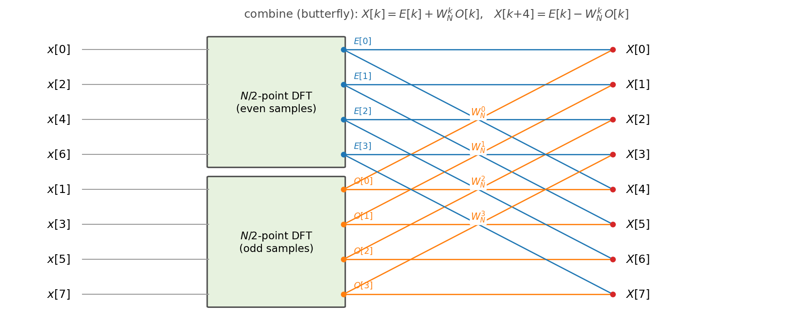
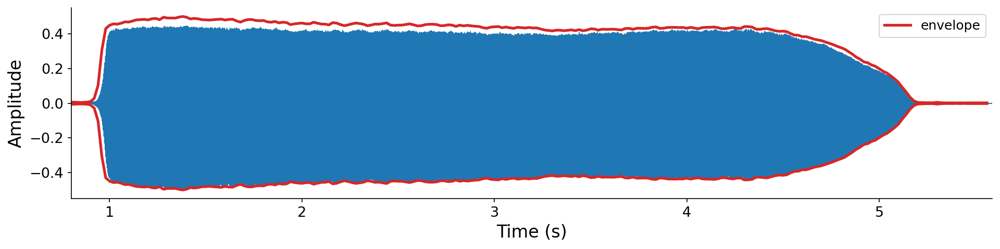

# The Discrete Fourier Transform

In [Chapter 5](../05-frequency-domain) we developed the Fourier transform, which converts a signal from the time domain into the frequency domain. It is a powerful and elegant tool, but the version we studied is a _mathematical_ primitive, and it is riddled with assumptions that are impractical in the real world. This is a book on _computer_ music: we want a tool we can actually run on digital audio.

In this chapter we address those incompatibilities one at a time to derive the {vocab}`discrete Fourier transform` (DFT), a metamorphosis of the Fourier transform that a computer can actually evaluate on a finite array of samples. This comes at a cost, and along the way we will meet the consequences of discretizing the transform. Finally, we will introduce the {vocab}`fast Fourier transform` (FFT), an _algorithm_ that computes the DFT exactly but with asymptotic behavior superior to a naive implementation.

## Practical limitations of the Fourier transform

### A review of the phasor and Fourier transform

Everything in this chapter builds on two ideas from [Chapter 5](../05-frequency-domain). Let us restate them briefly.

The first is the {vocab}`phasor`, or complex sinusoid, $a\, e^{j\omega t}$. Recall that this is a single compact expression, built from Euler's formula, that packages a real cosine and an imaginary sine together into a vector that rotates in the complex plane. It draws a circle of radius $a$, completing one revolution every $1/f$ seconds. See {ref}`Chapter 5 <sec-phasor>` for the full development.

The second is the {ref}`Fourier transform <sec-fourier-transform>` itself,

$$X(\omega) = \int_{-\infty}^{\infty} x(t)\, e^{-j\omega t}\, dt = R(\omega) + j\, I(\omega),$$

where $R(\omega) = \Re\big(X(\omega)\big)$ and $I(\omega) = \Im\big(X(\omega)\big)$ are its real and imaginary parts. The intuition, which is worth holding onto, is that to measure how much of frequency $\omega$ is present in $x(t)$, we **synthesize a phasor at frequency $\omega$, multiply it by $x(t)$ to measure their similarity, and sum that similarity over all time by integrating**.

### What makes it impractical

The Fourier transform is a mathematical object defined over the real line. If we want to analyze the frequency content of a finite array of digital audio samples with a finite amount of computation, three properties stand in our way:

1. **It integrates over infinite time.** The limits run from $-\infty$ to $\infty$. Real signals are never infinitely long, and even if they were, integrating over all time would take infinite computation.
1. **It is defined over continuous signals $x(t)$, not discrete samples $x[n]$.** Sometimes we know the continuous function behind our samples (when we synthesize it ourselves), but usually we do not. For example, a digital recording from a microphone gives us only the samples.
1. **It is defined for every real frequency $\omega$.** Suppose we had a signal $x(t)$ that consisted of a single basic sinusoid at an unknown frequency. To find that frequency using the Fourier transform, we would have to test _every_ possible $\omega$, an infinite search.

In the following sections, we will expand on and tackle these issues one by one.

## Issue 1: Finite signals

The Fourier transform is defined over infinitely long signals $x(t) : \mathbb{R} \to \mathbb{R}$. But what if we only have a signal of some finite duration $T$, defined on $[0, T)$? Or, more generally, what if we want the frequency content of just a _segment_ of a longer signal, defined on $[a, b]$?

We already saw the key trick in [Chapter 7](../07-sampling-theory) when we analyzed sampling. There we learned two useful strategies that we will apply here: (1) multiplying a continuous signal by a specially-shaped discontinuous one lets us model discrete phenomena, and (2) the Fourier transform of a discontinuous signal is perfectly well defined.

We define a {vocab}`window` function $w_{a,b}(t)$ that is 1 on the interval of interest and 0 everywhere else:

$$
w_{a,b}(t) = \begin{cases} 1 & \text{if } a \le t \le b, \\ 0 & \text{otherwise.} \end{cases}
$$

The idea is that a finite signal defined on $[a, b]$ can be viewed as an infinitely long signal _multiplied_ by this window. Multiplying zeroes out everything outside $[a, b]$ and leaves the signal untouched inside it. The figure below shows the effect in both domains, using the same running example as [Chapter 7](../07-sampling-theory), $x(t) = \sin(2\pi t) + \sin(2\pi 2 t)$:

:::{figure}
![A two-by-three grid. Top row (time): the signal x(t), a rectangular window that is 1 on [a,b], and their product, which keeps the signal only inside the window. Bottom row (frequency): the ideal spectrum of x(t) with sharp spikes at plus and minus 1 and 2 Hz, the window's spectrum which is a sinc function with a central lobe and decaying side lobes, and the windowed spectrum, in which each sharp spike has been smeared into a sinc-shaped lobe.](./assets/fig-windowing.png)

Windowing a signal to a finite interval, viewed in both domains. Multiplying $x(t)$ by the window $w_{a,b}(t)$ (top) has a side effect in the frequency domain (bottom): each sharp spectral line of $|X(\omega)|$ is smeared into a lobe, a phenomenon called _spectral leakage_.
:::

Windowing was not free. Comparing the bottom-left and bottom-right panels, the sharp spectral spikes of the original signal have been _smeared_ into lobes. This blurring is called {vocab}`spectral leakage`: energy from each true frequency "leaks" into neighboring frequencies. We can still make out the basic shape of the spectrum, with peaks near the true frequencies of 1 and 2 Hz, but it is no longer exact. Spectral leakage is the price of analyzing a finite slice of time, and it is unavoidable.

:::{note}
Leakage comes from the window's own spectrum (the middle panel), which is a _sinc_ function rather than a single spike. As we noted in [Chapter 7](../07-sampling-theory), multiplication in time is convolution in frequency, so the true spectrum gets convolved with (smeared by) the window's sinc. Choosing a gentler window shape than the abrupt rectangle can reduce the leakage, a refinement we will return to when we study frame-based processing.
:::

CLAUDE: expand on this a bit. show the integral broken up into a sum over 3 integrals: -inf to a, a to b, b to inf. explain that the two key simplifications: (1) the area under the curve of the outer 3 is always 0, and (2) x(t) \cdot w(t) = x(t) within [a, b]
Setting aside leakage, windowing gives us exactly what we wanted. Because $w_{a,b}(t)$ is zero outside $[a, b]$, the product $x(t)\,w_{a,b}(t)$ is also zero there, and so the infinite integral collapses to a finite one:

$$
\hat{X}(\omega) = \int_{-\infty}^{\infty} x(t)\, w_{a,b}(t)\, e^{-j\omega t}\, dt = \int_{a}^{b} x(t)\, e^{-j\omega t}\, dt.
$$

For a signal of duration $T$ starting at time 0, we take $[a, b] = [0, T]$. This resolves the first issue, and we can define $\hat{X}(\omega)$, a work-in-progress transform that tackles this first issue by integrating over a finite interval.

$$\hat{X}(\omega) = \int_{0}^{T} x(t)\, e^{-j\omega t}\, dt.$$

## Issue 2: Discrete samples

Our transform still integrates over a _continuous_ signal $x(t)$, but digital audio is a sequence of discrete samples $x[n]$. How do we evaluate an integral when we only have samples? We already solved exactly this problem in [Chapter 6](../06-modulation), when we needed to integrate a time-varying frequency to synthesize vibrato. The answer was a {ref}`Riemann sum <sec-time-varying-frequency>`: approximate the area under a curve by summing the areas of thin rectangles with width $\Delta t$ (sampling period) and height corresponding to the complex value at that sample.

Applying a Riemann sum to our windowed transform, we chop the interval $[0, T]$ into $N$ slices one sample wide, evaluate the integrand at each sample, and sum:

$$\hat{X}(\omega) \approx \sum_{n=0}^{N-1} x[n]\, e^{-j\omega n \Delta t}\, \Delta t, \qquad \text{where } N = T f_s, \;\; \Delta t = \frac{1}{f_s}, \;\; x[n] = x(n \Delta t).$$

The sample spacing $\Delta t$ appears as a constant multiplier on every term. Since we almost always care about the _relative_ amplitudes across frequencies rather than their absolute scale, we drop the constant $\Delta t$ and replace equality with proportionality:

$$\hat{X}(\omega) \propto \sum_{n=0}^{N-1} x[n]\, e^{-j\omega n \Delta t}.$$

This resolves the second issue. Our transform is now a finite sum over discrete samples, something a computer can evaluate. But it is still defined for every real $\omega$, and it would require an infinite amount of compute to enumerate all possible $\omega$.

## Issue 3: Finite frequencies

We have discretized time, but not frequency. The sum from the previous section can be evaluated at any real $\omega$, and our goal is to _discover_ the frequency content of $x[n]$, so we face a catch-22: how do we know which $\omega$ values to test if we know nothing about the signal in advance? There are infinitely many to choose from.

Here sampling theory rescues us again. Recall from [Chapter 7](../07-sampling-theory) that a signal sampled at rate $f_s$ can only carry frequency content in the range $[-\tfrac{f_s}{2}, \tfrac{f_s}{2}]$. Anything outside that range aliases back into it. That immediately shrinks our search from all of $\mathbb{R}$ down to a bounded interval of width $f_s$. But there are still infinitely many real frequencies inside it.

The key idea is to simply _pick a finite set_ of frequencies that evenly covers the range. For $N$ samples, we choose exactly $N$ frequencies, spaced uniformly across the bandwidth $f_s$. Their spacing is therefore

$$\Delta f = \frac{f_s}{N} = \frac{1}{N \Delta t}.$$

Indexing these frequencies by an integer $k$, the $k$-th analysis frequency is

CLAUDE: Help students out by defining $f_k$ first in [cycles / second] and then $\omega_k$ in [radians / second]
$$\omega_k = \frac{2\pi k}{N \Delta t} \quad \left[\frac{\text{radians}}{\text{second}}\right], \qquad k \in \{0, 1, \ldots, N-1\}.$$

CLAUDE: Revise this to use the units directive when referring to cycles/radians/seconds
There are a bewildering number of constants in the formula above, so let's unpack this a bit more intuitively. All we are doing is identifying the specific frequencies that complete exactly $k$ cycles in $N$ samples: $2 \pi k$ radians ($k$ cycles) per $N \Delta t$ seconds (seconds corresponding to $N$ samples).

CLAUDE: Revise this to highlight a key idea: $\Delta t$ cancels out leaving us with an expression that is no longer a function of the sampling rate.
Each $\omega_k$ corresponds to a phasor $e^{-j\omega_k n \Delta t}$ that completes exactly $k$ whole cycles over the $N$ samples. The following figure plots the real ($\cos$) and imaginary ($-\sin$) parts of these analysis phasors for the first few $k$:

:::{figure}


The analysis phasors $e^{-j\omega_k n\Delta t} = e^{-2\pi j k n / N}$ for $k = 0, 1, 2, 3$ (here $N = 64$), split into their real ($\cos$) and imaginary ($-\sin$) parts. Higher $k$ means a higher-frequency phasor, completing $k$ cycles across the window. This is reminiscent of the harmonics of additive synthesis from [Chapter 3](../03-additive-synthesis).
:::

:::{note}
Why index $k$ from $0$ to $N-1$, covering $[0, f_s)$, rather than the symmetric range $[-\tfrac{f_s}{2}, \tfrac{f_s}{2}]$ we might expect? The two are equivalent because of aliasing. A bin $k$ in the upper half, with frequency $f_k = k f_s / N$ above the Nyquist frequency $f_s/2$, is an exact alias of the negative frequency $f_k - f_s$. So the second half of the bins, $k = \tfrac{N}{2}+1, \ldots, N-1$, simply represents the negative frequencies $-\tfrac{f_s}{2}, \ldots, 0$. Convention indexes them as $0$ to $N-1$ because that is how they fall out of the math, but you should interpret the upper half as the negative frequencies folded around.
:::

## The discrete Fourier transform

We now have everything we need. Substituting the discrete analysis frequencies $\omega_k$ into our work-in-progress transform, the exponent simplifies neatly:

$$\hat{X}(\omega_k) \propto \sum_{n=0}^{N-1} x[n]\, e^{-j \omega_k n \Delta t} = \sum_{n=0}^{N-1} x[n]\, e^{-j \frac{2\pi k}{N \Delta t} n \Delta t} = \sum_{n=0}^{N-1} x[n]\, e^{-2\pi j k n / N}.$$

CLAUDE: Shift this callout into the previous section
The sample spacing $\Delta t$ has cancelled completely, leaving a clean expression that depends only on the samples and the indices. This is the discrete Fourier transform.

:::{prf:definition} Discrete Fourier transform
:label: def-dft
The _discrete Fourier transform_ of a length-$N$ signal $x[n]$ is the length-$N$ sequence

$$\texttt{DFT}[k] \coloneqq \sum_{n=0}^{N-1} x[n]\, e^{-2\pi j k n / N}, \qquad k \in \{0, 1, \ldots, N-1\}.$$
:::

Intuitively, the DFT does exactly what the Fourier transform did, just over a finite set of frequencies. For each of the $N$ {vocab}`bins` $k$ (the name for these discrete analysis frequencies), it synthesizes a phasor at $\omega_k$, multiplies it by the signal to measure their similarity, and sums the result. We are effectively _searching_ a finite set of bins for frequencies that resemble the signal.

CLAUDE: Can oyu add one more step showing how we go from $\frac{1}{N \Delta t}$ to $\frac{1}{T}$? it's a little obtuse at the moment. also, draw a box around the two key definitions of $\Delta f$: $\frac{f_s}{N}$ Hz and $\frac{1}{T}$ Hz to separate them from the definitions used to derive their eqiuvalence. both of the boxed definitions are used in practice in different contexts
:::{prf:definition} DFT bin spacing
:label: def-bin-spacing
The DFT bins are evenly spaced by

$$\Delta f = \frac{f_s}{N} = \frac{1}{N \Delta t} = \frac{1}{T} \quad \text{Hz},$$

where $T = N/f_s$ is the duration of the analyzed signal in seconds. Longer signals give finer frequency resolution.
CLAUDE: can we move the "Longer signals give finer frequency resolution" out of the directive and expand on it a bit below? The key idea is something like: the _spacing_ of the DFT bins is independent of the sampling rate and only depends on the duration of audio, while the _number_ of DFT bins for a fixed amount of time depends on hte sampling rate.
:::

### Real and imaginary parts

Applying Euler's formula to the definition splits the DFT into a real and an imaginary part, exactly as with the continuous transform:

$$\texttt{DFT}[k] = R[k] + j\, I[k], \qquad R[k] = \sum_{n=0}^{N-1} x[n] \cos\!\left(\tfrac{2\pi k n}{N}\right), \qquad I[k] = -\sum_{n=0}^{N-1} x[n] \sin\!\left(\tfrac{2\pi k n}{N}\right).$$

As before, we usually care about the {vocab}`amplitude spectrum` and {vocab}`phase spectrum`, obtained by converting each complex bin to polar form:

$$A[k] = \sqrt{R^2[k] + I^2[k]}, \qquad \phi[k] = \tan^{-1}\!\frac{I[k]}{R[k]}.$$

### The interactive winding view

The following interactive example makes the "multiply by a phasor and sum" intuition concrete, in the spirit of the winding visualization from [Chapter 5](../05-frequency-domain). Adjust the frequency of a real input sinusoid and the frequency of the probing phasor, and watch the wound-up signal and its center of mass in the complex plane. When the probe frequency matches a bin containing signal energy, the center of mass swings far from the origin:

:::{interactive}[notebooks/dft-winding.ipynb]
:::

### Removing redundancy

What is the "type signature" of the DFT? It takes $N$ real samples and returns $N$ complex numbers, so $\texttt{DFT} : \mathbb{R}^N \to \mathbb{C}^N$. Since a computer stores each complex number as two floats (its real and imaginary parts), we could also view it as $\mathbb{R}^N \to \mathbb{R}^{2N}$. But that feels wasteful. The DFT, like the Fourier transform, is an invertible bijection, so turning $N$ numbers into $2N$ numbers must involve redundancy.

Indeed it does, and the redundancy comes from the symmetry of real signals we met in [Chapter 6](../06-modulation). Because cosine is even and sine is odd, the DFT of a real signal satisfies

$$R[k] = R[N-k] \quad (\text{even}), \qquad I[k] = -I[N-k] \quad (\text{odd}).$$

So the upper half of the bins is just a mirror image of the lower half. This is the same even/odd symmetry of the amplitude and phase spectra from [Chapter 6](../06-modulation). We can tabulate it for a small example, $N = 8$ at $f_s = 1000$ Hz:

:::{list-table} DFT bins for $N = 8$, $f_s = 1000$ Hz. The upper bins ($k > N/2$) merely mirror the lower ones.
:header-rows: 1
:name: tbl-dft-redundancy

CLAUDE: Color the important bins as blue and the redundant bins as red

- - $k$
  - 0
  - 1
  - 2
  - 3
  - 4
  - 5
  - 6
  - 7
- - Frequency (Hz)
  - 0
  - 125
  - 250
  - 375
  - 500
  - 625
  - 750
  - 875
- - Aliased (Hz)
  - 0
  - 125
  - 250
  - 375
  - 500
  - $-375$
  - $-250$
  - $-125$
- - $R[k]$
  - $a$
  - $b$
  - $c$
  - $d$
  - $e$
  - $d$
  - $c$
  - $b$
- - $I[k]$
    - 0
    - $g$
    - $h$
    - $i$
    - 0
    - $-i$
    - $-h$
    - $-g$
      :::

Two additional optimizations appear in the table. The imaginary part vanishes at both ends, $I[0] = 0$ and $I[N/2] = 0$, because $\sin(0) = 0$ and $\sin(\pi n) = 0$ for all integer $n$. Counting what is left, we need only the bins $k = 0, 1, \ldots, N/2$, which is **$N/2 + 1$ complex bins**, but with two of them ($k=0$ and $k=N/2$) purely real-valued. That works out to exactly **$N$ real numbers** to store, matching the $N$ real inputs. The bijection is tidy after all: $N$ samples in, $N$ non-redundant coefficients out.

:::{important}
For a real-valued signal of length $N$, the DFT has only $N/2 + 1$ non-redundant bins, spanning $0$ to $f_s/2$. This is exactly what NumPy's `np.fft.rfft` ("real FFT") returns, and it is what you will use in practice.
:::

## The inverse DFT

Like the Fourier transform, the DFT is invertible. Given the $N$ frequency-domain coefficients, the {vocab}`inverse DFT` reconstructs the original $N$ time-domain samples exactly:

$$x[n] = \frac{1}{N} \sum_{k=0}^{N-1} \texttt{DFT}[k]\, e^{+2\pi j k n / N}.$$

The formula mirrors the forward transform, with two differences: the sign in the exponent flips (the phasors rotate the other way), and a factor of $1/N$ normalizes the result. Conceptually, this is additive synthesis: it rebuilds the signal as a sum of the phasors at each bin, weighted by that bin's DFT coefficient. Because the round trip is exact, $x = \texttt{IDFT}(\texttt{DFT}(x))$, we can move freely between the time and frequency domains, editing a sound in whichever domain is more convenient and transforming back.

## The fast Fourier transform

The DFT is remarkably simple to implement. The definition is a sum, and a fully vectorized version is essentially a single matrix multiplication in NumPy:

CLAUDE: Whoa, this @ syntactic sugar is cool, but might confuse students. Can we rewrite this without the @?

```python
def dft(x: np.ndarray) -> np.ndarray:
    N = len(x)
    k, n = np.arange(N).reshape(-1, 1), np.arange(N).reshape(1, -1)
    return np.exp(-2j * np.pi * k * n / N) @ x
```

Writing the same computation as an explicit double loop makes its cost visible. For each of the $N$ output bins, we sum over all $N$ input samples:

```python
def dft_unrolled(x: np.ndarray) -> np.ndarray:
    N = len(x)
    out = np.zeros(N, dtype=np.complex128)
    for k in range(N):
        for n in range(N):
            out[k] += x[n] * np.exp(-2j * np.pi * k * n / N)
    return out
```

Those nested loops reveal that the DFT is an $O(N^2)$ computation. For a short window this is fine, but audio windows are often thousands of samples long, and we may compute the DFT thousands of times per second of audio. Quadratic cost quickly becomes prohibitive. Can we do better?

It turns out we can do _asymptotically_ better. The key insight, popularized by James Cooley and John Tukey in 1965 (and, it was later discovered, known to Gauss a century and a half earlier. CLAUDE: Make this a margin note, not a nested parenthetical), is that **an $N$-point DFT can be expressed in terms of two $N/2$-point DFTs**: one over the even-indexed samples and one over the odd-indexed samples. Computer science students will recognize this as _divide and conquer_, the same recursive strategy behind algorithms like merge sort. We split the problem in half, solve each half recursively, and combine the results.

CLAUDE: This is a fairly useless figure at the moment. Unclear what "Combine (butterfly)" means. Can we show the recursive structure more explicitly perhaps? A more conventional butterfly diagram?
:::{figure}


The divide-and-conquer structure of the FFT. An $N$-point DFT is computed from two $N/2$-point DFTs (over the even- and odd-indexed samples), whose outputs are merged by a combining step. Applied recursively, this is the fast Fourier transform.
:::

The combining step, known as the {vocab}`butterfly`, merges the two half-size results in $O(N)$ time. Recursing all the way down gives $\log_2 N$ levels, each costing $O(N)$, for a total of $O(N \log N)$. That is an enormous improvement over $O(N^2)$: for a 4096-sample window, it is the difference between roughly 16 million operations and about 50 thousand. In code, the recursion handles the $\log N$ levels while a vectorized butterfly handles the $O(N)$ combining at each level:

```python
def fft(x: np.ndarray) -> np.ndarray:
    x = np.asarray(x, dtype=np.complex128)
    N = len(x)
    if N == 1:
        return x
    even, odd = fft(x[::2]), fft(x[1::2])          # divide and recurse
    twiddle = np.exp(-2j * np.pi * np.arange(N // 2) / N) * odd
    return np.concatenate([even + twiddle, even - twiddle])  # butterfly
```

The full runnable code, including a check that all three implementations agree with NumPy's optimized FFT, is in [code/dft.py](./code/dft.py).

The FFT is probably the most consequential algorithm in all of digital signal processing, underpinning not just audio analysis but multimedia compression, wireless communication, and much more. Understanding the high-level behavior of the algorithm (divide-and-conquer) and its asymptotic $O(N \log N)$ performance is far more important than actually implementing the algorithm or understanding the "butterfly" details. In practice you will call a highly-tuned library routine such as `np.fft.fft` (or `np.fft.rfft` for real signals), which combines these high-level ideas with additional low-level optimizations.

## Analyzing and reconstructing a real sound

Let us put the DFT to work on a real recording: a single clarinet note. Analysis and resynthesis together demonstrate the round trip between time and frequency that this chapter has built toward.

### Analysis

CLAUDE: Start a little before 1 second so we can more clearly see the "attack" phase of the envelope
First we _analyze_ the sound, viewing it in both domains. In the time domain, we plot the waveform from one second in to the end, which shows the sustained body of the note and its overall {vocab}`envelope`: a fast "attack", a long "sustain", and a slow "release". In the frequency domain, we take the DFT (via `np.fft.rfft`) of a stable segment and plot the amplitude spectrum:

:::{figure}


CLAUDE: This description is inaccurate. The waveform is too zoomed out to see the oscillation. Instead focus on the envelope, and make sure to grab more the full attack period.
The clarinet note in the time domain. The rapid oscillation is the waveform. The smooth red curve tracing its peaks is the _envelope_, roughly a slow attack, a sustain, and a decay.
:::

CLAUDE: the 300 Hz label should be on the actual 300 Hz fundamental, not on 600 Hz as it appears here
:::{figure}


The clarinet's amplitude spectrum from the DFT. The fundamental sits at $f_0 \approx 300$ Hz, and the note is dominated by its _odd_ harmonics (3rd at 900 Hz, 5th at 1500 Hz), with the even harmonics strongly suppressed. This odd-harmonic signature is characteristic of the clarinet. We will understand why when we examine instrument acoustics later on.
:::

From these two plots we can read off, by eye, a recipe for the sound: its _fundamental frequency_ ($f_0 \approx 300$ Hz), the _amplitudes of its harmonics_ (strong odds, weak evens, taken from the spectral peaks), and the shape of its _envelope_ (from the time-domain outline). The interactive example below performs this analysis in code:

:::{interactive}[notebooks/clarinet-analysis.ipynb]
:::

### Resynthesis

Now we run the process backwards. Using the fundamental, harmonic amplitudes, and envelope we just extracted, we can _resynthesize_ the note with the additive synthesis of [Chapter 3](../03-additive-synthesis), summing harmonics and applying the envelope:

:::{audio-list}
{audio}`Original clarinet <./assets/audio-clarinet.wav>`

{audio}`Resynthesized from its spectrum <./assets/audio-clarinet-resynth.wav>`

The original recording and an additive resynthesis built only from the fundamental, harmonic amplitudes, and envelope read off the DFT analysis. It is not a perfect copy (we discarded the phases, the exact harmonic evolution, and the breathy attack transient), but the pitch and characteristic timbre come through. Original: [356930](https://freesound.org/s/356930/) by MTG, License: [Attribution 3.0](http://creativecommons.org/licenses/by/3.0/).
:::

The interactive example below hardcodes the extracted parameters and produces the playable resynthesis, so you can experiment with the recipe:

:::{interactive}[notebooks/clarinet-synthesis.ipynb]
:::

Hopefully you agree from this example that the DFT is a powerful technique! We can synthesize a recognizable clarinet sound just by reading a handful of numbers straight off of the amplitude spectrum and combining with a basic amplitude envelope.

## Summary

- The _Fourier transform_ is a mathematical tool with three properties that make it impractical to compute: it integrates over infinite time, it operates on continuous signals, and it is defined for every real frequency.
- **Issue 1 (finite time):** multiplying by a rectangular {vocab}`window` restricts the transform to a finite interval, $\hat{X}(\omega) = \int_0^T x(t) e^{-j\omega t} dt$. This introduces {vocab}`spectral leakage`, a smearing of the spectrum.
- **Issue 2 (discrete samples):** a Riemann sum turns the integral into a finite sum over samples, $\hat{X}(\omega) \propto \sum_{n=0}^{N-1} x[n] e^{-j\omega n \Delta t}$.
- **Issue 3 (finite frequencies):** since a signal sampled at $f_s$ only has content in a band of width $f_s$, we test $N$ evenly-spaced analysis frequencies (bins), spaced $\Delta f = f_s / N = 1/T$ apart.
- The {vocab}`discrete Fourier transform` is $\texttt{DFT}[k] = \sum_{n=0}^{N-1} x[n]\, e^{-2\pi j k n / N}$, mapping $N$ samples to $N$ complex bins.
- For real signals, even/odd symmetry makes the upper bins redundant, so the DFT has only $N/2 + 1$ non-redundant bins spanning $[0, f_s/2]$. This is `np.fft.rfft`.
- The naive DFT is $O(N^2)$. The {vocab}`fast Fourier transform` uses divide and conquer to compute it in $O(N \log N)$.
- The DFT is invertible, enabling a perfect round trip between the time and frequency domains, which we used to analyze and resynthesize a clarinet note.

## Questions for the reader

:::{exercise}
**Bin spacing.** You compute the DFT of exactly 1 second of audio. What is the spacing in Hz between adjacent DFT bins in the output? More generally, what is the bin spacing for an input of duration $T$ seconds? If you wanted a frequency resolution of $1$ Hz, how long a segment would you need to analyze?
:::

:::{exercise}
**Counting bins.** You take the DFT of a $1024$-sample window of audio recorded at $f_s = 44{,}100$ Hz. (a) How many complex bins does the full DFT produce? (b) How many non-redundant bins does `np.fft.rfft` return for this real signal? (c) What frequency, in Hz, does bin $k = 100$ correspond to?
:::

:::{exercise}
**Reading a spectrum.** The amplitude spectrum of a periodic tone has strong peaks at 200, 600, and 1000 Hz, with the peaks at 400 and 800 Hz nearly absent. What is the fundamental frequency? Which harmonics are present, and what does the pattern of odd-only harmonics suggest about the sound?
:::

:::{exercise}
**Why $O(N \log N)$ matters.** A DFT is applied to a window of $N = 4096$ samples. Estimate the ratio between the number of operations for a naive $O(N^2)$ DFT and an $O(N \log N)$ FFT. If a real-time system must compute such a transform hundreds of times per second, why is this difference decisive?
:::

:::{exercise}
**Redundant bins.** For a real input of length $N = 16$, the DFT bin $R[k]$ satisfies $R[k] = R[N-k]$. Given $R[3] = 0.7$, what is $R[13]$? Which two bins are guaranteed to have a zero imaginary part, and why?
:::
