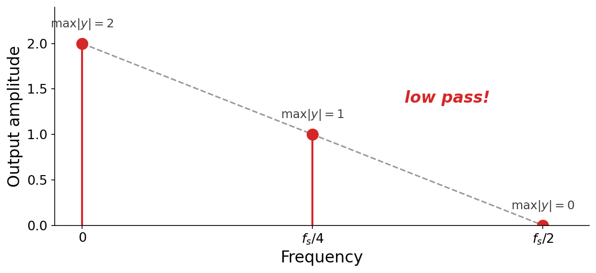

# Filters

So far, this book has mostly studied _synthesis_: techniques like additive and modulation synthesis that create sound from scratch. But computer music is as much about _sculpting_ existing sound as it is about creating new sound. In this chapter we study {vocab}`filters`, the tools we use to process a signal we already have, whether it came from a synthesizer, a microphone, or another filter.

This chapter was heavily inspired by the treatment of [convolution in _Digital Signals Theory_ {cite}`mcfee2023digital`](https://brianmcfee.net/dstbook-site/content/ch03-convolution/Convolution.html), and we borrow much of its notation. Filter analysis and design is an extraordinarily deep subject, and we will only take a cursory look here. Readers who want to go further should consult [Julius Smith's _Introduction to Digital Filters_ {cite}`smith2007introduction`](https://ccrma.stanford.edu/~jos/filters), a thorough and audio-focused treatment.

## What is a filter?

In signal processing, the word _filter_ is remarkably broad. It refers to essentially _any_ function that takes a signal as input and produces another signal as output. Because signals are themselves functions of time, a filter can be viewed as a function _of functions_.

In this book we study {vocab}`digital filters`. A filter is a function $g$ that maps an _entire_ input signal $\blue{x}$ to an _entire_ output signal $\purple{y}$, which we write $g : \blue{x} \mapsto \purple{y}$:

$$\blue{x} \;\longrightarrow\; \boxed{\,g\,} \;\longrightarrow\; \purple{y}$$

We can view each signal either as a function of a sample index, $x : \mathbb{N} \to \mathbb{R}$, or, for a finite signal of $N$ samples, as an array, $x \in \mathbb{R}^N$, so that a filter is a map between arrays, $g : \mathbb{R}^N \to \mathbb{R}^N$. This is a deliberately broad definition, and says nothing yet about _how_ a filter is implemented.

This definition is so broad that it covers almost all topics in computer music:

1. The synthesis techniques we have already seen, such as modulation synthesis, which transform one signal into another.
1. Many audio effects you may have encountered outside this book: reverb, delay, distortion, equalization, compression, and so on.

To make progress, we will narrow our attention to an especially important subclass: {vocab}`linear time-invariant` (LTI) filters. LTI filters are so ubiquitous in computer music and digital signal processing that **the word "filter" is shorthand for LTI filters** in colloquial usage. We will define _linear_ and _time-invariant_ precisely later in the chapter. For now, the important thing is their high-level purpose.

**The high-level goal of an LTI filter is to sculpt the frequency-domain content of a sound.** An LTI filter cannot invent new frequencies. It can only boost or attenuate the frequencies already present in its input, each by an amount that depends on the frequency.

:::{figure}
![Three stacked panels sharing a frequency axis from 0 to f_s over 2. Top: the input spectrum, a set of blue partials whose amplitudes decrease with frequency. Middle: the filter's magnitude response, a smooth red curve that bulges up over a band of low-to-middle frequencies. Bottom: the output spectrum in purple, equal to the input partials each scaled by the filter curve, so the middle partials are emphasized relative to the rest, with a dashed red outline of the filter response overlaid to show the ceiling it imposes.](./assets/fig-lti-goal.png)

An LTI filter reshapes a sound in the frequency domain. Each partial of the input $|X[k]|$ (blue) is scaled by the filter's response $|H[k]|$ (red), yielding the output $|Y[k]| = |H[k]| \cdot |X[k]|$ (purple). The dashed red outline repeats the filter response over the output, showing the ceiling it imposes on the frequency content. No new partials appear, and the existing ones are only reweighted.
:::

Over the next several sections we will build up several complementary _perspectives_ on LTI filters: difference equations, convolution, impulse responses, frequency-domain multiplication, and signal-flow diagrams. Each perspective focuses on different properties of filters from low-level implementation to high-level behaviors.

## Difference equations

In a digital signal processing context, a {vocab}`difference equation` defines a filter by expressing each output sample as a formula in terms of the input samples. It is the most direct, hands-on way to specify a filter, and it translates immediately into code.

### A first example

Consider the difference equation

$$\purple{y[n]} = \blue{x[n]} + \green{x[n-1]}.$$

Each output sample is the current input sample plus a _delayed copy_ of the input. The term $\green{x[n-1]}$ is the input shifted one sample later in time, in other words the value the input had one sample ago. Referring to a delayed copy of a signal like this, written $\green{x[n-d]}$ for a delay of $d$ samples, is the fundamental building block of every filter in this chapter, so make sure the idea feels natural before moving on.

Let us feed the filter a simple square wave with a ten-sample period, $x[n] = [1, 1, 1, 1, 1, -1, -1, -1, -1, -1, \ldots]$. To evaluate $x[n-1]$ at the very start, we need $x[-1]$, which lies before the signal begins. Throughout this chapter we adopt the standard convention that a signal is _zero_ at any index outside its defined range: $x[n] = 0$ for $n < 0$. The very first output sample therefore sees a delayed copy that is still "warming up" from zero.

:::{figure}
![Three stacked stem plots over sample indices 0 to 31. Top (blue): the input square wave x[n], five samples at plus one then five at minus one, repeating. Middle (red): x[n-1], the same square wave shifted one sample to the right, with the first sample (shaded) equal to zero. Bottom (purple): the sum y[n], which reaches plus or minus two across the flat stretches and steps through zero at each transition, after a one-sample warm-up.](./assets/fig-diffeq-lowpass.png)

The filter $\purple{y[n]} = \blue{x[n]} + \green{x[n-1]}$ applied to a square wave. The delayed copy $\green{x[n-1]}$ (green) is the input shifted right by one sample, with a zero assumed before $n = 0$ (shaded). Summing it with $\blue{x[n]}$ gives $\purple{y[n]}$ (purple).
:::

Comparing $y[n]$ to $x[n]$, a few things stand out:

1. The output has a larger _peak amplitude_, reaching $\pm 2$ where the two copies agree.
1. It has a slightly different _shape_, with the square wave's abrupt transitions softened into a step.
1. There is a brief "warm-up" at the very start.

Softening abrupt transitions is a hint that this filter smooths the signal by attenuating its high frequencies, which we will confirm later. You can experiment with this filter in code, including listening to the input and output, in the following example:

:::{interactive}[notebooks/difference-equations.ipynb]
:::

### A second example

Now consider a closely related difference equation that _subtracts_ the delayed copy instead of adding it, and scales both terms by one half:

$$\purple{y[n]} = \tfrac{1}{2}\blue{x[n]} - \tfrac{1}{2}\green{x[n-1]}.$$

:::{figure}
![Three stacked stem plots over sample indices 0 to 31. Top (blue): one half times x[n], a square wave between plus and minus one half. Middle (red): minus one half times x[n-1], the inverted square wave delayed by one sample, with the first sample shaded as a warm-up zero. Bottom (purple): the difference y[n], which is zero across the flat stretches of the square wave and spikes to plus or minus one only at the transitions.](./assets/fig-diffeq-highpass.png)

The filter $\purple{y[n]} = \tfrac{1}{2}\blue{x[n]} - \tfrac{1}{2}\green{x[n-1]}$ applied to the same square wave. Subtracting a delayed copy leaves the output zero wherever the input is constant and produces a spike only at each transition.
:::

The behavior has both differences and similarities compared with the previous example:

1. The one-half factors keep the amplitude in check.
1. Subtracting a delayed copy makes the filter respond only to _changes_ in the input, so the output is zero across the flat stretches and spikes at the transitions.
1. There is again a brief warm-up.

Responding only to change, and ignoring the steady stretches, is a hint that this filter discards low frequencies and keeps the high ones. This filter is, in effect, a crude edge detector.

### What do these filters do to sound?

Difference equations are trivial to implement, but as the two examples show, their effect can be hard to predict just by reading the formula. The clearest way to build intuition is to _listen_. Below are the two filters applied to an audible square-wave tone (a richer square than our ten-sample toy, so many harmonics are in play):

:::{audio-list}
{audio}`Input square wave $x[n]$ <./assets/audio-diffeq-input.wav>`

{audio}`$y_1[n] = x[n] + x[n-1]$ <./assets/audio-diffeq-y1.wav>`

{audio}`$y_2[n] = \frac{1}{2}x[n] - \frac{1}{2}x[n-1]$ <./assets/audio-diffeq-y2.wav>`

By ear, the first filter sounds darker and mellower, the second brighter and thinner.
:::

We can see this directly by passing _white noise_ (which contains every frequency in equal measure) through each filter and plotting the amplitude spectrum of the result. Because the input is spectrally flat, the output spectrum traces out the filter's own frequency response. The two are near-mirror images of each other:

:::{figure}


The amplitude spectrum of white noise after passing through each filter. Since the input noise is spectrally flat, each output spectrum reveals that filter's frequency response. The first, $y_1$ (a _sum_ of a signal and its delayed copy), passes low frequencies and rolls off the highs: a **low-pass**. The second, $y_2$ (a _difference_), does the reverse: a **high-pass**.
:::

So the sum acts as a low-pass and the difference as a high-pass. We reached both conclusions by ear and by eye, with no theory at all. Over the rest of the chapter we build up several more _perspectives_ on filters like these, each revealing a different facet of how they work.

(sec-convolution)=

## Convolution

In the previous section we met two difference equations with quite different behaviors,

$$\purple{y_1[n]} = \blue{x[n]} + \blue{x[n-1]}, \qquad \purple{y_2[n]} = \tfrac{1}{2}\blue{x[n]} - \tfrac{1}{2}\blue{x[n-1]}.$$

How might we _generalize_ this idea? The trick is to write both filters in a single common format, attaching an explicit coefficient to every delayed term,

$$
\begin{aligned}
\purple{y_1[n]} &= \red{1} \cdot \blue{x[n]} &+ \red{1} \cdot \blue{x[n-1]}, \\
\purple{y_2[n]} &= \red{\tfrac{1}{2}} \cdot \blue{x[n]} &- \red{\tfrac{1}{2}} \cdot \blue{x[n-1]}.
\end{aligned}
$$

The pattern is now clear. Each filter is a weighted sum of delayed copies of the input, and a filter is fully specified by its list of weights: $[1, 1]$ for the first and $[\tfrac{1}{2}, -\tfrac{1}{2}]$ for the second. Collecting the weights into a sequence $\red{h}$, every filter of this form (of any length) can be written in a common format known as _convolution_.

:::{prf:definition} Convolution
:label: def-convolution
The {vocab}`convolution` of a length-$K$ filter $\red{h}$ with a length-$N$ signal $\blue{x}$ is the signal

$$\purple{y[n]} = \sum_{k=0}^{K-1} \red{h[k]} \cdot \blue{x[n-k]}.$$

This operation is so common that it has its own notation, an asterisk:

$$\purple{y} = \red{h} * \blue{x}.$$
:::

### An example of convolution

Let us work a small example by hand. Take a short input $\blue{x} = [1, 1, 1]$ (length $N = 3$) and a short filter $\red{h} = [3, 2, 1]$ (length $K = 3$). Applying the definition, each output sample is a sum of products, remembering that any out-of-range sample of $x$ is zero:

$$
\begin{aligned}
\purple{y[0]} &= \red{h[0]}\blue{x[0]} &&+ \red{h[1]}\blue{x[-1]} &&+ \red{h[2]}\blue{x[-2]} &&= 3 + 0 + 0 &&= 3, \\
\purple{y[1]} &= \red{h[0]}\blue{x[1]} &&+ \red{h[1]}\blue{x[0]}  &&+ \red{h[2]}\blue{x[-1]} &&= 3 + 2 + 0 &&= 5, \\
\purple{y[2]} &= \red{h[0]}\blue{x[2]} &&+ \red{h[1]}\blue{x[1]}  &&+ \red{h[2]}\blue{x[0]}  &&= 3 + 2 + 1 &&= 6, \\
\purple{y[3]} &= \red{h[0]}\blue{x[3]} &&+ \red{h[1]}\blue{x[2]}  &&+ \red{h[2]}\blue{x[1]}  &&= 0 + 2 + 1 &&= 3, \\
\purple{y[4]} &= \red{h[0]}\blue{x[4]} &&+ \red{h[1]}\blue{x[3]}  &&+ \red{h[2]}\blue{x[2]}  &&= 0 + 0 + 1 &&= 1, \\
\purple{y[5]} &= \red{h[0]}\blue{x[5]} &&+ \red{h[1]}\blue{x[4]}  &&+ \red{h[2]}\blue{x[3]}  &&= 0 + 0 + 0 &&= 0.
\end{aligned}
$$

:::{figure}
![Three stem plots. Left (blue): x[n] equal to [1,1,1] at indices 0,1,2. Middle (red): h[n] equal to [3,2,1] at indices 0,1,2. Right (purple): the convolution y equal to [3,5,6,3,1] at indices 0 through 4, forming a peak in the middle.](./assets/fig-convolution-example.png)

Convolving $\blue{x} = [1,1,1]$ with $\red{h} = [3,2,1]$ yields $\purple{y} = [3,5,6,3,1]$. The output has five nonzero samples.
:::

Notice that the output $\purple{y} = [3, 5, 6, 3, 1]$ is _longer_ than either input. In general, convolving a length-$N$ signal with a length-$K$ filter produces an output with $N + K - 1$ nonzero samples. The convolution "spreads" the input out by the length of the filter.

You can watch convolution unfold as a sliding operation in the animation below, where a longer input signal is convolved with a filter. The filter slides across the input one sample at a time, and at each position the output sample is the sum of the overlapping products. Note that the filter appears _reversed_ as it slides: this falls directly out of the definition, since the term $\red{h[k]}\,\blue{x[n-k]}$ pairs the $k$-th filter coefficient with the input sample $k$ steps _back_, so larger $k$ reaches further into the past.

:::{figure}


Convolution as a sliding sum. The reversed filter $\red{h}$ slides across the input $\blue{x}$ one sample at a time, starting where it overlaps the assumed-zero samples before $n = 0$. At each position, the overlapping products are summed to produce one output sample of $\purple{y}$.
:::

### Commutativity of convolution

What happens if we swap the roles of $\red{h}$ and $\blue{x}$, convolving $\blue{x} * \red{h}$ instead of $\red{h} * \blue{x}$? Reworking the same example with the roles reversed, so now the input is summed against the filter, gives

$$
\begin{aligned}
\purple{y[0]} &= \blue{x[0]}\red{h[0]} &&+ \blue{x[1]}\red{h[-1]} &&+ \blue{x[2]}\red{h[-2]} &&= 3 + 0 + 0 &&= 3, \\
\purple{y[1]} &= \blue{x[0]}\red{h[1]} &&+ \blue{x[1]}\red{h[0]}  &&+ \blue{x[2]}\red{h[-1]} &&= 2 + 3 + 0 &&= 5, \\
\purple{y[2]} &= \blue{x[0]}\red{h[2]} &&+ \blue{x[1]}\red{h[1]}  &&+ \blue{x[2]}\red{h[0]}  &&= 1 + 2 + 3 &&= 6, \\
\purple{y[3]} &= \blue{x[0]}\red{h[3]} &&+ \blue{x[1]}\red{h[2]}  &&+ \blue{x[2]}\red{h[1]}  &&= 0 + 1 + 2 &&= 3, \\
\purple{y[4]} &= \blue{x[0]}\red{h[4]} &&+ \blue{x[1]}\red{h[3]}  &&+ \blue{x[2]}\red{h[2]}  &&= 0 + 0 + 1 &&= 1, \\
\purple{y[5]} &= \blue{x[0]}\red{h[5]} &&+ \blue{x[1]}\red{h[4]}  &&+ \blue{x[2]}\red{h[3]}  &&= 0 + 0 + 0 &&= 0.
\end{aligned}
$$

which produces exactly the same output $[3, 5, 6, 3, 1]$. This is no accident. **Convolution is commutative**:

$$\red{h} * \blue{x} = \blue{x} * \red{h}.$$

In other words, it does not matter which signal we call the "filter" and which the "input", the result is identical.

### Other properties of convolution

Beyond commutativity, convolution has two more essential algebraic properties. We state them here and leave their proofs (a matter of manipulating the summation) as exercises.

:::{important}
Convolution is **commutative**: $\;a * b = b * a$.
:::

:::{important}
Convolution is **associative**: $\;a * (b * c) = (a * b) * c$.
:::

:::{important}
Convolution is **distributive** over addition: $\;a * (b + c) = a * b + a * c$.
:::

Associativity and commutativity have a practical consequence worth scrutinizing further. For a chain of convolutions like $a * b * c$, computing in _any order_ gives the same result, but _some orders require far less work than others_.

To see this, note that convolving a length-$K$ filter with a length-$N$ signal costs at least $K \cdot N$ multiplications. Suppose $a$, $b$, and $c$ have lengths $A < B < C$. Then:

1. Computing $a * (b * c)$ first convolves $b * c$ (cost $BC$, length $B + C - 1$), then convolves $a$ with the result (cost $A(B + C - 1)$). The total is $BC + AB + AC - A$.
1. Computing $(a * b) * c$ first convolves $a * b$ (cost $AB$, length $A + B - 1$), then convolves with $c$ (cost $(A + B - 1)C$). The total is $AB + AC + BC - C$.

The two totals differ only in their final term: $-A$ versus $-C$. Since $C > A$, the second ordering subtracts more and therefore costs less. The lesson is that when convolving several signals, it pays to combine the _shorter_ ones first.

### Implementing convolution

Convolution translates directly into code. A literal transcription of the definition uses two nested loops, one over the output index $n$ and one over the filter index $k$:

```python
def convolve(x: np.ndarray, h: np.ndarray) -> np.ndarray:
    N, K = len(x), len(h)
    y = np.zeros(N + K - 1)
    for n in range(N + K - 1):
        for k in range(K):
            if 0 <= n - k < N:      # samples outside x are zero
                y[n] += h[k] * x[n - k]
    return y
```

The full runnable version, checked against NumPy's `np.convolve`, is in [code/convolve.py](./code/convolve.py). The two nested loops make the cost plain: producing $N + K - 1$ outputs, each a sum of up to $K$ products, is an $O(NK)$ computation. This is perfectly fine for the short filters behind simple difference equations. But as the input lengths $N$ and $K$ grow (sometimes _hundreds of thousands_ of samples long in practical scenarios), the quadratic cost becomes a serious problem. We will return to this shortly with a dramatically faster approach.

(sec-convolution-theorem)=

## The convolution theorem

We have defined convolution and seen that it generalizes difference equations, but it is not yet obvious that we have made progress toward our stated goal of _sculpting content in the frequency domain_. So far everything has happened in the time domain. The bridge between the two is one of the most important results in all of signal processing.

:::{prf:theorem} The convolution theorem
:label: thm-convolution
Convolution in the time domain corresponds to _multiplication_ in the frequency domain. If $\purple{y} = \red{h} * \blue{x}$, then their DFTs satisfy

$$\purple{Y[k]} = \red{H[k]} \cdot \blue{X[k]}$$

at every frequency bin $k$.
:::

A proof is beyond the scope of this book (see {cite}`smith2007introduction` or {cite}`mcfee2023digital`), but the consequence is exactly what we were after. Convolving with a filter $\red{h}$ multiplies the spectrum of the input by $\red{H}$, the spectrum of the filter. So to boost or attenuate particular frequencies, we simply design a filter whose spectrum $\red{H}$ has the desired shape. This is precisely the frequency-sculpting picture from the start of the chapter, now made concrete: $\purple{|Y[k]|} = \red{|H[k]|} \cdot \blue{|X[k]|}$.

Let's draw an analogy to something we have already seen. Back in [Chapter 4](../04-score-timbre) we shaped a sound's loudness _over time_ by multiplying it by an amplitude envelope. The convolution theorem says that a filter is, in effect, an _envelope applied in the frequency domain_: $H$ is a shape we multiply the spectrum by, sculpting which frequencies come through, exactly as an amplitude envelope sculpts which moments in time come through.

:::{margin}
A technical caveat: the theorem as stated holds exactly for _circular_ convolution, in which the index $n-k$ wraps around modulo $N$ rather than running off the end into assumed zeros. The ordinary (linear) convolution we defined agrees with the circular version only when both signals are first zero-padded to length $N + K - 1$, which is exactly what the fast-convolution recipe below does.
:::

The theorem also has a _dual_, obtained by swapping the roles of the two domains:

:::{prf:theorem} The convolution theorem (dual)
:label: thm-convolution-dual
Multiplication in the time domain corresponds to _convolution_ in the frequency domain. If $\purple{y} = \red{h} \cdot \blue{x}$ is the element-wise product of two signals, then their DFTs satisfy

$$\purple{Y[k]} \;\propto\; \big(\red{H} * \blue{X}\big)[k]$$

at every frequency bin $k$: the spectrum of a product is (up to a constant scale factor) the convolution of the spectra.
:::

This dual form connects to several phenomena we have already encountered, each an instance of "multiplying in time smears in frequency":

1. In [Chapter 7](../07-sampling-theory), sampling was modeled as multiplying a signal by an impulse train in time. In frequency, this convolves the spectrum with an impulse train, producing the spectral copies that lead to _aliasing_.
1. In [Chapter 8](../08-dft), windowing a signal to a finite length meant multiplying by a rectangular window in time. In frequency, this convolves the spectrum with the window's spectrum, producing _spectral leakage_.
1. In [Chapter 6](../06-modulation), ring modulation multiplied one sinusoid by another in time. In frequency, this convolves their spectra, creating the _sidebands_ at sum and difference frequencies.

Seen this way, three seemingly different effects from three different chapters are all consquences of the convolution theorem.

### Leveraging the convolution theorem

The convolution theorem is not just conceptually satisfying, it is also enormously _practical_. Recall that directly convolving two signals of length $N$ costs $O(N^2)$ operations. The theorem offers a shortcut. Since convolution in time equals multiplication in frequency, we can convolve by transforming to the frequency domain, multiplying, and transforming back:

$$
\begin{aligned}
\red{h} * \blue{x} &= \texttt{IDFT}\big(\texttt{DFT}(\red{h}) \cdot \texttt{DFT}(\blue{x})\big) \\
                   &= \texttt{IFFT}\big(\texttt{FFT}(\red{h}) \cdot \texttt{FFT}(\blue{x})\big).
\end{aligned}
$$

The first line is just the convolution theorem read backwards, using the invertibility of the DFT from [Chapter 8](../08-dft). The second line swaps in the _fast_ Fourier transform (and its equally fast inverse) for the same result. Now count the cost: two forward FFTs and one inverse FFT are each $O(N \log N)$, and the sample-by-sample multiplication in between is only $O(N)$. The total is

$$O(N \log N) + O(N \log N) + O(N \log N) = O(N \log N),$$

a massive improvement over the $O(N^2)$ of direct convolution.

In practice, for a filter of length $K$ and a signal of length $N$, we first zero-pad both to a common length of at least $N + K - 1$ (so the circular wraparound of the DFT does not corrupt the result), rounded up to the nearest power of two so the FFT is maximally efficient.

:::{note}
The constant factors still favor direct time-domain convolution for _short_ filters, but frequency-domain convolution wins as the filter grows, and for long filters it wins by a landslide.
:::

## Impulse response

Convolution is closely tied to a concept called the _impulse response_, which gives us yet another way to think about filters.

At the start of the chapter we defined a filter as a function $g : x \mapsto y$. Convolution by a fixed filter $h$ is one such function: it takes an input $x$ and returns $h * x$. Let us name it $g_h$, so that

$$g_h(x) = \red{h} * \blue{x}.$$

Now let's ask a simple question: what does this filter do to one very special input, the {vocab}`unit impulse`

$$\delta = [1, 0, 0, 0, \ldots],$$

a single one followed by infinitely many zeros? Conceptually, the unit impulse is silence everywhere except for an infinitesimally brief spike at time zero. A perfect impulse does not exist in the real world, but a balloon pop or a hand clap is not far off.

The {vocab}`impulse response` of a filter is simply its output when fed the unit impulse, namely $g(\delta)$. Let us compute it for $g_h$. Applying the convolution sum with $x = \delta$, and remembering that $\delta[n]$ is one only when $n = 0$ and zero otherwise:

$$
\begin{aligned}
g_h(\delta)[0] &= \red{h[0]}\,\blue{\delta[0]} &&+ \red{h[1]}\,\blue{\delta[-1]} &&+ \red{h[2]}\,\blue{\delta[-2]} &&+ \cdots &&= \red{h[0]}, \\
g_h(\delta)[1] &= \red{h[0]}\,\blue{\delta[1]} &&+ \red{h[1]}\,\blue{\delta[0]}  &&+ \red{h[2]}\,\blue{\delta[-1]} &&+ \cdots &&= \red{h[1]}, \\
g_h(\delta)[2] &= \red{h[0]}\,\blue{\delta[2]} &&+ \red{h[1]}\,\blue{\delta[1]}  &&+ \red{h[2]}\,\blue{\delta[0]}  &&+ \cdots &&= \red{h[2]}, \\
&\;\;\;\vdots
\end{aligned}
$$

The punch line here is simple. **The impulse response of the "convolve by $h$" filter is just $h$ itself**:

$$g_h(\delta) = \red{h}.$$

The unit impulse "picks out" the coefficients of $h$ one at a time. This is why the $h$ coefficients are referred to as an _impulse response_: it is literally the filter's response to an impulse. It also establishes a clean one-to-one correspondence: a difference equation's coefficients _are_ its impulse response, so we can translate freely between the two views.

### Designing impulse responses

Because a filter is completely characterized by its impulse response, and because the same convolution operation implements _any_ impulse response, we can _design_ filters with specific time-domain behaviors just by choosing the numbers in $h$. Here are a few useful ones:

:::{list-table}
:header-rows: 1
:name: tbl-impulse-designs

- - Desired behavior
  - Impulse response $h$
- - Delay the signal by 3 samples
  - $[0, 0, 0, 1]$
- - Apply a gain of 5 (no delay)
  - $[5]$
- - Mix the signal with a 1-sample-delayed copy
  - $[1, 1]$
- - Pass the signal through unchanged (identity)
  - $[1]$
:::

The last one is worth expanding on. The impulse response $h = [1] = \delta$ leaves the signal untouched, because $\delta * x = x$. The unit impulse is thus the _identity element_ for convolution, playing the same role that $1$ plays for ordinary multiplication.

### Real-world impulse responses

The impulse response also gives us a way to _reverse engineer_ a filter we did not design. Suppose someone hands you a mysterious black box that filters audio, and you want to know what it does. Just feed it an impulse and record the output. That output _is_ the impulse response, and (for an LTI filter) it tells you everything about the box: to reproduce the box's effect on any other signal, you convolve that signal with the recorded impulse response.

This idea is the basis of {vocab}`convolution reverb`. The acoustics of a physical space (a concert hall, a stairwell, a cathedral) act as an LTI filter: the space delays, attenuates, and mixes together countless reflections of whatever sound is produced in it. We can capture that entire acoustic signature by recording the space's impulse response, approximated by popping a balloon or firing a starter pistol and recording the reverberant decay. Convolving any dry recording with that impulse response makes it sound as though it were played in that space.

:::{figure}


A room's impulse response builds up from the direct sound plus a growing collection of delayed, attenuated reflections off the walls. Convolving a dry signal with this response simulates playing the signal in the room. Animation is borrowed with permission from _Digital Signals Theory_ {cite}`mcfee2023digital` ([source](https://brianmcfee.net/dstbook-site/content/ch03-convolution/IR.html)).
:::

With a recorded impulse response in hand, applying convolution reverb is just a single convolution. The example below convolves a dry marimba loop with the recorded impulse response of a real church (resampling the dry sound to match the impulse response's sample rate first). Listen for the way the marimba suddenly acquires the long, echoing tail of the space:

:::{interactive}[notebooks/convolution-reverb.ipynb]
:::

:::{note}
Dry sound: [Marimba loop 3](https://freesound.org/s/522193/) by BrickDeveloper171, License: [CC0](http://creativecommons.org/publicdomain/zero/1.0/). Impulse response: [IR_Church_01](https://freesound.org/s/474296/) by snapssound, License: [Attribution 4.0](https://creativecommons.org/licenses/by/4.0/).
:::

(sec-lti)=

## Linear, time-invariant filters

We have been calling convolution an _LTI_ filter without justifying the name. Now we can. LTI stands for two properties, _linearity_ and _time-invariance_, and convolution has both.

These are properties of a filter in general, so we state them for an arbitrary filter $g$ first, then show that convolution satisfies them.

A filter $g$ is {vocab}`linear` if it respects scaling and addition:

1. **Consistency over gain.** Scaling the input scales the output by the same factor: $\;g(A \cdot x) = A \cdot g(x)$ for any constant $A$.
1. **Consistency over mixtures.** The response to a sum of inputs is the sum of the responses: $\;g(x_1 + x_2) = g(x_1) + g(x_2)$.

A filter $g$ is {vocab}`time-invariant` if delaying the input merely delays the output by the same amount, without otherwise changing it. Writing $\Delta_d = [0, 0, \ldots, 0, 1]$ for the impulse response that delays a signal by $d$ samples (so $\Delta_d * x$ is $x$ delayed by $d$),

$$g(\Delta_d * x) = \Delta_d * g(x) \quad \text{for all } d \ge 0.$$

In words, it makes no difference whether you delay first and then filter, or filter first and then delay.

### Non-LTI filters

Not every filter is LTI. Two familiar operations fail the tests above. The first is _clipping_, which hard-limits a signal to $[-1, 1]$ (as in [Chapter 1](../01-sound-audio)):

$$y[n] = \min\big(\max(x[n], -1),\, 1\big).$$

Clipping is not linear. Take the quiet signal $x = [0.5]$: doubling the input doubles the output, since $g(2x) = [1] = 2\,g(x)$. But for the loud signal $x = [1]$, the output is already at the limit, so doubling the input leaves the output unchanged: $g(2x) = [1] \ne 2\,g(x) = [2]$. Consistency over gain fails.

The second is time _reversal_, which flips a length-$N$ signal back to front:

$$y[n] = x[N-1-n].$$

Reversal is linear but not time-invariant. Take $x = [1, 2, 3]$ and a one-sample delay $\Delta_1$. _Delaying first and then reversing_ gives $g(\Delta_1 * x) = g([0, 1, 2, 3]) = [3, 2, 1, 0]$, whereas _reversing first and then delaying_ gives $\Delta_1 * g(x) = \Delta_1 * [3, 2, 1] = [0, 3, 2, 1]$. The two disagree, so consistency over delay fails.

### LTI filters

**Convolution satisfies both properties, so it is a linear, time-invariant filter.** This follows directly from the algebraic properties we established earlier, rather than needing any new argument.

Convolution is _linear_ because of its distributivity and scaling. Distributivity, $h * (x_1 + x_2) = h * x_1 + h * x_2$, is exactly consistency over mixtures, and $h * (A x) = A (h * x)$ is exactly consistency over gain.

Convolution is _time-invariant_ because delaying a signal is _itself_ a convolution, with the delay impulse $\Delta_d$. So by associativity and commutativity, $h * (\Delta_d * x) = \Delta_d * (h * x)$: filtering then delaying gives the same result as delaying then filtering.

In fact, the converse is also true, though we will not prove it: _every_ LTI filter can be written as a convolution with some impulse response, one that may be _infinitely long_ (as we will see with recursive filters just below). This is a remarkably strong statement. It means the humble convolution sum captures the entire universe of LTI filters, and it is why the impulse response is such a powerful tool.

:::{important}
The single most important property of LTI filters, and the main reason they are the workhorse of computer music, is that **they cannot add any new frequency content to a signal.** An LTI filter can only boost or attenuate the frequencies that are already present. This is exactly what makes their effect predictable, and it is why "shaping the spectrum" is a complete description of what they do.
:::

## Recursive filters

Every filter we have seen so far computes its output purely from the _input_. But there is no reason a difference equation cannot also refer to _past outputs_. Filters that do are called {vocab}`recursive filters`, and they open up a large and powerful new class of behaviors.

### Signal-flow diagrams

Recursive filters are often best understood visually, as a {vocab}`signal-flow diagram`. This is yet another perspective on filters, complementing difference equations, convolution, and impulse responses. The diagrams are built from three elements: wires that carry a signal, a summing junction (drawn as a circled plus) that adds signals together, and a _delay block_ labeled $z^{-1}$, which delays its input by exactly one sample, mapping $x[n]$ to $x[n-1]$.

:::{margin}
The notation $z^{-1}$ comes from the _z-transform_, a generalization of the DFT that is the standard tool for analyzing recursive filters. We won't cover the z-transform in this course, but we will still adopt the conventional $z^{-N}$ notation in signal flow diagrams for a delay of $N$ sample. Note that delaying by one sample is itself just convolution with the impulse response $\color{red}{h} = [0, 1]$.
:::

:::{figure}
![Two signal-flow diagrams side by side. Left, labeled feedforward only: the input x[n] splits, one path going straight to a summing junction and another passing through a z-to-the-minus-one delay block before reaching the junction, whose output is y[n]; the equation is y[n] = x[n] + x[n-1]. Right, labeled feedback only: the input x[n] goes straight to a summing junction whose output y[n] is also tapped and fed back through a z-to-the-minus-one block into the junction; the equation is y[n] = x[n] + y[n-1].](./assets/fig-recursive-signalflow.png)

Left: a _feedforward_ filter, $y[n] = x[n] + x[n-1]$, whose output depends only on the input (a delayed copy of the _input_ is added in). Right: a _feedback_ filter, $y[n] = x[n] + y[n-1]$, whose output depends on itself (a delayed copy of the _output_ is added in). The feedback loop is what makes a filter recursive.
:::

The left diagram is an ordinary filter: the input flows forward through a delay and a sum to the output. The right diagram adds a _feedback_ loop, "tapping" the output, delaying it, and feeding it back into the sum. This feedback is what makes the filter recursive. Contrasting the two side by side, the only difference is whether the delayed copy fed into the sum comes from the input ($x[n-1]$, feedforward) or from the output ($y[n-1]$, feedback).

### Generalized difference equation

We can generalize the difference equation to include both past inputs and past outputs.

:::{prf:definition} General recursive difference equation
:label: def-recursive
A recursive filter is defined by

$$
\begin{aligned}
\purple{y[n]} = {}& b_0\,\blue{x[n]} + b_1\,\blue{x[n-1]} + \cdots + b_M\,\blue{x[n-M]} && \text{(feedforward)} \\
& \phantom{b_0\,\blue{x[n]}}{} + a_1\,\purple{y[n-1]} + \cdots + a_L\,\purple{y[n-L]} && \text{(feedback)}
\end{aligned}
$$

The $M{+}1$ {vocab}`feedforward coefficients` $b_i$ act on past _inputs_, and the $L$ {vocab}`feedback coefficients` $a_j$ act on past _outputs_. The feedforward part is exactly a convolution: the $b_i$ are the same numbers we called the impulse response $\red{h}$ earlier, just renamed $b$ by convention in the recursive setting. Note there is no $a_0$ term, since $y[n]$ cannot depend on _itself_, only on past outputs. The largest input and output delays are $M$ and $L$.
:::

Two facts about this general form are worth committing to memory. First, **every filter of this form is LTI**, feedback and all. Second, the {vocab}`order` of the filter is the largest delay it uses, $\max(M, L)$. For example, $y[n] = x[n] + x[n-1] + \tfrac{1}{3}y[n-2]$ has $M = 1$ and $L = 2$, so it is a second-order filter.

Recursive filters are commonplace in computer music because they can achieve higher-quality frequency responses with very few coefficients (and thus very little computation) compared to the equivalent non-recursive filter. More on "higher-quality" frequency responses in the next section!

### Finite and infinite impulse responses

Feedback has a striking consequence for the impulse response. Consider the simplest recursive filter,

$$y[n] = x[n] + y[n-1].$$

What is its response to the unit impulse $\delta = [1, 0, 0, \ldots]$? We can read the output off the difference equation one sample at a time, recalling that $y[n] = 0$ for $n < 0$:

$$
\begin{aligned}
y[0] &= x[0] + y[-1] &= 1 + 0 = 1, \\
y[1] &= x[1] + y[0]  &= 0 + 1 = 1, \\
y[2] &= x[2] + y[1]  &= 0 + 1 = 1, \\
y[3] &= x[3] + y[2]  &= 0 + 1 = 1, \\
     &\;\;\vdots
\end{aligned}
$$

The input contributes only its single initial $1$, but the feedback keeps copying the previous output forward forever. The impulse response is $[1, 1, 1, 1, \ldots]$, _infinitely long_. This particular filter accumulates a running sum of its input.

This distinguishes two families of filters:

1. A filter with only feedforward coefficients has a {vocab}`finite impulse response` (FIR) equal to the coefficients themselves. Its impulse response has as many nonzero samples as it has coefficients, and then stops.
1. A recursive filter (with feedback) generally has an {vocab}`infinite impulse response` (IIR). The feedback keeps the response going forever.

With feedback comes a new danger: an IIR filter can be {vocab}`unstable`. Compare two filters. The filter $y[n] = x[n] + 0.9\,y[n-1]$ is _stable_: each pass through the loop shrinks the signal by a factor of $0.9$, so its impulse response $[1, 0.9, 0.81, \ldots]$ decays toward zero. But $y[n] = x[n] + 1.1\,y[n-1]$ is _unstable_: each pass _amplifies_ the signal by $1.1$, so its impulse response $[1, 1.1, 1.21, \ldots]$ grows without bound and quickly explodes into a deafening blowup. Designing stable recursive filters is a central concern of filter design.

For implementation, an IIR filter must generally be run as a difference equation, computing each output from previous outputs, rather than as a direct convolution (its impulse response is infinite, so we cannot convolve with all of it). That said, the impulse response of a _stable_ IIR filter decays, so in practice we can approximate it by a finite one: run the impulse response until it has decayed below some threshold (say $60$ dB down, $|y[n]| \le 0.001$), truncate it there, and convolve with the result. The example below computes the impulse response of the stable recursive filter $y[n] = x[n] + 0.95\,y[n-100]$ and finds where it crosses the $-60$ dB truncation threshold:

:::{interactive}[notebooks/iir-truncation.ipynb]
:::

## Filter types

LTI filters are often categorized by the _shape_ of their frequency response, that is, by which bands of frequencies they pass and which they reject. A handful of shapes are so common that they have standard names. We start with their _idealized_ forms, drawn as perfectly sharp "brick-wall" responses:

:::{figure}


The four canonical filter shapes, drawn as idealized "brick-wall" magnitude responses. The {vocab}`passband` (shaded) is the range of frequencies that pass through, the {vocab}`stopband` is the range that is rejected, and the {vocab}`cutoff frequency` $f_C$ marks the boundary (placed at the center of the band for the band-pass and band-stop).
:::

1. A {vocab}`low-pass` filter passes low frequencies and rejects those above its cutoff. Rolling off a sound's upper frequencies to make it darker or muffled is a low-pass.
1. A {vocab}`high-pass` filter does the opposite, passing high frequencies and rejecting those below its cutoff. Removing low-frequency rumble is a high-pass.
1. A {vocab}`band-pass` filter passes a band of frequencies around a center frequency and rejects everything else. A telephone or a "lo-fi" effect is roughly band-pass.
1. A {vocab}`band-stop` filter, also called a {vocab}`notch`, is the inverse: it rejects a band and passes everything else. Removing a single offending hum frequency is a notch.

To hear the difference, here is the same burst of white noise (which contains every frequency in equal measure) passed through each of the four filter types. Real filters are not the brick walls drawn above, so some sound leaks through the stopbands, but the character of each is unmistakable:

:::{audio-list}
{audio}`Original white noise (all frequencies) <./assets/audio-filter-noise.wav>`

{audio}`Low-pass (only lows) <./assets/audio-filter-lowpass.wav>`

{audio}`High-pass (only highs) <./assets/audio-filter-highpass.wav>`

{audio}`Band-pass (a middle band) <./assets/audio-filter-bandpass.wav>`

{audio}`Band-stop (a middle band removed) <./assets/audio-filter-bandstop.wav>`

White noise through each of the four filter types, kept quiet to protect your ears.
:::

### From ideal to real

Real digital filters cannot achieve those perfectly vertical brick-wall edges. An actual low-pass response rolls off _gradually_, and this forces us to be precise about what "cutoff" even means. By convention, the {vocab}`cutoff frequency` $f_C$ is the point where the response has fallen to some amplitude threshold (often $-6$ dB or half the amplitude), and the region between the passband and the stopband, where the response slides from $-6$ dB down to some "fully rejected" level like $-60$ dB, is called the {vocab}`transition band`:

:::{figure}


Left: a real low-pass filter. The {vocab}`cutoff frequency` $f_C$ is where the response crosses $-6$ dB, and the {vocab}`transition band` (shaded) is the gradual slide from there down to the stopband (here $-60$ dB). Right: a real band-pass filter, whose passband edges $f_L$ and $f_H$ are the two $-6$ dB crossings; the {vocab}`bandwidth` is $f_H - f_L$.
:::

The steepness of the transition band is one of the main things filter design trades off against cost: a sharper transition needs a higher-order filter and more computation. For a band-pass filter, the two $-6$ dB crossings $f_L$ and $f_H$ bracket the passband, and their difference is the {vocab}`bandwidth`, $f_H - f_L$. A narrow bandwidth means a more selective, sharply-tuned filter. This selectivity is quantified by the filter's {vocab}`quality factor`, or $Q$:

$$Q = \frac{f_C}{f_H - f_L} = \frac{\text{center frequency}}{\text{bandwidth}}.$$

A high $Q$ means a narrow, resonant peak (very selective), while a low $Q$ means a broad, gentle one. $Q$ is the "resonance" knob on a synthesizer filter, and we will hear its effect in the subtractive-synthesis examples below.

## Analyzing filters

We have looked at filters both in their low-level _implementation_ (difference equations, convolution) and in their high-level _behavior_ (sculpting in frequency domain, convolution theorem). But how might we connect the two? We have two directions to worry about. Given a filter (its difference equation or impulse response), how do _analyze_ its frequency response, to know what it will do to a sound? And conversely, given a desired frequency response, how do we _desing_ a filter that achieves it? There are entire textbooks written on these questions. In this book, we will consider filter design as explicitly out of scope, and present just a cursory empirical view of filter analysis here.

The empirical idea is simple and follows directly from what an LTI filter does: it scales each frequency by some amount. So to probe the response at a given frequency, we _feed the filter a pure sinusoid at that frequency and measure how much the output's amplitude changed_.

Let's start by looking at a simple FIR filter that we discussed previously, $y[n] = x[n] + x[n-1]$, at three telling frequencies: DC ($0$ Hz), a quarter of the sample rate ($f_s/4$), and the Nyquist frequency ($f_s/2$). At each, we write down the sampled cosine $x[n] = \cos(2\pi f n / f_s)$ and push it through the difference equation:

$$
\begin{aligned}
f &= 0:      \quad &x = [1, 1, 1, 1, \ldots],  && y = [1, 2, 2, 2, \ldots],  && \max|y| = 2, \\
f &= \tfrac{f_s}{4}:  \quad &x = [1, 0, -1, 0, \ldots],  && y = [1, 1, -1, -1, \ldots], && \max|y| = 1, \\
f &= \tfrac{f_s}{2}:  \quad &x = [1, -1, 1, -1, \ldots], && y = [1, 0, 0, 0, \ldots],   && \max|y| = 0.
\end{aligned}
$$

:::{figure}


Probing $y[n] = x[n] + x[n-1]$ by hand at three frequencies. The output amplitude falls from $2$ at DC to $0$ at Nyquist. Just three points are enough to recognize the shape: a **low-pass** filter.
:::

Three points already reveal the trend, and confirm by measurement what we guessed from the filter's smoothing effect earlier: it is a low-pass. To fill in the whole curve, we automate the same procedure, sweeping the probe frequency across the full range and recording the output amplitude at each:

:::{figure}


The empirically measured frequency response of $y[n] = x[n] + x[n-1]$ (blue stems), obtained by probing with sinusoids at forty-one frequencies including exactly $f_s/4$ and $f_s/2$. The probe points at those two frequencies read $1$ and $0$, matching our hand calculations above.
:::

Sweeping across the whole band confirms the low-pass shape unmistakably: the response falls smoothly from a gain of $2$ at DC to $0$ at Nyquist, passing through exactly $1$ at $f_s/4$ and $0$ at Nyquist as we computed by hand. Look closely, though, and a few probe points sit slightly _below_ the otherwise smooth trend. These outliers are an artifact of our crude amplitude estimate. We take a sinusoid's amplitude to be its largest _sample_, $\max|y|$, but the true peak of the underlying continuous wave usually falls _between_ two samples, so the largest sample we happen to catch undershoots it. The $f_s/4$ point is one such case, reading exactly $1$, below the sinusoid's true peak.

This same response can be derived _analytically_ instead of measured, giving the exact closed form $2\,|\cos(\pi f / f_s)|$ (the red curve above). The derivation is beyond our scope, but interested readers can follow it through Smith's [mathematical sine-wave analysis](https://ccrma.stanford.edu/~jos/fp/Mathematical_Sine_Wave_Analysis.html) and [rederiving the frequency response](https://ccrma.stanford.edu/~jos/fp/Rederiving_Frequency_Response.html) {cite}`smith2007introduction`. Because the analytical formula gives the _true_ peak directly, free of the between-samples problem, it always _upper-bounds_ the empirical measurement, which is why every probe point lands on or just below it. The empirical method, by contrast, requires no derivation at all and works for any filter you can run. You can measure the response of your own filters, including ones you invent, in the following example:

:::{interactive}[notebooks/frequency-response.ipynb]
:::

:::{note}
We have only measured the _amplitude_ response, how much each frequency is scaled. LTI filters also affect _phase_, shifting each frequency in time, described by the filter's _phase response_ $\angle H(\omega)$. Phase matters whenever filtered signals are mixed back together, where it governs constructive and destructive interference, and it can be manipulated creatively (a guitar "phaser" is one example). An {vocab}`all-pass` filter is designed to leave every amplitude untouched while altering only the phase.
:::

## Subtractive synthesis

We opened this chapter by contrasting synthesis with processing, but filters can be a _synthesis_ tool in their own right. {vocab}`Subtractive synthesis` starts from a harmonically rich source (often noise or a buzzy waveform like a sawtooth) and _carves away_ frequencies with filters to shape a timbre. It is the founding principle of the classic analog synthesizer, and the complement of the additive synthesis from [Chapter 3](../03-additive-synthesis): rather than building a sound up from sinusoids, we start with everything and subtract.

:::{figure}


Subtractive synthesis: start from a harmonically rich source (a pulse wave, with many strong harmonics), pass it through a filter (often time-varying), and the filter carves the spectrum into the desired shape. Compare this to additive synthesis, which instead _builds up_ a spectrum from individual sinusoids.
:::

For these examples we use a small library of ready-made filter designs, `rbj.py`, which implements Robert Bristow-Johnson's widely used ["Audio EQ Cookbook"](https://www.musicdsp.org/en/latest/_downloads/3e1dc886e7849251d6747b194d482272/Audio-EQ-Cookbook.txt) formulas {cite}`bristowjohnson2016cookbook`. Each function returns the feedforward and feedback coefficients ($b$ and $a$) of a second-order recursive filter (a _biquad_), ready to apply with SciPy's `lfilter`.

Our first example filters white noise, whose spectrum is flat (equal energy at all frequencies) and therefore a perfect raw material. A low-pass version keeps only the lows for a soft "thump", and a high-pass version keeps only the highs for a crisp "tick". Arranging the two with a {pyquist}`Score` produces a simple drum-like rhythm:

:::{interactive}[notebooks/subtractive-noise.ipynb]
:::

Our second example is the sound most associated with subtractive synthesis: a _resonant filter sweep_. We start with a bright sawtooth-like tone and pass it through a resonant low-pass filter (one with a pronounced peak at its cutoff), then _move the cutoff frequency over time_. As the cutoff sweeps up and down, it emphasizes different harmonics in turn.

:::{interactive}[notebooks/subtractive-sweep.ipynb]
:::

## Summary

- A {vocab}`filter` is any function that maps an input signal to an output signal. We focused on {vocab}`linear time-invariant` (LTI) filters, which sculpt a sound in the frequency domain without adding new frequencies.
- A {vocab}`difference equation` defines a filter by writing each output sample as a weighted sum of past input (and possibly output) samples. It is trivial to implement but hard to predict by inspection.
- {vocab}`Convolution`, $y = h * x = \sum_k h[k]\,x[n-k]$, generalizes the (non-recursive) difference equation. It is commutative, associative, and distributive, and produces an output of length $N + K - 1$.
- The {vocab}`convolution theorem` states that convolution in time equals multiplication in frequency, $Y[k] = H[k] \cdot X[k]$. This is how filters sculpt the spectrum, and (via the FFT) it lets us convolve in $O(N \log N)$ instead of $O(N^2)$.
- The {vocab}`impulse response` $h$ is a filter's output to a unit impulse. It fully characterizes an LTI filter, and every LTI filter is a convolution with its impulse response.
- {vocab}`Recursive filters` feed past outputs back into the sum. They are efficient but can have an {vocab}`infinite impulse response` and can be {vocab}`unstable`.
- Filters are categorized by response shape ({vocab}`low-pass`, {vocab}`high-pass`, {vocab}`band-pass`, {vocab}`band-stop`), and a filter's frequency response can be measured empirically by probing it with sinusoids.
- {vocab}`Subtractive synthesis` uses filters as a synthesis tool, carving a timbre out of a harmonically rich source.
- Filtering can be viewed in many equivalent forms: a difference equation, a convolution, an impulse response, a signal-flow diagram, or a multiplication in the frequency domain.

## Questions for the reader

::::{exercise}
**Impulse response from a difference equation.** A filter is defined by $y[n] = \tfrac{1}{3}x[n] + x[n-2]$. Write down its impulse response $h$, and state its length $K$.

:::{solution}
$h = [\tfrac{1}{3}, 0, 1]$, of length $K = 3$.
:::
::::

::::{exercise}
**Difference equation from an impulse response.** A filter has impulse response $h = [1, 0, -1]$. Write down the difference equation for $y[n]$. Is this filter FIR or IIR, and why?

:::{solution}
$y[n] = x[n] - x[n-2]$. FIR, because it has no feedback (the output depends only on inputs).
:::
::::

::::{exercise}
**Signal-flow diagrams.** Draw a signal-flow diagram (using $z^{-1}$ delay blocks and a summing junction) for the filter $y[n] = x[n] - \tfrac{1}{2}x[n-1] + \tfrac{1}{4}y[n-1]$. Label the feedforward and feedback paths, and state the filter's order.
::::

:::{exercise}
**Proving the properties of convolution.** Starting from the summation definition $\,(h * x)[n] = \sum_k h[k]\,x[n-k]$, prove that convolution is:

1. commutative
1. distributive over addition

For commutativity, the substitution $m = n - k$ is helpful.
:::

::::{exercise}
**Ordering a chain of convolutions.** You must compute $a * b * c$, where $a$, $b$, and $c$ have lengths $2$, $10$, and $1000$. Using the multiplication count $KN$ for convolving a length-$K$ filter with a length-$N$ signal, compute the total cost of $(a * b) * c$ versus $a * (b * c)$. Which ordering is cheaper?

:::{solution}
$(a * b) * c$ costs about $11{,}020$ multiplications versus about $12{,}018$ for $a * (b * c)$, so $(a * b) * c$ is cheaper.
:::
::::

::::{exercise}
**Computing a convolution.** A filter has impulse response $h = [2, 1, 1]$ and is applied to the input $x = [1, 2, 4, 2, 1]$ (every sample outside the listed ranges is $0$). Using $y[n] = (h * x)[n] = \sum_k h[k]\,x[n-k]$, compute the full output sequence $y$. How long is it, and why?

:::{solution}
$y = [2, 5, 11, 10, 8, 3, 1]$, of length $7$ (the input length plus the filter length, minus one).
:::
::::

::::{exercise}
**Stability.** For the recursive filter $y[n] = x[n] + a\,y[n-1]$, write out the first five samples of the impulse response in terms of $a$. For which values of $a$ does the impulse response decay to zero, and for which does it grow without bound?

:::{solution}
$1,\ a,\ a^2,\ a^3,\ a^4$. It decays to zero when $|a| < 1$ and grows without bound when $|a| > 1$.
:::
::::

::::{exercise}
**Identifying a filter's type.** The two-tap averager $y[n] = x[n] + x[n-1]$ has frequency response $2\,|\cos(\pi f / f_s)|$. Evaluate the response at $f = 0$ and at the Nyquist frequency $f = f_s/2$. Based on these two values, is this a low-pass or a high-pass filter?

:::{solution}
The response is $2$ at $f = 0$ and $0$ at the Nyquist frequency, so it is a low-pass filter.
:::
::::

::::{exercise}
**Classifying a filter.** Consider the filter $y[n] = x[n] + \tfrac{1}{2}x[n-1] + \tfrac{1}{2}y[n-1]$. For each of the following properties, state whether the filter has it and give a one-line justification:

1. finite impulse response (FIR) or infinite impulse response (IIR)
1. stable or unstable
1. linear
1. time-invariant

:::{solution}

1. IIR (it has feedback)
1. Stable ($|\tfrac{1}{2}| < 1$)
1. Linear
1. Time-invariant

:::
::::

## Musical examples

Filtering is not merely a technical tool. It is a core expressive device across a century of music.

### Alvin Lucier - _I Am Sitting in a Room_ (1969)

The quintessential demonstration of filtering, feedback, and room acoustics. Lucier recorded himself speaking, then played the recording back into the room and re-recorded it, repeating the cycle dozens of times. Each pass convolves the sound with the room's impulse response once more, so the frequencies the room emphasizes grow louder with every iteration while the rest fade away, until the intelligible speech dissolves into the pure resonant tones of the room itself. It is the convolution reverb of this chapter applied over and over.

<iframe width="560" height="315" src="https://www.youtube-nocookie.com/embed/fAxHlLK3Oyk" title="YouTube video player" frameborder="0" allow="accelerometer; autoplay; clipboard-write; encrypted-media; gyroscope; picture-in-picture; web-share" referrerpolicy="strict-origin-when-cross-origin" allowfullscreen></iframe>

### Daft Punk - _Voyager_ (2001)

A showcase of subtractive synthesis in popular music. Nearly every part leans on filtering: gentle filters with moving cutoffs add motion to the pads, and a resonant low-pass sweep gives the bassline its vocal, funky "wah".

<iframe width="560" height="315" src="https://www.youtube-nocookie.com/embed/INbgG9M0WYE" title="YouTube video player" frameborder="0" allow="accelerometer; autoplay; clipboard-write; encrypted-media; gyroscope; picture-in-picture; web-share" referrerpolicy="strict-origin-when-cross-origin" allowfullscreen></iframe>
