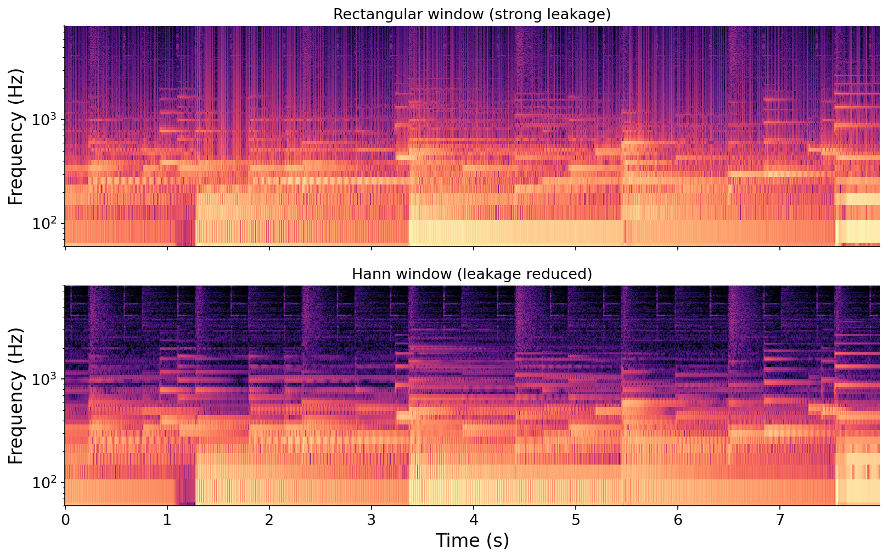
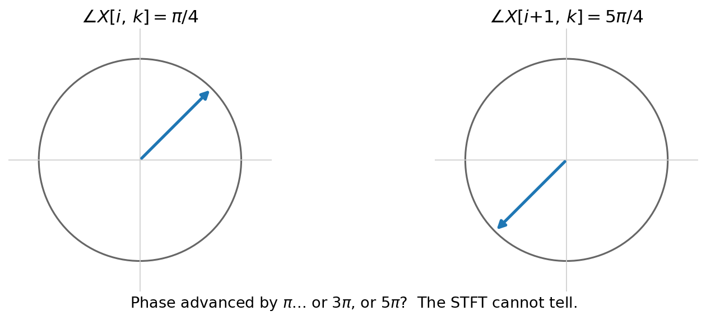

# Frame-based Processing

So far we have studied two extremes of how a computer handles time. When we studied {ref}`sampling <sec-sampling-and-frequency>` in [Chapter 7](../07-sampling-theory), we saw that music audio is usually sampled at more than $40{,}000$ times per second, fast enough to capture the highest frequencies we can hear. When we studied the {ref}`Fourier transform <sec-fourier-transform>` in [Chapter 5](../05-frequency-domain) and its practical cousin the {ref}`DFT <def-dft>` in [Chapter 8](../08-dft), we did the opposite: we integrated across _all_ of time to produce a single summary of a sound's frequency content, in effect measuring it just once no matter how long it was (a "rate" of $0$ measurements per second).

Most phenomena in music live _between_ these two extremes. The attack of a plucked string lasts about a hundredth of a second, a four-on-the-floor kick drum at 120 BPM lands twice a second, a pianist playing Bach's Prelude in C plays around five notes a second, and the [world's fastest drummer](https://en.wikipedia.org/wiki/World%27s_Fastest_Drummer) can manage twenty strokes a second. None of these needs the microsecond precision of individual samples, but all of them are lost to the time integration of a global Fourier transform.

:::{list-table} The rate at which things happen in music, from a single Fourier measurement to individual samples. The musically interesting middle (blue) is what this chapter is about.
:header-rows: 1
:name: tbl-rates

- - Phenomenon
  - Interval
  - Rate
- - Fourier transform (whole recording)
  - $\red{\infty}$
  - $\red{0}$ Hz
- - Kick drum at 120 BPM
  - $\blue{500}$ ms
  - $\blue{2}$ Hz
- - Melody (Bach, ~5 notes/sec)
  - $\blue{200}$ ms
  - $\blue{5}$ Hz
- - World's fastest drummer
  - $\blue{50}$ ms
  - $\blue{20}$ Hz
- - Instrument attack
  - $\blue{10}$ ms
  - $\blue{100}$ Hz
- - Audio samples
    - $\red{0.023}$ ms
    - $\red{44{,}100}$ Hz
      :::

**How do we process phenomena that happen at these intermediate, musically intuitive rates, say tens to hundreds of times per second?** The answer is {vocab}`frame-based processing`, a family of techniques that aggregate audio samples into chunks called {vocab}`frames` and then analyze or manipulate those frames. It is the foundation for granular synthesis, the spectrogram, time stretching, and much of the audio software you use every day. Throughout the chapter we will use a recording of a jazz trio as a running example:

:::{audio}
[A jazz trio (our running example)](./assets/audio-trio.wav)

Eight seconds of a jazz trio, which we will slice, scramble, stretch, and analyze throughout this chapter. [725677](https://freesound.org/s/725677/) by draganov89, License: [Attribution NonCommercial 4.0](https://creativecommons.org/licenses/by-nc/4.0/).
:::

(sec-extracting-frames)=

## Extracting frames

We begin with the most basic operation: chopping a signal into frames.

:::{prf:definition} Frame extraction
:label: def-frame
To extract frames of {vocab}`frame length` $N_F$ from a signal $x$, the $n$-th sample of the $k$-th frame $x_k$ is

$$x_k[n] = \begin{cases} x[k \cdot N_H + n] & \text{for } n \in \{0, 1, \ldots, N_F - 1\}, \\ 0 & \text{otherwise,}\end{cases}$$

where $N_H$ is the {vocab}`hop length`, the spacing in samples between the start of one frame and the start of the next.
:::

That is all there is to it: we extract segments of $N_F$ samples along the signal in increments of $N_H$ samples, and each stop is a frame. The simplest case takes $N_H = N_F$, so the frames tile the signal end to end:

:::{figure}


Extracting frames with $N_H = N_F$: the frames tile the signal one after another with no overlap.
:::

If the signal is sampled at $f_s$, this produces frames at a {vocab}`frame rate` of

$$f_k \left[{unit}`frames,second`\right] = f_s \left[{unit}`samples,second`\right] \cdot \frac{1}{N_H} \left[{unit}`frames,sample`\right].$$

Frames give us a new unit of time, complementing the _seconds_ and _samples_ we already know. The offset of frame $k$ is $k \cdot N_H$ samples, so its natural timestamp $t_k$ is $\frac{k \cdot N_H}{f_s}$ seconds. For example, at $f_s = 44{,}100$ Hz with $N_H = 1024$, frame $10$ represents the moment $t_{10} = \frac{10 \cdot 1024}{44100} \approx 232$ ms. Conversely, a recording of duration $T$ spans $\frac{T \cdot f_s}{N_H}$ frames, so a ten-second file at these settings is about $\frac{10 \cdot 44100}{1024} \approx 430.7$ frames. (We will deal with that fractional frame shortly.)

The relationship between $N_F$ and $N_H$ controls how much consecutive frames _overlap_. When $N_H < N_F$, each frame shares some samples with its neighbors. We quantify this as the {vocab}`overlap`, expressed as a fraction of the frame length:

$$\text{overlap} = \frac{N_F - N_H}{N_F}.$$

At $N_H = N_F$ there is no overlap (0%); at $N_H = N_F/2$ the frames overlap by half (50%). The animation below shows a single frame advancing across a signal at three overlap settings:

:::{figure}


The same frame length $N_F$ at three overlaps. Lowering the hop $N_H$ increases the overlap, packing the frames more densely (thin gray lines mark each frame offset $t_k$).
:::

## Reassembly with overlap-add

Reassembling frames into a signal is similarly straightforward. Given frames $x_k$ extracted at hop length $N_H$, we reconstruct an estimate $\hat{x}$ by adding each frame back at its original position:

:::{prf:definition} Overlap-add
:label: def-overlap-add
The {vocab}`overlap-add` reconstruction of frames $x_k$ at hop length $N_H$ is

$$\hat{x}[n] = \sum_{k} x_k[n - k \cdot N_H].$$
:::

Under what conditions does this round trip give _perfect reconstruction_, meaning $\hat{x} = x$? It depends entirely on the overlap, which we can see by tracking how many frames cover each sample:

:::{figure}


How overlap-add reconstructs, as a function of hop length. Only $N_H = N_F$ covers every sample exactly once (perfect reconstruction). Larger hops leave gaps; smaller hops double-count the overlaps, changing the amplitude.
:::

1. When $N_H = N_F$ (no overlap), the frames tile the signal exactly once, and $\hat{x} = x$. Perfect reconstruction.
1. When $N_H > N_F$, there are _gaps_ between frames, and the samples that fall in them are simply lost.
1. When $N_H < N_F$, the frames overlap, and the overlapping samples get added together more than once, boosting the amplitude.

Both building blocks are only a few lines of code. Extraction walks the signal in hops, yielding one $N_F$-sample frame at a time and stopping once fewer than a full frame remains:

CLAUDE: Change these to N_H and N_F throughout code examples for consistency

```python
def iter_frames(audio: pq.Audio, hop_length: int, frame_length: int) -> Iterator[np.ndarray]:
    for start in range(0, len(audio) - frame_length + 1, hop_length):
        yield audio.samples[start:start + frame_length]
```

Overlap-add takes the frames stacked into a single array and walks back the other way, adding each one into an output buffer at its hop position:

```python
def overlap_add(frames: np.ndarray, hop_length: int, sample_rate: int) -> pq.Audio:
    num_frames, frame_length, num_channels = frames.shape
    out = np.zeros((hop_length * (num_frames - 1) + frame_length, num_channels), dtype=frames.dtype)
    for k, frame in enumerate(frames):
        out[k * hop_length: k * hop_length + frame_length] += frame
    return pq.Audio(out, sample_rate)
```

The full runnable versions are in [code/frames.py](./code/frames.py). You can hear perfect reconstruction (and break it) by playing with $N_H$ and $N_F$ yourself below:

CLAUDE: _Collapse_ (don't hide) the first cell of this notebook since it's redundant w/ the inline code above

:::{interactive}[notebooks/frames.ipynb]
:::

## Windowing

In the previous section, we saw that overlapping frames can affect amplitude. The predictability of this suggests a potential mechanism to counteract it. Let's work our way towards a solution.

Instead of extracting raw frames, we can multiply each frame by a {vocab}`window` function $w \in \mathbb{R}^{N_F}$ as we extract it:

:::{prf:definition} Windowed frame extraction
:label: def-windowed-frame
Given a {vocab}`window` $w \in \mathbb{R}^{N_F}$, the windowed frame $x'_k$ is the extracted frame multiplied sample-by-sample by the window:

$$x'_k[n] = w[n] \cdot x[k \cdot N_H + n] = w[n] \cdot x_k[n].$$
:::

Overlap-add then reassembles the windowed frames, $\hat{x}[n] = \sum_k x'_k[n - k \cdot N_H]$. When does this still give perfect reconstruction? The condition is that the overlapping windows add up to the same non-zero constant at every sample:

:::{prf:definition} Constant overlap-add
:label: def-cola
A window $w$ and hop length $N_H$ satisfy the {vocab}`constant overlap-add` (COLA) property if the shifted windows sum to a non-zero constant $c$ at every sample $n$:

$$\sum_{k} w[n - k \cdot N_H] = c.$$

When they do, overlap-add reconstructs the original signal up to that constant factor, so dividing it out recovers $x$ exactly:

$$x[n] = \frac{1}{c}\, \hat{x}[n] = \frac{1}{c} \sum_{k} x'_k[n - k \cdot N_H].$$
:::

:::{note}
Strictly, COLA holds only if we imagine the windows continuing infinitely in both directions. At the very edges of a finite signal (near $0$ and $T$ seconds) fewer windows overlap, so their sum falls short of $c$. But as long as the sum is constant in the _steady state_ away from the edges, reconstruction is perfect there, and the affected fraction of the signal shrinks as the signal grows longer.
:::

Many combinations of window, frame length, and hop length satisfy COLA. The simplest is the rectangular window (all ones) at 0% overlap, which is exactly the perfect-reconstruction case we already saw ($c = 1$). A more useful one is the {vocab}`Hann window`,

$$w[n] = \frac{1}{2}\left(1 - \cos\!\left(\frac{2\pi n}{N_F}\right)\right),$$

a raised cosine bump that tapers smoothly to zero at both ends, used at 50% overlap (where the overlapping windows again sum to a constant):

:::{figure}


Hann windows at 50% overlap satisfy constant overlap-add: although each window rises and falls, the overlapping windows always sum to the same constant (bold line), so overlap-add reconstructs the signal exactly.
:::

Why would we ever prefer a tapered window to a plain rectangle, if both reconstruct perfectly? The reason has to do with what happens in the _frequency_ domain, and it will not become clear until we study the short-time Fourier transform later in this chapter. For now, take it on faith that smooth windows are often worth the trouble.

### Boundary conditions

In addition to the COLA edge cases, an eagle-eyed reader may have noticed we glossed over some other edge cases.

Firstly, what do we do with the _fractional frame_ at the end of a signal, where a frame starts inside the signal ($k \cdot N_H < N$) but runs off the end ($k \cdot N_H + N_F \geq N$)? Two conventions are common: we can {vocab}`zero-pad`, filling the missing tail of the frame with zeros, or we can simply truncate, discarding any frame that does not fit completely. Both are widely used.

Secondly, where should we anchor a frame relative to its timestamp? A frame canonically describes time at $t_k = k \cdot N_H$ samples. We have defined this sample as the _first_ of the corresponding frame, i.e., ${x_k[0] = k \cdot N_H}$. But it may be more intuitive in some cases to _center_ the frame around this timestep, i.e., ${x_k[\frac{N_F}{2}] = k \cdot N_H}$.

These two choices, alignment and padding, are independent, giving four combinations in all:

CLAUDE: Mark the same $t_k$ w/ vertical lines clearly in all 4 figures.

:::{figure}
![Four stacked panels of the same waveform, all with no overlap. Each shows frames as colored bands with a dashed line marking where the signal ends. Row 1 (left-aligned, zero-pad): frames start at the timestamp and the final frame extends past the signal end into a hatched zero-padded region. Row 2 (left-aligned, truncate): the final incomplete frame is dropped. Row 3 (centered, zero-pad): frames are centered on their timestamps, so the first frame extends before time zero into a hatched region. Row 4 (centered, truncate): incomplete frames at both ends are dropped.](./assets/fig-boundary.png)

The four boundary conventions: {left-aligned, centered} $\times$ {zero-pad, truncate}, shown with no overlap. Hatched regions are zero-padding beyond the signal; the dashed line marks the signal's end. You will encounter these in practice as arguments like `pad=True` or `center=False`.
:::

Ultimately these are just boundary conditions, affecting a smaller and smaller fraction of frames as the signal grows longer, so we will mostly ignore them from here on.

## Granular synthesis

We can now extract and reassemble frames, but so far the exercise has been been somewhat pointless: worst case we lose information, and best case we get back exactly what we started with. The interesting possibilities open up when we _manipulate_ the frames before reassembling them.

This is the idea behind {vocab}`granular synthesis`: chop a sound into many tiny slices, called {vocab}`grains` (typically tens of milliseconds long), then transform and rearrange those grains to build something new. It is a bit like making a collage out of a photograph, cutting it into little pieces and gluing them back in a new arrangement.

:::{figure}


Granular synthesis in three steps: extract short grains from the source (each multiplied by a smooth window), then reassemble them, possibly reordered, resized, or otherwise transformed, into a new sound.
:::

Because a grain is so short, it loses much of the recognizable character of the original sound. And a raw grain, sliced out with a hard rectangular window, has abrupt edges that produce an audible click. So in practice we multiply each grain by a smooth window (a Hann window, say) to taper those edges. Here is a handful of 50 ms grains lifted from the running example and played back with a big gap between them, first with hard rectangular edges and then windowed:

:::{audio-list}
{audio}`Raw (rectangular) grains <./assets/audio-grains-rect.wav>`

{audio}`Windowed (Hann) grains <./assets/audio-grains-hann.wav>`

The same grains, played with a rectangular window (note the click at each edge) and with a Hann window (smooth).
:::

### Manipulating grains

Individual grains are not very interesting on their own. The power of granular synthesis comes from manipulating them _as units_ before reassembly. One of the simplest manipulations is to _reorder_ them. We can shuffle grains across the whole signal, or shuffle them only within short segments:

:::{figure}


Two ways to randomize grain order: globally (top), which fully scrambles the sound, or within short segments (bottom), which keeps the large-scale structure while blurring the fine detail.
:::

Reordering grains produces a striking effect. It preserves the overall _texture_ of the sound while erasing its specifics, a kind of controlled blur:

CLAUDE: relative amplitudes here are still off. granular-texture should be louder (maybe +6dB?) and scrambled samples should be much quieter (maybe -12dB)?
:::{audio-list}
{audio}`Granular texture (grains shuffled within segments) <./assets/audio-granular-texture.wav>`

{audio}`For contrast: the raw samples shuffled <./assets/audio-scrambled-samples.wav>`

Shuffling _grains_ keeps the character of the sound. Shuffling the raw _samples_ (bottom) destroys it entirely, leaving only noise.
:::

That contrast is the whole point. Shuffling grains keeps the sound recognizable, but shuffling the underlying _samples_ (not grains) yields nothing but noise. Working at the level of grains, rather than samples, is what makes the effect musical. Order is not the only property we can manipulate: we could also change the grains' amplitude, duration, pitch, or density before reassembling. You can explore all of these by editing the `manipulate` function below:

:::{interactive}[notebooks/granular.ipynb]
:::

### Time stretching

Here is a particularly useful manipulation. What if we _decouple_ the hop length at which we extract grains from the hop length at which we overlap them back together? Call the extraction hop $N_H$ and the reassembly hop $N_H'$. If $N_H' = 2 N_H$, we spread the grains out to twice their original spacing, doubling the output's duration. If $N_H' = \tfrac{1}{2} N_H$, we pack them together, halving it:

CLAUDE: What's goign on here? The "extracted" grains are _taller_ than the reassembled ones (implying higher amplitude), when they should be the same height and width
:::{figure}


Time stretching by decoupling the hops. The grains are unchanged, but reassembling them at twice the spacing ($N_H' = 2 N_H$) makes the output twice as long, halving the playback speed.
:::

:::{audio-list}
{audio}`Original <./assets/audio-trio.wav>`

{audio}`Half speed (grains spread out) <./assets/audio-stretch-half.wav>`

{audio}`Double speed (grains packed together) <./assets/audio-stretch-double.wav>`

Granular time stretching. Changing the spacing at reassembly changes the duration, and therefore the playback speed, while the grains themselves are untouched.
:::

We have achieved {vocab}`time stretching`. Spreading or packing the grains changes the total duration, and hence the playback speed, without touching the contents of the grains themselves.

This is the _second_ time we have changed playback speed. The first was {ref}`resampling <sec-resampling>` in [Chapter 7](../07-sampling-theory). Listen to the same speed changes done by resampling instead:

:::{audio-list}
{audio}`Half speed via resampling <./assets/audio-resample-half.wav>`

{audio}`Double speed via resampling <./assets/audio-resample-double.wav>`

Resampling also changes the speed, but notice that it changes the _pitch_ too, exactly like slowing down or speeding up a record.
:::

The difference is crucial. Resampling changes duration _and_ pitch together (slower means lower, faster means higher), which was exactly what we wanted for wavetable synthesis. But granular time stretching changes duration while keeping the pitch _constant_. Having both techniques suggests something powerful: _decoupled_ control over pitch and duration. We can first _resample_ the grains to change their pitch, and then independently _time stretch_ them by changing their spacing:

CLAUDE: Include a figure here in the same design language as the one above in this section.

:::{audio-list}
{audio}`Half speed and 20% higher pitch (resample + stretch) <./assets/audio-decoupled.wav>`

Combining resampling (to shift the pitch up 20%) with granular time stretching (to slow to half speed) lets us control the two independently.
:::

In practice, getting a clean result from granular time stretching requires a generous amount of overlap between grains, so that the crossfades between them are smooth.

## The short-time Fourier transform

Granular synthesis showed that frame-based processing can do genuinely creative things. Now we turn to perhaps its most powerful application: the {vocab}`short-time Fourier transform` (STFT), which reveals how a sound's frequency content evolves _over time_.

Recall the limitation of the DFT: it integrates over all time, turning $N$ samples into $N$ bins and, in the process, discarding _when_ each frequency occurred. But of course frequency content changes over time in music, that is what a musical melody _is_. How can we see those changes? The idea is exactly the frame-based recipe: slice the signal into frames and take the DFT of each one.

:::{prf:definition} Short-time Fourier transform
:label: def-stft
The {vocab}`short-time Fourier transform` of a signal $x$ applies the DFT to each extracted frame:

$$\texttt{STFT}_k(x) = \texttt{DFT}(x_k), \qquad x_k[n] = x[k \cdot N_H + n].$$

For a signal of $N$ samples with hop length $N_H$ and frame length $N_F$, the output is a complex matrix of shape $\frac{N}{N_H} \times N_F$: one row per frame, one column per frequency bin (or $\frac{N_F}{2}+1$ columns for real-valued audio).
:::

Taking the magnitude of each frame and stacking the frames side by side gives a {vocab}`spectrogram`, a two-dimensional image with time on the horizontal axis, frequency on the vertical axis, and amplitude encoded as color intensity. Because our ears perceive amplitude roughly logarithmically, we usually take the $\log$ of the magnitude before mapping it to color. For the same reason, the frequency axis is often drawn on a _log_ scale too: our sense of pitch is logarithmic, so an octave (a _doubling_ of frequency) sounds like a constant step no matter where it falls, and a log axis gives every octave equal space. We will develop this logarithmic view of pitch in [Chapter 15](../15-psychoacoustics-tuning).

The spectrogram is one of the most important visualizations in all of audio. Here it is on a simple rising melody, C-D-E-F-G played as sine tones, shown three ways for comparison:

CLAUDE: Same log scale for "dft of whole signal" x axis as well
CLAUDE: In the first plot ("the melody"), the note rectangles should be full length! right now they look like short staccato onsets in that figure, but the audio / spectrogram has them as legato. also, align them in time properly with the spectrogram (right now they're inexplicably unaligned from one another)
:::{audio-figure}
{audio}`The C-D-E-F-G melody <./assets/audio-melody.wav>` 

The same rising C-D-E-F-G melody shown three ways: in symbolic form (top), as a log-frequency spectrogram (middle), and as a plain DFT of the whole signal (bottom). The DFT finds all five pitches but loses their _order_; the spectrogram shows each pitch at the moment it sounds, so the rising melody is unmistakable.
:::

The plain DFT sees all five notes as five peaks but cannot tell you their order. The spectrogram shows each note stepping up in turn. That extra time axis is the whole point of the STFT.

The STFT is really just the frame-based recipe with a DFT in the middle: cut the signal into frames, and take the DFT of each one.

CLAUDE: Draw a thin rectangle around each frame DFT amplitude plot for clarity
CLAUDE: The first couple of frames start with a big white rectangle on the bottom of the plot... seems like something is off? maybe the (nearest neighbor) interpolation is bugging out?
:::{figure}
![A schematic. At top, a waveform x[n] divided into four colored frames labeled frame 0 through frame 3. Each frame has a downward arrow into its own "DFT" box, and each box has a downward arrow to a small magnitude spectrum. A caption reads: one spectrum per frame equals the spectrogram.](./assets/fig-stft-analysis.png)

The STFT as analysis: each frame is sent through its own DFT, and the resulting spectra, stacked side by side, form the spectrogram.
:::

### Configuring the frame length

The STFT has two key parameters, the frame length $N_F$ and the hop length $N_H$, and choosing them well is something of an art. Consider $N_F$ first. What happens as we make frames longer?

The upside is better _frequency_ resolution. Recall that the DFT bin spacing is $\Delta f = f_s / N_F$, so longer frames pack the bins closer together and resolve nearby frequencies more finely. But this comes at a cost in _time_ resolution: a longer frame smears a wider stretch of time into a single spectrum. In the extreme where $N_F$ grows to the whole signal length $N$, we are back to a single all-of-time DFT, having thrown away time entirely. This is a fundamental trade-off, and you can watch it play out by sweeping $N_F$ through powers of two:

CLAUDE: Include one more power of two so the blurring effect is even clearer
:::{figure}


The time-frequency resolution trade-off. At the beginning of the animation, short frames give sharp timing but coarse frequency; by the end, long frames give fine frequency detail but blur events together in time.
:::

There is a second cost: computation. Under the FFT, a single DFT of length $N_F$ costs $O(N_F \log N_F)$, and the STFT computes one for each of its $\frac{N}{N_H}$ frames:

$$\underbrace{\frac{N}{N_H}}_{\text{number of frames}} \cdot \underbrace{O(N_F \log N_F)}_{\text{cost per DFT}} \;=\; O\!\left(N \cdot N_F \log N_F\right),$$

taking the hop $N_H$ to be a constant factor in the last step. So the total cost grows with the frame length $N_F$, another reason not to make frames larger than the application needs.

There is no universally best $N_F$; it depends on the application. A few rules of thumb: use a power of two for FFT efficiency, and make the frame at least one cycle of the lowest frequency you care about. The lower limit of human hearing is around $20$ Hz, a cycle of which is $\frac{1}{20}$ seconds or $50$ ms, and at $44.1$ kHz a $4096$-sample frame ($\approx 93$ ms) comfortably covers it.

### Configuring the hop length

The hop length $N_H$ is a gentler knob. Unlike $N_F$, it does _not_ affect frequency resolution at all: the DFT of each frame is unchanged no matter how far apart the frames sit. Instead, $N_H$ controls two things. The first is time resolution, since a smaller hop means more frames per second and a finer-grained view of how the sound changes. The second is computational cost: an STFT of $N$ samples produces $\frac{N}{N_H}$ frames, so halving the hop doubles the number of DFTs we must compute.

We usually express the hop as an amount of _overlap_, the quantity $\frac{N_F - N_H}{N_F}$ we {ref}`defined at the start of the chapter <sec-extracting-frames>`. Recall that we must keep $N_H \le N_F$ or we will skip samples between frames. In the STFT, a common choice is $N_H = N_F / 2$ (50% overlap), and heavy overlaps like 75% ($N_H = N_F/4$) are typical when reconstruction quality matters.

### Windowing revisited

We can now settle the question we deferred earlier: why bother with smooth windows? The answer is {ref}`spectral leakage <sec-windowing>`, which we first met in [Chapter 8](../08-dft). Extracting a frame is a _multiplicative_ operation: it is equivalent to multiplying the signal by a rectangular window that is one over the frame and zero everywhere else. By the {ref}`convolution theorem <thm-convolution>` from [Chapter 9](../09-filters), multiplying by a window in time _convolves_ the signal's spectrum with the window's spectrum, smearing each sharp spectral line into a blur.

The rectangular window's spectrum is a sinc function with tall side lobes, so it smears energy far and wide:

:::{figure}


Framing with a rectangular window causes strong spectral leakage. By the convolution theorem, the spectrum of the windowed signal (bottom right) is the signal's spectrum convolved with the window's spectrum (a sinc with large side lobes), smearing each sharp line across many bins.
:::

Because every frame is a windowed slice, this leakage is present in _every_ STFT, and it is worse than in a plain DFT because each frame is shorter. The fix is to multiply each frame by a window with a gentler spectrum, such as the Hann window. Its spectrum concentrates energy in a narrow central lobe with much smaller side lobes, so the smearing is greatly reduced:

CLAUDE: Let's go with 1 Hz and 4 Hz instead of 1 and 2, in both figures. Otherwise the hann window effect is smearing the peaks together, and looks worse than rectangular
:::{figure}


A Hann window has a much cleaner spectrum than the rectangle, its side lobes are far smaller, so convolving with it (windowing each frame) reduces spectral leakage substantially.
:::

The effect is visible in the spectrogram itself, where the rectangular window's leakage shows up as vertical smearing that the Hann window cleans away:

:::{figure}


Log-frequency spectrograms of the running example with a rectangular window (top) and a Hann window (bottom). The Hann window's reduced leakage yields a noticeably cleaner picture.
:::

This is also why granular synthesis windowed each grain: the same smoothing that reduces spectral leakage also removes the audible clicks at grain edges. In the STFT, where we window every frame repeatedly, it is especially important.

### Spectral analysis

The spectrogram is a powerful _analysis_ tool. Suppose we are handed the C-D-E-F-G recording from earlier and asked which _pitches_ it contains and when. We can march through the STFT frame by frame, find the loudest frequency in each frame whose energy exceeds some threshold, round it to the nearest musical pitch, and emit a note whenever the detected pitch changes. This turns a {pyquist}`Audio` into a {pyquist}`Score`, a crude form of music {vocab}`transcription`:

:::{interactive}[notebooks/transcription.ipynb]
:::

Transcription in general is a hard problem, especially for _polyphonic_ music where many notes sound at once, but this simple peak-picking approach works well enough for clean, monophonic input like our sine melody.

### The inverse STFT

We have been _computing_ the STFT; now let us _invert_ it. Is the STFT invertible? We already know the DFT is, since $x = \texttt{IDFT}(\texttt{DFT}(x))$. So under a rectangular window at 0% overlap, where the frames tile the signal exactly, the STFT is invertible too: applying the inverse DFT to each frame recovers that frame, and overlap-add stitches the frames back together,

$$\texttt{ISTFT}(\texttt{STFT}(x)) = x.$$

Intuitively, the exact invertibility of the DFT implies that the STFT does not change the reconstruction properties of standard frame-based processing. Accordingly, For other windows and overlaps, the same COLA condition from before guarantees perfect reconstruction: as long as the (squared) windows sum to a constant, the inverse DFTs overlap-add back to the original signal (potentially with a constant amplitude gain that we can adjust for). A runnable STFT and inverse STFT are in [code/stft.py](./code/stft.py).

### Spectral processing

The invertibility of the STFT unlocks a whole family of effects. We can transform a sound into the time-frequency domain, _edit_ the spectral coefficients however we like, and transform back, a technique called {vocab}`spectral processing`. Now that we have analysis _and_ synthesis in hand, the whole pipeline is a single frame-based flow with an editing step in the middle:

CLAUDE: change "frame $x_k$" to "frame $x'_k$ (windowed)"
:::{figure}


The full STFT pipeline. Analysis (the STFT) frames the signal and takes the DFT of each frame; synthesis (the inverse STFT) takes the inverse DFT of each frame and overlap-adds the results. Editing the spectra in between is spectral processing.
:::

CLAUDE: Let's add a third example where we apply a brick wall "low pass filter" (zeroing out freq content above some threshold)

Two quick examples: we can keep each frame's magnitudes but replace its phases with random values, which smears the sound's sharp transients into a wash, or we can perform _cross-synthesis_, combining the magnitudes of one sound with the phases of another:

CLAUDE: the "cross synthesis" example isn't coming across effectively as implemented. let's try again. see the bush/cello example from "raw/spectral-process.sal" for the correct high-level technique to apply.
:::{audio-list}
{audio}`Phase randomized (transients smeared) <./assets/audio-phase-random.wav>`

{audio}`Cross-synthesis (trio's magnitudes, Lucier's phases) <./assets/audio-cross-synth.wav>`

Two spectral-processing effects, both computed by editing the STFT and inverting it. The cross-synthesis takes the magnitude spectrum of the trio and the phase spectrum of a spoken clip (Alvin Lucier's _I Am Sitting in a Room_).
:::

There is an enormous space of effects to explore here. Try inventing your own by editing the STFT directly:

:::{interactive}[notebooks/spectral-processing.ipynb]
:::

### The phase vocoder

We end our discussion of the STFT with a famous spectral-processing algorithm, the {vocab}`phase vocoder`, which performs high-quality time stretching without pitch shifting.

:::{margin}
Despite the name, the phase "vocoder" is applied to all kinds of audio, not just voice. It is the algorithm behind the "2x speed" button on video sites. It was originally proposed in 1966 as a low-bandwidth way to transmit _speech_, one year after the FFT was invented, and the name stuck.
:::

Granular synthesis already gave us pitch-preserving time stretching. But we can also frame time stretching as a spectral-processing operation: to slow a sound to half speed, we want an output STFT with twice as many frames, so we simply _interpolate_ between the input frames. Let's define $X[j] = \texttt{STFT}_j(x)$, i.e., the DFT of the $j$-th frame of $x$. For output frame $i$, we blend input frames $j = \lfloor i/2 \rfloor$ and $j+1$:

$$Y[i] = (1 - a)\, X[j] + a\, X[j+1], \qquad a = \tfrac{i}{2} - j.$$

This is not unlike the interpolation operation in wavetable synthesis except applied to complex-valued frames instead of wavetable samples. This sounds reasonable, but it has a subtle flaw involving _phase_. Each STFT bin has a phase, and when we interpolate we are implicitly assuming we know how that phase advances from one frame to the next. But the phase is only known modulo $2\pi$: if a bin's phase reads $\pi/4$ in one frame and $5\pi/4$ in the next, did it advance by $\pi$, or by $3\pi$, or by $5\pi$? The sliding-window nature of the STFT makes this ambiguous, and naive interpolation between ambiguous phases produces a smeared, "phasey" artifact.

:::{figure}


The trouble with phase. A bin's phase jumps from $\pi/4$ to $5\pi/4$ between frames, but the true advance could be $\pi$, $3\pi$, $5\pi$, or any of infinitely many possibilities. The STFT alone cannot disambiguate them.
:::

The phase vocoder resolves this by predicting how the phase _should_ evolve. Bin $k$ corresponds to a frequency of $\omega_k$ radians per sample, so over a single hop of $N_H$ samples its phase should advance by an _expected_ amount of $\omega_k \cdot N_H$ radians. The algorithm compares this expected advance to the _observed_ advance (the actual phase difference between two consecutive frames) and resolves the $2\pi$ ambiguity by picking whichever multiple lands nearest the expectation. Accumulating these corrected advances frame by frame builds a clean, continuous phase for the output. The details are beyond our scope, but the result is time stretching that exceeds the quality of granular synthesis:

:::{audio-list}
{audio}`Original <./assets/audio-trio.wav>`

{audio}`Half speed (pitch preserved) <./assets/audio-pv-half.wav>`

{audio}`Double speed (pitch preserved) <./assets/audio-pv-double.wav>`

{audio}`Pitched down an octave (phase vocoder + resampling) <./assets/audio-pv-pitch.wav>`

The phase vocoder stretches time while holding pitch constant, and combined with resampling it gives independent control over both.
:::

## Real-time processing

Frame-based processing has one more role to play, which we will return to in [Chapter 17](../17-realtime): it is how real-time audio works. Suppose we want to synthesize an endless stream of audio _on the fly_, computing each sample $x[n] = x(\tfrac{n}{f_s})$ just in time to be played. We could call our synthesis function once per sample, but function calls have computational overhead, and at tens of thousands of samples per second that overhead adds up fast. Worse, it is overkill: we cannot physically turn knobs fast enough to need per-sample control anyway.

Instead, real-time systems compute audio in frames, usually called {vocab}`blocks` in this context. We pick a block length $B$, and at each moment $\frac{k \cdot B}{f_s}$ the operating system asks our program for the next $B$ samples. This is exactly frame-based processing with $N_H = N_F = B$. As long as we can compute each block in less than $\frac{B}{f_s}$ seconds, the audio never runs dry and we achieve a real-time stream. We will develop this idea properly when we study real-time, interactive audio.

## Summary

- Frame-based processing operates on music at intermediate, musically intuitive rates by aggregating samples into {vocab}`frames`.
- A frame is $x_k[n] = x[k N_H + n]$, controlled by the {vocab}`frame length` $N_F$ and the {vocab}`hop length` $N_H$. Their ratio sets the overlap.
- {vocab}`Overlap-add` reassembles frames. It is perfect reconstruction when $N_H = N_F$ with rectangular windows, or more generally when windows satisfy {vocab}`constant overlap-add`.
- {vocab}`Granular synthesis` chops sound into {vocab}`grains` and manipulates them (reordering, resizing, respacing) to create textures, and to time-stretch without changing pitch.
- The {vocab}`short-time Fourier transform` takes the DFT of each frame, revealing how frequency content evolves over time. Its magnitude is a {vocab}`spectrogram`.
- The frame length $N_F$ trades time resolution against frequency resolution; the hop length $N_H$ trades time resolution against computation. Windowing each frame reduces {vocab}`spectral leakage`.
- The STFT is invertible, enabling {vocab}`spectral processing`: editing a sound in the time-frequency domain. The {vocab}`phase vocoder` uses this to time-stretch while preserving pitch.
- Real-time audio is frame-based processing with $N_H = N_F = B$, computing one {vocab}`block` at a time.

## Questions for the reader

:::{exercise}
**Frames and time.** A recording at $f_s = 48{,}000$ Hz is processed with frame length $N_F = 2048$ and hop length $N_H = 512$. (a) What is the frame rate in frames per second? (b) What percentage overlap is this? (c) What timestamp, in milliseconds, does frame $k = 20$ correspond to?
:::

:::{exercise}
**Perfect reconstruction.** You extract frames with a rectangular window and reassemble them with overlap-add. For each of $N_H = N_F$, $N_H = 2 N_F$, and $N_H = N_F / 2$, describe what the reconstructed signal looks like compared to the original, and say which (if any) is perfect reconstruction.
:::

:::{exercise}
**Grains versus samples.** Randomizing the order of a sound's _grains_ preserves its overall texture, but randomizing the order of its _samples_ produces only noise. Explain why, in terms of what information a single grain carries that a single sample does not.
:::

:::{exercise}
**Resolution trade-off.** You want to analyze a bass line whose lowest note is $55$ Hz, and you also want to pinpoint the exact moment each note begins. Explain the tension between these two goals in terms of the frame length $N_F$, and suggest a frame length that is a reasonable compromise at $f_s = 44{,}100$ Hz.
:::

:::{exercise}
**Time stretch versus resampling.** Both granular time stretching and resampling can make a recording play back at half speed. How does each affect the _pitch_ of the result, and why? Which would you use to slow down a song for practice without making it sound lower?
:::

:::{exercise}
**Reading a spectrogram.** Sketch (in words) what the spectrogram of a single, sustained trumpet note would look like: where would you see energy, and how would it be arranged on the time and frequency axes? How would it differ from the spectrogram of a snare drum hit?
:::

## Musical examples

Curtis Roads, a pioneer of granular synthesis, composed some of the earliest and most influential music built entirely from grains. His [Eleventh Vortex](https://www.youtube.com/watch?v=XgBjD6_SbOU) is a dense cloud of thousands of tiny sonic particles, exactly the granular textures of this chapter taken to an extreme.

Aphex Twin's "[Equation](https://www.youtube.com/watch?v=M9xMuPWAZW8)" (formally titled with a mathematical equation) hides a visual surprise: near the end of the track, his face is drawn directly into the _spectrogram_. It only becomes visible when you view the sound in the time-frequency domain, a playful demonstration that the spectrogram is a genuine, invertible representation of sound, and that spectral processing runs both ways.
