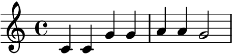
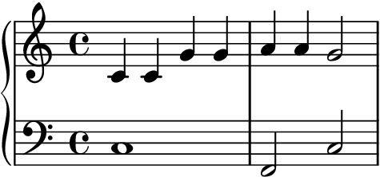
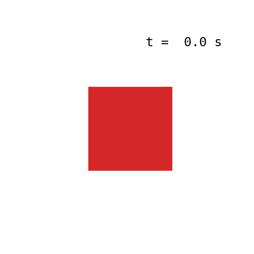
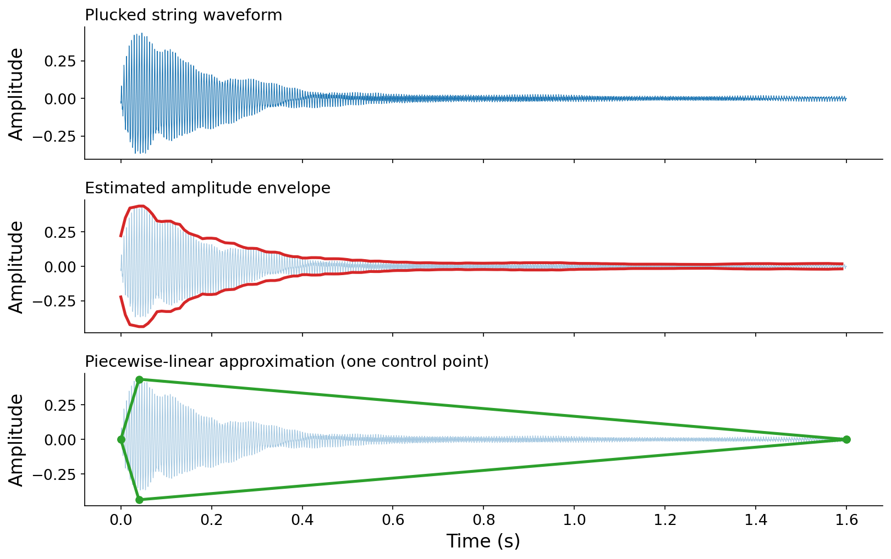
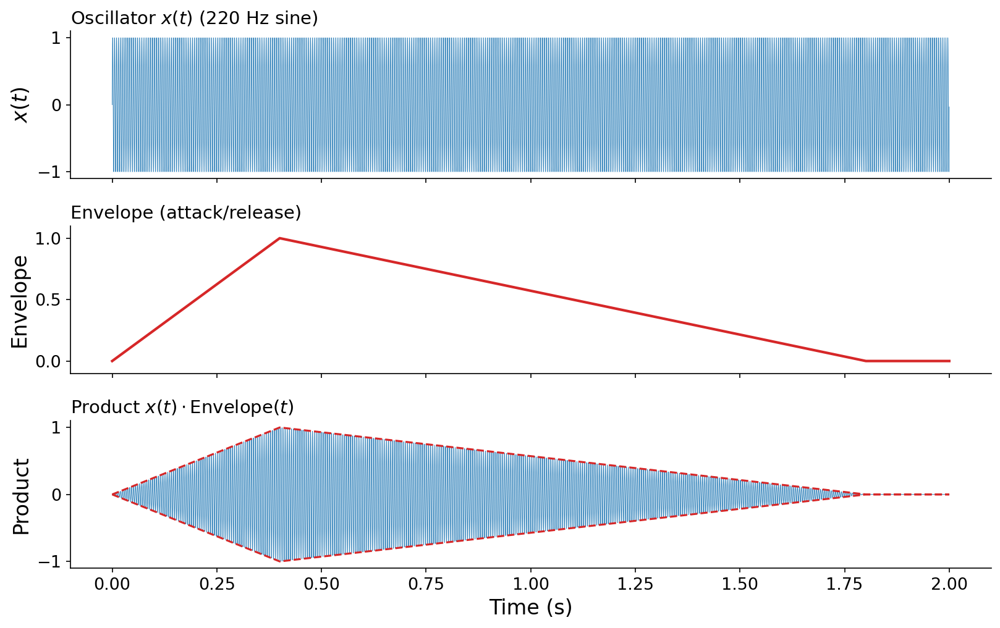
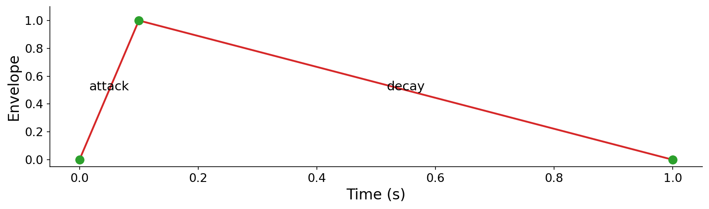
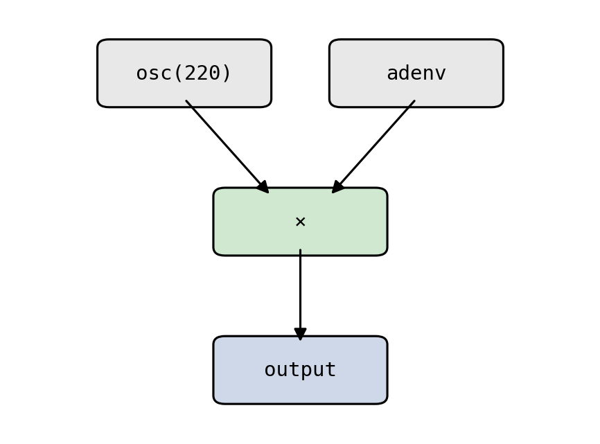
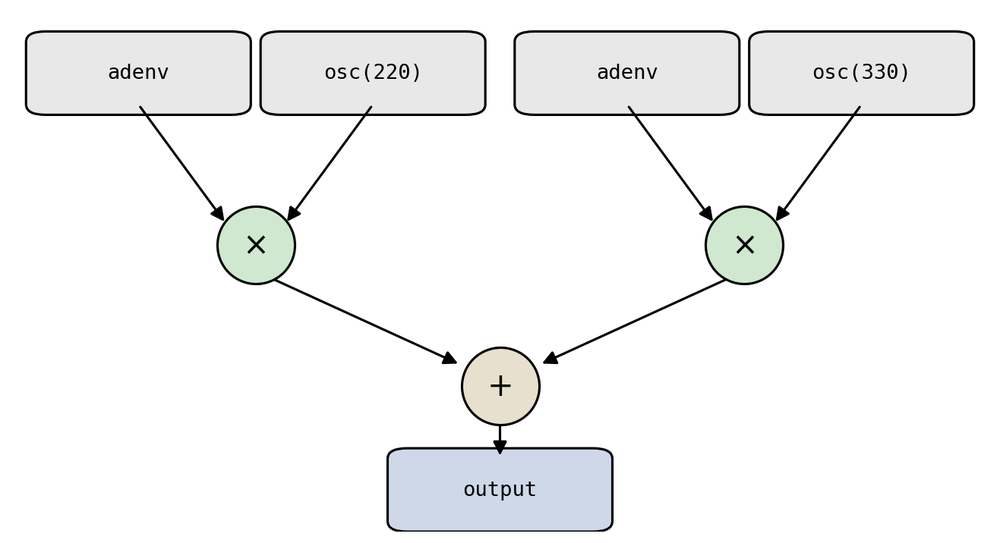

# Scores and Timbre

So far, this book has focused on the basics of musical _sound_: the periodic phenomena that characterize a single tone, and the synthesis techniques that produce it. But a tone in isolation is not yet music. Music unfolds in time as a sequence of events: notes that start, stop, and overlap to form melody, rhythm, and harmony.

Edit: this paragraph is rough. awkward transition. flip the organization w/ bottom line up front: this chapter, we're focusing on music scores. then go into comparison between music and language, dropping the awkward "analogy is apt here". don't say the word timbre yet, since we haven't defined it. stick with a more general description, e.g., "... how to combine scores with the other elements of musical sound that we've studied previously". Music is often compared to language, and the analogy is apt here. Underlying a recording of speech is a _transcript_, a high-level symbolic representation of the words being spoken. In the same way, underlying a piece of music is a _score_: a high-level, sparse, and discrete description of the events that make up the music. This chapter studies scores, how to represent them on a computer, and how to combine them with the timbres we already know how to synthesize.

## Scores

If you've studied music before, you're likely familiar with musical scores written in standard notation:

EDIT: Add tempo marking, e.g., quarter note = 120, so the times can be in seconds below

:::{figure}


The first phrase of "Twinkle, Twinkle, Little Star", consisting of seven _notes_ with musical pitches C C G G A A G. Written in standard Western notation: quarter notes in 4/4 time, treble clef.
:::

:::{audio}
[The melody above, synthesized](./assets/audio-twinkle-melody.wav)

The same melody, synthesized so you can hear it without reading notation.
:::

:::{note}
**You will not need to read music notation in this class.** The staff above is included only for demonstration, and to ground the discussion for those who _have_ studied music notation. Everything we do with scores will be expressed in code.
:::

Standard notation was designed for human composition and performance. But here we're studying computer music, so we should ask: how should we represent a score on a _computer_?

Across many musical practices and cultures (including but not limited to Western music), musical scores can be characterized by a set of {vocab}`events`: each occurring at a specific point in time and carrying parameters that describe it. This is exactly how Pyquist represents a score. A {vocab}`score` is a list of {vocab}`event`s, where each event is a pair of a `time` and a dictionary of keyword arguments:

EDIT: Condense this into one code example w/ `Score` below, no need to specify a single `pq.Event` as a separate code example. Also introduce the example at a high level, something like: a natural way of translating Western music notation into a `Score` is to map each _note_ into an event.

```python
import pyquist as pq

# pq.Event(time, kwargs); pq.Score is a list of events.
event = pq.Event(0.0, {"pitch": "C4", "duration": 1.0})
```

:::{note}
Pyquist leaves the meaning of an event up to you. You decide what units `time` is in (seconds, beats, ...) and which keyword arguments each event carries. Unless otherwise noted, `time` is assumed to be in seconds in this book. In this example, we will use the keys `pitch` and `duration` as the keyword arguments.
:::

The notated melody above translates directly into a `pq.Score`:

EDIT: Modify `pyquist` lib so that `pq.Score` automatically attempts to convert and tuple it encounters into `pq.Event` (must be 2-tuple w/ number and kwargs dict, otherwise error). Remove pq.Event from all subsequent examples, as well as README and HelloPyquist in the original library. Modify this to be at 120 BPM, so 0.0/0.5/1.0/...

```python
melody = pq.Score([
    pq.Event(0.0, {"pitch": "C4", "duration": 1.0}),
    pq.Event(1.0, {"pitch": "C4", "duration": 1.0}),
    pq.Event(2.0, {"pitch": "G4", "duration": 1.0}),
    pq.Event(3.0, {"pitch": "G4", "duration": 1.0}),
    pq.Event(4.0, {"pitch": "A4", "duration": 1.0}),
    pq.Event(5.0, {"pitch": "A4", "duration": 1.0}),
    pq.Event(6.0, {"pitch": "G4", "duration": 2.0}),
])
```

For the seven notes in our running example, we've encoded three dimensions into the corresponding events:

1. The _horizontal_ position of each note becomes the `time` of its event.
1. The _vertical_ position of each note becomes a `pitch` (fundamental frequency) in its kwargs.
1. The _color_ (filled vs. hollow, flags, etc.) of each note, which indicates rhythmic value, becomes a `duration` in its kwargs.

### Contemporaneous events

EDIT: Better set up here, e.g., "One difference between language and music is that language is typically "single stream": one speaker speaks one word at a time. In contrast, ..." Scores can also contain events that occur at the same time. We encode these simply as multiple events sharing a timestamp. Here, a bass line is layered beneath the melody, with the first bass note beginning at the same instant as the first melody note:

:::{figure}


The same melody (treble clef) harmonized with a bass line (bass clef). The bass C and the first melody C both begin at $t = 0$, so they sound simultaneously.
:::

Because a `pq.Score` is just a list of events, harmonizing the melody is as simple as adding a second list of events:

```python
bass = pq.Score([
    pq.Event(0.0, {"pitch": "C3", "duration": 4.0}),
    pq.Event(4.0, {"pitch": "F2", "duration": 2.0}),
    pq.Event(6.0, {"pitch": "C3", "duration": 2.0}),
])
harmonized = pq.Score(melody + bass)
```

:::{audio}
[The harmonized score, synthesized](./assets/audio-twinkle-harmonized.wav)

The melody and bass line rendered together. The full code is in [code/score_render.py](./code/score_render.py).
:::

### A score is a very general structure

Pyquist adopts a deliberately _general_ definition of a score. You decide what a score means, what arguments each event carries, and how those arguments are interpreted. The only commonality is that a score represents **things occurring at certain points in time**.

Nothing about this definition is even specific to sound! The same structure can describe any time-varying content, such as visual events in an animation:

```python
shapes = pq.Score([
    pq.Event(0.0, {"color": "red", "shape": "square"}),
    pq.Event(2.0, {"color": "blue", "shape": "star"}),
    pq.Event(3.0, {"color": "green", "shape": "circle"}),
])
```

EDIT: Make this a wider aspect ratio to not take up as much vertical height. put the timer in the top left, dunno what I was thinking

:::{figure}


The `shapes` score above, interpreted visually. Each event swaps the displayed shape and color at its timestamp; the counter shows the current time as the four-second loop repeats.
:::

## Scores vs. timbre

In [Chapter 3](../3-additive-synthesis), we studied additive synthesis, whose goal was to combine harmonics into richer sounds, or {vocab}`timbre`s (pronounced like the first two syllables of "tambourine").

:::{prf:definition} Timbre
:label: def-timbre
_Timbre_ is the set of attributes of a musical sound that let us recognize it as a distinct musical component or instrument, independent of its pitch and loudness.
:::

EDIT: Avoid saying "compose" throughout, as it's overloaded in a musical context

Timbre and scores are complementary, equally critical dimensions of how we perceive music. Together, they capture the _acoustic_ and _symbolic_ aspects of music, respectively. The remarkable thing is that we can **combine the two together**: a score says _when_ and _with what parameters_, and a timbre says _what it sounds like_.

As a concrete example, imagine a jazz trio playing a jazz standard notated as sheet music. In this example, the three instruments (piano, bass, drums) characterize three acoustically distinct timbres, and the sheet music is the score informing which notes they play and when.

### A formal view

Let's make this a bit more precise. Following the structure above, a score is a set of $N$ sound events $\{E_1, E_2, \ldots, E_N\}$, where each event

$$E_i = (t_i, \theta_i)$$

pairs an onset time $t_i$ (in seconds) with a dictionary of sound-producing parameters $\theta_i$.

We model a timbre or instrument as a function that turns parameters into sound. Given parameters $\theta$, the timbre $T_\theta(t) : \mathbb{R} \to \mathbb{R}$ produces a waveform.

A _performance_ of the score is then the sum of every event's sound, each shifted to its onset time:

EDIT: Make this definition more standalone, including the sub definitions of events and timbre functions

:::{prf:definition} Rendering a score
:label: def-render
$$x(t) = \sum_{i=1}^{N} T_{\theta_i}(t - t_i).$$
:::

The shift $t - t_i$ places event $i$'s sound at its onset $t_i$. In practice, $T_\theta(t)$ is nonzero only for a finite window, so on a computer we compute only those nonzero samples and mix them into the output.

:::{note}
This definition is very general. If $\theta$ carries a parameter like `{"instrument": "bass"}`, then a single instrument function $T_\theta$ can dispatch to entire _collections_ of instruments (e.g., the jazz trio above), choosing how to synthesize each event based on its parameters.
:::

In Pyquist, the method `Score.render` executes exactly this formula. It takes an instrument, a callable that maps an event's kwargs to `pq.Audio`. It then shifts each rendered event to its onset and sums them into a single output `pq.Audio`. Here is a simple additive-synthesis instrument and the call that renders our melody:

EDIT: Just make this a basic sine wave oscillator called `osc` using `np.sin`. forget about additive. I don't want to confuse people since this doesn't do a wavetable

```python
def additive_instrument(pitch: str, duration: float, **kwargs) -> pq.Audio:
    f_0 = pitch_to_frequency(pitch_name_to_pitch(pitch))
    N = int(duration * F_S)
    t = np.arange(N) / F_S
    k = np.arange(1, 5)               # four harmonics
    a = 1.0 / k                       # 1/k amplitude decay
    samples = (a * np.sin(2 * np.pi * k * f_0 * t[:, np.newaxis])).sum(axis=1)
    env = np.interp(t, [0.0, 0.02, duration], [0.0, 1.0, 0.0], left=0.0, right=0.0)
    return pq.Audio(samples * env, F_S)

audio = melody.render(additive_instrument)
```

The instrument is called once per event, with that event's kwargs (`pitch` and `duration`); `render` handles the time-shifting and mixing. The full code, including the envelope we'll explain shortly, is in [code/score_render.py](./code/score_render.py).

### Perception: timbre vs. score

EDIT: Sharper transition. When we studied additive synthesis, we learned that adding together harmonics can produce different timbres. Now, in the formal view above, we learned that adding is also the basis of rendering scores! So where does the dividing line lie between the two? Then, include the following paragraph. The dividing line between timbre and score can be surprisingly thin. In Western music, a score is usually a collection of notes, each with a pitch (a fundamental frequency). When several frequencies sound at once, our ear may interpret them as a single unified _timbre_ or as multiple distinct _events_, depending on the relationships between those frequencies.

EDIT: Also extend this to be a code example as well. Represent each as a `Score` (with "frequency" instead of pitch, small sleight of hand). Only difference between the two scores is the frequencies of each notes.

Listen to two arpeggios. Both are built the same way: pure sinusoids entering one after another, 0.1 seconds apart, then sustaining together. Only the choice of frequencies differs.

EDIT: Make these last for 4 seconds instead

:::{audio-list}
{audio}`Harmonics of middle C <./assets/audio-timbre-harmonic.wav>`

{audio}`A C dominant-7 chord <./assets/audio-timbre-chord.wav>`

Left: frequencies at $1\times, 2\times, 3\times, 4\times$ the frequency of middle C. Right: the four notes of a C dominant-7 chord (C, E, G, B♭).
:::

EDIT: A bit sharper in this perceptual description. At first, in both examples, you hear 4 distinct tones, as each frequency enters one by one. However, over time, you may start to perceive the left example as a single "fused" timbre, while the right example continues to sound like 4 distinct "notes".
The first example tends to fuse into a single, richer tone; the second tends to be heard as four separate notes. **The key distinguishing feature is whether the frequencies are _harmonics_ of one another.** When the frequencies are integer multiples of a common fundamental, as in the first example, our ear fuses them into one timbre. When they are not, as in the chord, our ear separates them into distinct events. This is precisely why additive synthesis (Chapter 3) constrains its components to integer multiples of $f_0$: that constraint is what makes the result sound like one tone rather than a chord.

## Envelopes

We've seen that we can compose scores with timbres to produce richer music. But there's a gap to bridge first. In a musical score, events are _finite_ in duration: you pluck a string, and the sound decays away after some time. EDIT: However, ..., don't leave the reader hanging! get to the counterpoint before the figure

EDIT: Merge the estimated amplitude envelope and piecewise linear approximation into one subfig. Also, I'm realizing the piecewise linaer approximation uses _two_ control points (a_dur and d_dur), not one. So just drop the references to the number of control points. Also, for both estimate / piecewise linear approximation, just show the top half, not the bottom half

:::{figure}


A plucked guitar string (from Chapter 3). Top: the raw waveform. Middle: a smooth curve tracing the waveform's peak amplitude over time, its _envelope_. Bottom: a piecewise-linear approximation of that envelope using a single control point at the peak.
:::

The additive synthesis of Chapter 3, however, produces tones of theoretically _infinite_ duration: a sum of sinusoids just keeps going. {vocab}`Envelopes` bridge this gap, taking us from infinite sustained tones to finite sound events.

Look again at the plucked string above. Zoomed in, it shows the quasi-periodic behavior we'd expect from additive synthesis. EDIT: Show this in the figure? Right now it's not there. But zoomed out, it has a distinct _shape_: its peak amplitude rises sharply, then decays. If we trace an outline around the waveform's peak amplitude, we get a curve that "envelopes" the oscillation within. If we could synthesize such a curve and multiply it by an oscillator, we could turn an infinite tone into a finite event. As the bottom panel suggests, even a simple piecewise-linear shape captures the essence.

### A formal view

If a sound is a function $x(t) : \mathbb{R} \to \mathbb{R}$ mapping time to amplitude, an envelope is a function

$$\text{Envelope}(t) : \mathbb{R} \to [0, 1]$$

specifying an amplitude attenuation factor at each point in time, where 0 means silence and 1 means no attenuation. Crucially, an envelope is zero outside some finite window $(a, b)$:

$$
\text{Envelope}(t) \begin{cases}
\in (0, 1] & \text{if } a < t < b, \\
= 0 & \text{otherwise.}
\end{cases}
$$

We _apply_ an envelope to a sound by simple multiplication: $x(t) \cdot \text{Envelope}(t)$. Because the envelope is zero outside $[a, b]$, the product is also zero there, regardless of how $x(t)$ behaves. This accomplishes our goal of turning a potentially infinite sound into a finite one.

:::{audio-list}
{audio}`Oscillator alone <./assets/audio-env-demo-sine.wav>`

{audio}`Oscillator times envelope <./assets/audio-env-demo-enveloped.wav>`

A 220 Hz sine before and after applying an attack/release envelope.
:::

EDIT: Use a_dur = 0.1 and d_dur = 0.9 throughout all examples for consistency

:::{figure}


Top: the oscillator $x(t)$, a 220 Hz sine. Middle: an attack/release envelope. Bottom: their product. The product's amplitude is bounded by the envelope (dashed), and it fades to silence at both ends.
:::

### Piecewise-linear envelopes

Envelopes are often described by piecewise-linear functions, parameterized by a set of {vocab}`control points` $(t_1, a_1), (t_2, a_2), \ldots, (t_P, a_P)$. Between consecutive control points, the envelope interpolates linearly. Outside the first and last control points, it typically is assumed to take on the edge values: $a_1$ if $t \leq a_1$, or $a_P$ if $t \geq t_P$. Accordingly, for most envelopes, $a_1 = a_P = 0$.

The simplest useful envelope has two segments and a single interior control point: an _attack_ that rises linearly from 0 to a peak, followed by a _decay_ that falls back to 0. We can write it with control points $(0, 0)$, $(a_\text{dur}, 1)$, and $(a_\text{dur} + d_\text{dur}, 0)$:

$$
\text{adenv}(t) = \begin{cases}
\dfrac{t}{a_\text{dur}} & \text{if } 0 \le t < a_\text{dur}, \\[2mm]
1 - \dfrac{t - a_\text{dur}}{d_\text{dur}} & \text{if } a_\text{dur} \le t \le a_\text{dur} + d_\text{dur}, \\[2mm]
0 & \text{otherwise.}
\end{cases}
$$

In code, we can express any piecewise-linear envelope compactly with `np.interp`, which handles the segment-by-segment interpolation for us:

```python
def adenv(a_dur: float, d_dur: float, N: int, n: int = 0) -> np.ndarray:
    t = (n + np.arange(N)) / F_S
    env = np.interp(
        t, [0.0, a_dur, a_dur + d_dur], [0.0, 1.0, 0.0]
    )
    return env[:, np.newaxis]
```

EDIT: Margin note. Here we are making a specific semantic choice to return `np.ndarray` instead of `pq.Audio`, because the Envelope is not intended to be _listened_ to as audio.

EDIT: Simplify this, since I changed the definition of piecewise linear to not be zero outside of t_1 and t_P. Don't need to do left/right anymore. The `left=0.0` and `right=0.0` arguments enforce the boundary condition that the envelope is zero outside its window. The trailing `[:, np.newaxis]` reshapes the result to `(N, 1)` so that, recalling the `(num_samples, num_channels)` convention from [Chapter 2](../2-synthesis-vectorized), the envelope broadcasts cleanly across the channels of an `Audio` buffer when we multiply by `adenv(...)`. Extending this to an arbitrary number of control points is left as an exercise.

:::{figure}


The output of `adenv(0.1, 0.9, ...)` over one second: a 0.1 s attack to the peak, then a 0.9 s decay. The three control points are marked.
:::

:::{audio}
[An enveloped 220 Hz tone](./assets/audio-enveloped-note.wav)

A 220 Hz sine multiplied by `adenv(0.1, 0.9, ...)`, producing a finite note. The full code is in [code/envelope.py](./code/envelope.py).
:::

## Unit generators and block-based computing

Creating an enveloped tone involved multiplying an oscillator by an envelope. More generally, compelling musical results come from representing synthesis and processing building blocks as reusable functions, called {vocab}`unit generators` {cite}`mathews1969technology`, and composing them into more complex topologies.

EDIT: For all these block diagrams and functional code examples, `adenv` should be `adenv(0.1, 0.9)`. also, adenv should come first (leftmost) in the code / visuals

EDIT: Use standard block diagram glphys (circles w/ operator) for adds / multiplies

These topologies can be drawn as directed graphs, or written as nested function calls. The enveloped tone above is the topology `mul(adenv(...), osc(220))`:

:::{figure}


A unit-generator topology for an enveloped tone: an oscillator and an envelope are multiplied together.
:::

Summing two enveloped tones gives a small chord, `add(mul(adenv, osc(220)), mul(adenv, osc(330)))`:

:::{figure}


A larger topology: two enveloped oscillators summed into one output.
:::

:::{audio-list}
{audio}`mul(adenv, osc(220)) <./assets/audio-topology-mul.wav>`

{audio}`add of two enveloped tones <./assets/audio-topology-add.wav>`

The two topologies above, rendered to audio.
:::

EDIT: Add another example showing an efficiency consideration: that some equivalent graphs may be more _efficient_ than others. E.g., `mul(adenv(...), add(osc(...), osc(...)))` uses 1 fewer unit gen.

Full-fledged computer music programming languages (Nyquist, Csound, Pure Data, Max/MSP, etc.) ship with comprehensive libraries of unit-generator primitives. Pyquist takes a more hands-off approach: **you implement your own unit generators**, as functions that take parameters or audio as input and produce sound. Either way, unit generators are at the core of computer music programming.

So how do we implement them _efficiently_?

### Efficient unit generators via block-based computing

We compose unit generators by calling and combining functions. But synthesis must produce many thousands, even millions, of samples, so we need an execution strategy that is efficient in both memory and compute. The key tension is that **function calls have overhead**. There are three natural strategies. To compare them concretely, suppose our network has $M$ unit generators, we want to synthesize $N$ total samples, and each function call carries a fixed overhead equivalent to computing $c = 20$ samples.

EDIT: Drop $c$ from everything here. It doesn't really demonstrate command of big O notation (it's literally a constant factor).

EDIT: Reverse the order here. Start with ugen_by_ugen, then do sample_by_sample.

**Sample-by-sample.** For each output sample, run every unit generator for that one sample, then aggregate.

EDIT: Change all these examples to `mul` instead of `*`

```python
sample_by_sample = []
for n in range(N):
    sample_by_sample.append(osc(220.0, 1, n) * adenv(0.1, 0.9, 1, n))
sample_by_sample = pq.Audio.concatenate(sample_by_sample)
```

EDIT: Refer to the number of function calls, not the call overhead. E.g., here O(M \cdot N)

This is extremely memory-efficient: only $O(M)$ samples are held at once. But it makes $M \cdot N$ unit-generator calls, so the call overhead is $O(c \cdot M \cdot N)$, which is enormous.

**Ugen-by-ugen.** Run each unit generator once to synthesize _all_ of its samples, then aggregate.

EDIT: Please do the ugen_a, ugen_b thing like my code example showed!! Make the memory stuff even more flagrant

```python
ugen_by_ugen = osc(220.0, N) * adenv(0.1, 0.9, N)
```

EDIT: Isn't this O(M \cdot N) memory??? why just O(N)?

This makes only $M$ calls, so overhead is a negligible $O(c \cdot M)$. But it must hold every unit generator's full output in memory at once, costing $O(N)$ memory.

**Block-by-block.** Process the signal in fixed-size blocks of $B$ samples, running each unit generator once per block.

```python
B = 441  # block size in samples (0.01 s)
block_by_block = []
for n in range(0, N, B):
    block_by_block.append(osc(220.0, B, n) * adenv(0.1, 0.9, B, n))
block_by_block = pq.Audio.concatenate(block_by_block)
```

This is the sweet spot. Memory is $O(M \cdot B)$, and the number of calls is $M \cdot N / B$, for overhead $O(c \cdot M \cdot N / B)$. By choosing $B$, we trade off between the two extremes. The full runnable comparison is in [code/block_based.py](./code/block_based.py), which verifies all three produce identical output.

EDIT: With the rewrites above, this should be the first time we introduce an empirical measurement of function calling overhead (don't need to define it as $c$ anymore) as measured in equivalent units of samples.

Plugging in $N = 44{,}100$ (one second), $M = 2$, $c = 20$, and $B = 441$ makes the tradeoff concrete:

EDIT: Update this, treating `mul` as a ugen as well!

:::{list-table} Cost of each strategy for one second of a two-ugen network
:header-rows: 1
:name: tbl-block-costs

- - Strategy
  - Function calls
  - Overhead (sample-equiv.)
  - Peak memory (samples)
- - Sample-by-sample
  - 88,200
  - ~1,764,000
  - ~2
- - Ugen-by-ugen
  - 2
  - ~40
  - ~44,100
- - Block-by-block ($B = 441$)
    - 200
    - ~4,000
    - ~882
      :::

Sample-by-sample wastes enormous effort on call overhead; ugen-by-ugen consumes a very large amount of memory; block-by-block keeps both modest.

**Most computer music software computes audio in blocks** {cite}`puckette2007theory`. You will see blocks throughout the computer music stack, and block-based computing will be essential again when we discuss real-time, interactive audio later in the book. It's a good habit to practice. That said, you don't _always_ need it: with modern hardware, ugen-by-ugen is often perfectly practical, and even sample-by-sample has its place.

### Idioms for implementing unit generators

A unit generator must produce successive blocks while remembering where it left off (here, the oscillator's phase). Python offers several idioms for managing that state, each with different tradeoffs:

EDIT: Avoid using the word "thread"! it is overloaded in a CS context

1. As a pure **function of the global sample index**, with the caller tracking position.
1. As a **function that threads state in and out** explicitly.
1. As an **iterator** that yields successive blocks, hiding the state in its local scope.
1. As a **stateful object** that remembers its own phase between calls.

```python
# (1) Function of the global sample index n
def osc(f_0: float, N: int, n: int = 0) -> pq.Audio:
    t = (n + np.arange(N)) / F_S
    return pq.Audio(np.sin(2.0 * np.pi * f_0 * t), F_S)

# (2) Threads phase state in and out
def osc_stateless(f_0: float, N: int, phase: float = 0.0) -> tuple[pq.Audio, float]:
    d_phase = 2.0 * np.pi * f_0 / F_S
    phases = phase + np.arange(N) * d_phase
    return pq.Audio(np.sin(phases), F_S), phase + N * d_phase

# (3) Iterator over blocks
def osc_iter(f_0: float, B: int) -> Iterator[pq.Audio]:
    phase = 0.0
    while True:
        block, phase = osc_stateless(f_0, B, phase)
        yield block

# (4) Stateful object
class Osc:
    def __init__(self, f_0: float) -> None:
        self.d_phase = 2.0 * np.pi * f_0 / F_S
        self.phase = 0.0

    def __call__(self, N: int) -> pq.Audio:
        phases = self.phase + np.arange(N) * self.d_phase
        self.phase += N * self.d_phase
        return pq.Audio(np.sin(phases), F_S)
```

These idioms produce identical output but suit different situations; [code/unit_generators.py](./code/unit_generators.py) runs all four and confirms they agree. **We do not recommend one over the others.** Experiment and find what works best for your application.

## Summary

- A {vocab}`score` is the symbolic "language" of music: a sparse, discrete set of timed events. In Pyquist, a `Score` is a list of `Event`s, each a `(time, kwargs)` pair, and you decide what the time units and kwargs mean.
- Simultaneous events are encoded as multiple events sharing a timestamp. The score structure is general enough to describe any timed content, not just sound.
- {vocab}`Timbre` and scores are complementary: a score says _when_, an instrument says _what it sounds like_. Rendering sums each event's sound shifted to its onset: $x(t) = \sum_i T_{\theta_i}(t - t_i)$, which `Score.render` computes.
- Whether simultaneous frequencies are heard as one timbre or as separate notes depends on whether they are **harmonics** of a common fundamental.
- An {vocab}`envelope` $\text{Envelope}(t) : \mathbb{R} \to [0, 1]$ is zero outside a finite window. Multiplying a sustained tone by an envelope produces a finite event. Piecewise-linear envelopes are defined by control points.
- {vocab}`Unit generators` are reusable functions that produce or process sound, composed into topologies (directed graphs / nested calls).
- Because function calls have overhead, synthesis is usually computed **block-by-block**, balancing the memory cost of ugen-by-ugen against the call overhead of sample-by-sample.

## Questions for the reader

:::{exercise}
**Reading a score.** Consider the score `pq.Score([pq.Event(0.0, {"pitch": "C4", "duration": 2.0}), pq.Event(1.0, {"pitch": "E4", "duration": 2.0})])`. At time $t = 1.5$ seconds, how many notes are sounding, and which? Explain why, referring to each event's onset time and duration.
:::

:::{exercise}
**Timbre or score?** You synthesize four simultaneous sustained sinusoids at 200, 400, 600, and 800 Hz. Are you more likely to hear a single tone or a four-note chord? What if the frequencies were 200, 283, 327, and 412 Hz instead? Justify your answers in terms of harmonic relationships.
:::

:::{exercise}
**Envelope values.** An attack/decay envelope has control points $(0, 0)$, $(0.2, 1)$, and $(0.5, 0)$ (times in seconds). What is the envelope's value at $t = 0.1$ s? At $t = 0.35$ s? At $t = 0.8$ s?
:::

:::{exercise}
**Designing an ADSR envelope.** Many synthesizers use a four-segment _attack-decay-sustain-release_ (ADSR) envelope: a rise to a peak, a fall to a sustain level, a hold at that level, and a final release to zero. Write down a set of control points $(t_i, a_i)$ that would implement an ADSR envelope with a 0.05 s attack to amplitude 1.0, a 0.1 s decay to a sustain level of 0.7, a 0.5 s sustain, and a 0.2 s release.
:::

:::{exercise}
**Block-based bookkeeping.** You synthesize 5 seconds of audio at $f_s = 44{,}100$ Hz using a network of $M = 3$ unit generators, processed block-by-block with a block size of $B = 512$ samples. How many blocks are processed? How many total unit-generator calls are made? Compare the call count to the ugen-by-ugen and sample-by-sample strategies.
:::

:::{exercise}
**Choosing a block size.** Suppose you halve the block size $B$. Qualitatively, what happens to (1) the peak memory used and (2) the total function-call overhead? Why might a real-time system nonetheless prefer a small block size despite the overhead?
:::

## Musical examples

- Max Mathews et al. - _Daisy Bell_ (1961): an early landmark of computer music, pairing Mathews's additive-synthesis accompaniment with early speech synthesis. Later referenced in Kubrick's _2001: A Space Odyssey_.
- Kyle Gann - _Hyperchromatica_ (2018): a work for three computer-controlled, micro-tuned pianos, exploring scores whose pitches lie outside the standard Western tuning.
