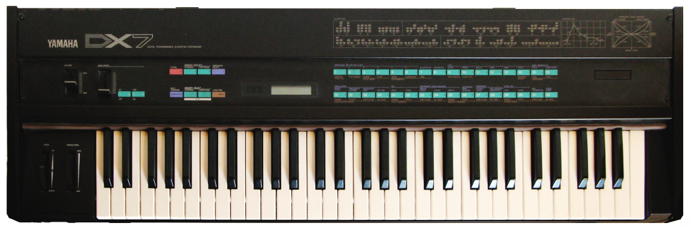

# Computer Music

## Why study computer music?

If you have ever been interested in understanding

### Music and computation are inextrictably linked

- Computation examples: streaming music on your phone, producing music in a DAW, generating music with AI
- Under the hood, computation can be used for everything from
- Mathematics example: ? earliest design of musical instruments by interval relationships, periodicity as a fundamental property of both musical pitch and rhythm
- If you are interested in better understanding these relationships, then computer music is for you!

### Technology is upstream of musical possibility

- Music and technology have always co-evolved
  - In the hands of musicians, technology can expand the creative and cultural boundaries of music
  - Pervasive theme throughout music history: new technology creates new creative opportunities for artists
  - Pianoforte allowed Beethoven to compose beautiful Sonatas
  - Multitrack recording enable The Beatles to create Revolver
  - Amplification and electricity allowed Jimi Hendrix
  - Digital sampling used by Kate Bush on Hounds of Love
- If you are interested in building new computing tools that may expand the possibilities in music, then computer music is for you!

### Inspiration: _FM Synthesis_

- Chowning CMJ'1976
- "Full stack" example demonstrating the impact of computing, from _acoustics_ to _theory_ to _programming_ to _design_ to _culture_
- _Music acoustics_: Musical sounds contain rich mixtures of many time-varying periodic components. Especially with limited compute, challenging to synthesize so many components! E.g., a percussive chime instrument <audio src="./assets/fs192645-chime.wav">Orchestral chime. Obtained from Freesound. chimes_f#3_p_1.wav by sgossner -- https://freesound.org/s/192645/ -- License: Attribution 4.0</audio>
- _Mathematical theory_: Working at SAIL, Chowning realizes that well-known method of frequency modulation produces infinitely complex spectra by combining two components in a particular way. $x(t) = \sin(2 \pi f_c t + I \cdot \sin(2 \pi f_m t))$. Parameters can be carefully controlled to imitate natural musical sounds <audio src="./assets/bell-fm.mp3">FM bell sound synthesized using Csound `fmbell`</audio>
- _Efficient programming_: Despite the efficiency gains of FM, we still need to design efficient implementations that can synthesizes this function tens of thousands of times per second! (Python example `def fm(f_c, f_m, I, f_s, T): ...` that calls out to `sine_lookup` function taking phase from 0 to 2pi, not shown)
- _Instrument design_: Yamaha licensed FM as the synthesis engin in the legendary [DX7 Synthesizer](https://en.wikipedia.org/wiki/Yamaha_DX7) 
- _Music culture_: The DX7 used by thousands of musicians and became the "sound of the 80s". Ironically, while FM was originally explored for imitating existing instruments, musicians tended to prefer its ability to create novel synthesizer sounds! Examples: [A-ha - Take On Me](https://www.youtube.com/watch?v=djV11Xbc914), [Whitney Houston - Didn't We Almost Have It All](https://www.youtube.com/watch?v=c0TghfreFok)

### Computing is the frontier of music technology

- Digital technology is now a key component of music on stage, in the studio, and in your ears!
- This trend of music and technology co-evolving will likely continue, even as we venture into new technologies such as AI. Like past technological developments (e.g., recording), newer technologies will impact the economic landscape of music, but also present new creative opportunities
- If you are interested in better understanding how computers are able to synthesize,

## Who is this book for?

- At its core, this book on computer music is written from a _computer science_ perspective
- It is highly technical and meant to support computer science courses on musical computing, similar to texts on computer graphics
- We _will_ assume substantial background experience in programming and mathematics
- We will _not_ assume much musical expertise, but musical training will be a helpful bonus for learning this material
- You don't need to be an expert in both music and computing to read this text, but there is an unfortunate asymmetry to be aware of:
  - Students with strong music / weak computing backgrounds may struggle and should study introductory CS first
  - Students with strong computing / weak music backgrounds should be fine

- In more detail:
  - _Programming_:
    This book assumes substantial familiarity with Python programming and basic computer science (e.g., data structures, Big O notation)
    If you're unfamiliar, you should learn the basics before proceeding.
  - _Math_:
    - You should be reasonably comfortable with trigonometry, basic calculus, and complex numbers.
    - You won't have to do much derivation here, but you'll need to understand these concepts at least at a high-level.
    - It's okay if your skills are rusty - should be possible to brush the dust off as you go through book.
  - _Music_: We aspire to make this course accessible even to those without any musical training! However, you will benefit from a basic foundation in understanding musical concepts like pitch and an ethusiastic or discerning ear for music.

## What will readers learn from this book?

- How to program a computer to efficiently store, synthesize, and process musical sound
- A foundation of digital signal processing and the frequency domain that may transfer to many other areas of computing
- The basics of how sound works in the physical world (acoustics) and how we perceive it (psychoacoustics)
- Exposure to more advanced topics, especially real-time interactive music applications and music AI

## Why was this book written?

- This book was written to support computer music courses taught from a computer science perspective
- Long term, my hope is that _computer music may be viewed as a first class citizen of computer science_, alongside similarly applied domains like computer graphics
- Written to fulfill a perceived gap in existing computer music literature:
  - Taught in a modern and accessible programming language (Python)
  - Technical material at the level of rigor expected by computer science texts, while keeping the focus empirical and not going _too_ deep into the theory
  - More grounded in technical correctness than artistic considerations
- This book was heavily inspired by [_Digital Signals Theory_ by Brian McFee](https://brianmcfee.net/dstbook-site/content/intro.html)
- This book stands on the shoulders of giants! Inspired by many wonderful texts from folks like Curtis Roads, Roger Dannenberg, Julius Orion Smith, and Brian McFee. This is intended to complement, not supersede
