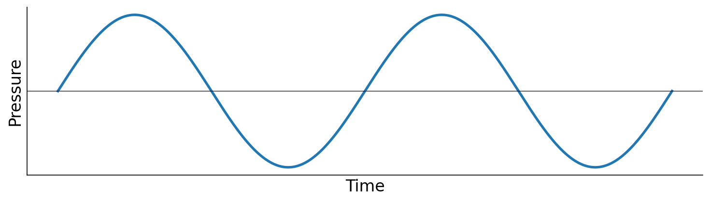
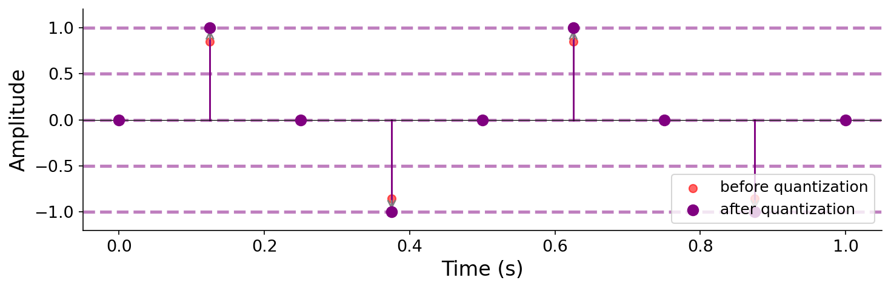
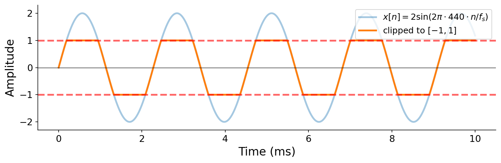

# Sound and Digital Audio

Here we first characterize what sound _is_ in the physical world, then build up the standard way that computers _represent_ sound as _digital audio_. By the end, you'll synthesize your first sound from scratch with a few lines of Python, and you'll have the vocabulary to talk precisely about waveforms, sampling, quantization, frequency, and amplitude.

## What is sound, physically?

Sound is what happens when something in the world moves and disturbs the air around it. Strike a guitar string, snap your fingers, or push air past a vibrating reed, and you set the surrounding air molecules into motion. These disturbances propagate outward as alternating regions of higher and lower pressure — compressions and rarefactions — that we call _sound waves_.

A microphone, or your eardrum, sits at one fixed point in this traveling pressure field. If we measure the local air pressure at that point as a function of time, we get a one-dimensional signal: pressure goes up, pressure goes down, pressure passes through ambient atmospheric pressure on its way between the two. We call this measurement _analog sound_.

## Waveforms: sound as a continuous function

Formally, we describe an analog sound by a function

$$x(t) : \mathbb{R} \to \mathbb{R},$$

mapping a real-valued time $t$ (seconds) to a real value $x(t)$. We refer to such a function as a _waveform_, or more generally as a (continuous-time) _signal_.



To represent natural sound, $x(t)$ characterizes the air pressure at a fixed point in space over time. Pressure can be measured in physical units like Pascals, but in computer music we usually work with a unitless, normalized representation. Once a sound is recorded through a microphone (or otherwise scaled to a known range), we refer to the measured quantity as _amplitude_, and we linearly rescale it so that the recording system's full dynamic range maps to the interval $[-1, 1]$:


**A key aspect of this rescaling is that amplitude is _proportional_ to pressure**. Concretely, $x(t) = p(t) / p_{\max}$, where $p(t)$ is the underlying pressure signal (e.g., in Pascals) and $p_{\max}$ is the maximum pressure magnitude the recording system can represent. Unless otherwise specified, you should henceforth imagine the vertical axis of a waveform plot as a unitless amplitude in $[-1, 1]$: $+1$ is the maximum positive deviation the system can represent, $-1$ is the maximum negative deviation, and $0$ is silence.

## From analog to digital

Computers cannot store an analog signal $x(t)$ directly. The function takes real-valued inputs and produces real-valued outputs, so even a one-second clip carries an infinite amount of information. To bring sound into the digital world, we have to approximate $x(t)$ with a finite amount of data.

Transforming this _continuous sound_ to _digital audio_ involves discretizing both time and amplitude, then encoding the result:

1. _Sampling_ in time: measure the signal amplitude at discrete, evenly spaced points known as _samples_.
2. _Quantizing_ in amplitude: latch each amplitude to its nearest neighbor in a finite set of amplitude values.
3. _Encoding_: assign each quantized value a discrete integer symbol that can be stored in computer memory.

### Sampling

To _sample_ a continuous signal means to measure or evaluate it at a sequence of discrete time points, uniformly spaced at some interval $T_s$. We call $T_s$ the _sampling period_; its units are $\left[\frac{\text{seconds}}{\text{sample}}\right]$. Its reciprocal $f_s$, in units of $\left[\frac{\text{samples}}{\text{second}}\right]$, is called the _sample rate_, and the units already show us that $f_s = 1 / T_s$. Sample rates of 44,100 Hz and 48,000 Hz are common values of $f_s$ in practice; that is, **digital audio usually involves tens of thousands of samples per second**.

We index samples by an integer $n$ and adopt the convention

$$x[n] = x(n / f_s),$$

so $x[0]$ is the signal at time $t = 0$, $x[1]$ is its value at time $t = 1 / f_s$, and so on. Continuous-time signals get parentheses ($x(t)$); discrete-time sample sequences get square brackets ($x[n]$). This distinction will matter throughout the book. **You should grow very accustomed to converting between units of $[\text{samples}]$ and time in $[\text{seconds}]$** by dividing or multiplying by $f_s$.


After sampling, an infinite continuous function has been replaced by a finite ordered sequence of real numbers. Specifically, for some duration $T$, $x$ is now an array of $T \cdot f_s$ numbers, i.e., $x \in \mathbb{R}^{T \cdot f_s}$. But the values $x[n]$ are still real-valued, and we still cannot store real numbers exactly.

### Quantization

To _quantize_ a sample is to round its amplitude to the nearest value in a chosen finite set $V \subseteq [-1, 1]$. The simplest choice is a uniformly spaced grid such as $V = \{-1.0, -0.5, 0.0, 0.5, 1.0\}$. Each sample $x[n]$ is replaced by

$$\hat{x}[n] = \arg\min_{v \in V} |x[n] - v|.$$



Quantization introduces a small error — the difference $\hat{x}[n] - x[n]$, called _quantization noise_ — but in exchange we get a sequence of values drawn from a finite alphabet, which a computer _can_ store.

## TODO: Bookmark for later.

### Encoding and bit depth

A finite set $V$ of size $|V|$ can be represented exactly by integer **symbols**, e.g., $\{0, 1, \ldots, |V| - 1\}$, or by signed integers in some symmetric range. Each symbol can be stored using a fixed number of bits:

$$b = \lceil \log_2 |V| \rceil.$$

This $b$ is called the **bit depth** of the digital audio. A small example: $|V| = 7$ requires $b = 3$ bits per sample. CD-quality audio uses $b = 16$ bits, allowing for $2^{16} = 65{,}536$ distinct amplitude levels.

Knowing the sample rate $f_s$ and the bit depth $b$ lets us compute the **bitrate** of uncompressed digital audio:

$$\text{bitrate} = f_s \cdot b \quad (\text{bits per second}).$$

A monaural CD-quality stream (44,100 Hz, 16-bit) is therefore $44{,}100 \times 16 = 705{,}600$ bits per second, or about 88 KB/s. Stereo doubles this.

### Digital audio is an array of numbers!

Put together, a digital audio signal is just an array of integers along with a sample rate. For example, at $b = 3$ bits per sample, the symbol sequence $[0, 2, 0, -2, 0, 2, 0, -2, 0]$ encodes the amplitude sequence $[0.0, 1.0, 0.0, -1.0, 0.0, 1.0, 0.0, -1.0, 0.0]$, which (interpreted at some sample rate) is a short fragment of a square-like wave.

Why integers instead of floats? Two reasons:

1. **Storage**. Integers can be packed at exactly $b$ bits per sample, with no waste.
2. **Hardware**. Digital-to-analog converters operate on integer codes directly, so integer sample arrays are the natural lingua franca between software, file formats, and audio hardware.

In practice, when you read or write a WAV file at 16-bit depth, the file stores signed integers in $[-32{,}768, 32{,}767]$. Audio libraries typically convert these to floating-point values in $[-1, 1]$ for you on the way in, and back to integers on the way out.

## Digital-to-analog conversion

To actually _hear_ digital audio, the discrete sample sequence has to be converted back into a continuous voltage that can drive a loudspeaker. This is the job of a **digital-to-analog converter** (**DAC**), a piece of hardware in every phone, laptop, and audio interface.

A DAC takes the integer samples, produces a piecewise-constant ("staircase") voltage signal, and then applies a **reconstruction filter** that smooths the staircase back into a continuous waveform. The whole pipeline looks like:

```
analog → [ ADC ] → samples → [ DAC ] → staircase → [ filter ] → analog
```

The big idea is that, under conditions we will formalize in a later chapter, this reconstruction can be perceptually identical to the original analog signal $x(t)$, provided $f_s$ is high enough and $b$ is large enough. For now, trust that the DAC is doing the right thing, and focus on producing nice integer arrays for it to play.

## Synthesis: making sound from math

So far, we've discussed _recording_ an existing analog signal and storing it as digital audio. Rather than measuring some real-world sound, we can alternatively _invent_ a continuous function $x(t)$ and have the computer evaluate it at sample times. This is called **synthesis**.

The recipe is simple:

1. Pick a sample rate $f_s$ and a duration $T$ in seconds.
2. Determine the total number of samples, $N = \lfloor T \cdot f_s \rfloor$.
3. For each index $i \in \{0, 1, \ldots, N-1\}$, compute $x[i] = x(i / f_s)$.
4. Hand the resulting array (plus $f_s$) to the audio system to play.

Here is the simplest interesting example: a 440 Hz sine wave (concert A) for one second at CD-quality sample rate.

```python
import math

f_s = 44100         # samples per second
duration = 1.0      # seconds
f = 440.0           # Hz
N = int(duration * f_s)

samples = [0.0] * N
for i in range(N):
    t = i / f_s
    samples[i] = math.sin(2.0 * math.pi * f * t)
```

<audio src="./assets/audio-sine-440.wav">A 440 Hz sine tone, one second long, at $f_s = 44{,}100$ Hz.</audio>

The full runnable script (including code to write a WAV file) is in [code/synthesis.py](./code/synthesis.py).

Although this is just a `for` loop over `math.sin`, you have already done something nontrivial: used the relationship $x[i] = x(i / f_s)$ to bridge between the continuous mathematical description of a sound (a function of time) and its discrete computer representation (an array of samples). Most synthesis algorithms in this book are variations on this theme.

## Clipping

One last practical concern. Every DAC has a finite output range. When you hand it samples whose absolute values exceed $1$, it will simply **clip** them:

$$y[n] = \max(-1, \min(x[n], 1)).$$



Clipping is extremely intrusive: it introduces a harsh, raspy character into the sound, and at high amplitudes can damage speakers as well as ears. For example, multiplying a 440 Hz sine by 2 saturates the DAC and produces a signal that's close to a square wave:

<audio src="./assets/audio-clipped-sine.wav">A 440 Hz sine multiplied by 2, then clipped to $[-1, 1]$, then attenuated. Same fundamental frequency as the clean sine above, but with the harsh timbre of hard clipping.</audio>

A simple defensive habit while developing synthesis code is to **normalize** your output to lie within $[-1, 1]$ before sending it to the DAC, e.g.,

$$y[n] = \frac{x[n]}{\max_{j \in \{0, \ldots, N-1\}} |x[j]|}.$$

> **A critical safety note.** When experimenting with synthesis code, **do not wear headphones** until you know the output is bounded. It is very easy to write a one-line bug that produces a much louder sound than you intended, and a sudden loud signal directly against your eardrums can cause real damage. Listen through external speakers at low volume while you debug, then _cautiously_ put headphones on once the output is well-behaved.

## Summary

- Physical sound is a traveling pattern of air-pressure variation. Analog sound is a continuous signal $x(t) : \mathbb{R} \to \mathbb{R}$ describing the time-varying pressure measured at a single point.
- Amplitude is, by convention, a unitless quantity in $[-1, 1]$.
- Converting analog to digital requires **sampling** (in time, at rate $f_s$), **quantizing** (in amplitude, to a finite set), and **encoding** (as integer symbols of bit depth $b$).
- The discrete representation $x[n] = x(n / f_s)$ is what computers actually manipulate; we use parentheses for continuous time and square brackets for sample indices.
- A DAC reconstructs an analog signal by smoothing the discrete samples. Under conditions we will study later, this reconstruction can be made arbitrarily close to the original.
- **Synthesis** turns this pipeline around: we _define_ a function $x(t)$ in code and evaluate it at sample times to produce digital audio.
- Be wary of values outside $[-1, 1]$, which will clip. Keep headphones off until your output is bounded.

## Questions for the reader

1. **Bit depth arithmetic.** You are designing a recording format that uses 24 bits per sample at a sample rate of 48,000 Hz. What is the uncompressed bitrate (bits per second) for a single channel? How many discrete amplitude levels can each sample distinguish?
1. **Sample count.** Write a one-line Python expression that computes the number of samples needed to store $T$ seconds of audio at sample rate $f_s$. Be explicit about how you handle a non-integer product of $T$ and $f_s$.
1. **Synthesis.** Modify the 440 Hz sine wave example to produce a 1-second tone at 220 Hz, then another at 880 Hz. Listen to all three. What relationship do you hear between consecutive pairs, and how does it correspond to the relationship between their frequencies?
1. **Clipping by hand.** Suppose $x[n] = 1.5 \cdot \sin(2 \pi \cdot 440 \cdot n / f_s)$ at $f_s = 44{,}100$ Hz. Sketch (or plot in code) what the clipped output looks like over one fundamental period. Why does this signal not sound like a clean sine?
1. **Quantization noise.** Quantize the sine $x(t) = \sin(2\pi \cdot 440 \cdot t)$ to a 2-bit representation (i.e., 4 amplitude levels) at $f_s = 44{,}100$ Hz, write it to a WAV file, and listen. Describe in words how it differs from the un-quantized version.
1. **Open.** Pick a recording you enjoy and listen for anything you can _hear_ that points to specific decisions about sample rate, bit depth, channels, or other digital-audio parameters. There is no wrong answer; the goal is to start associating engineering choices with sonic outcomes.
