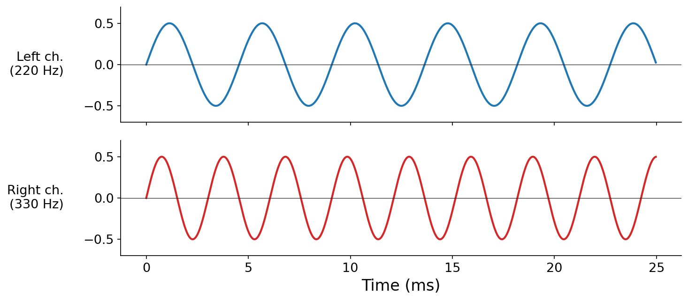

# Synthesis and Vectorized Computation

In chapter 1 we built the conceptual foundation of digital audio: how the continuous signal $x(t)$ gets sampled, quantized, and stored as an array of numbers. This chapter is about _doing things_ with those arrays. We'll write our first real synthesis code, learn _vectorized computation_ in NumPy (the workhorse of computer music in Python), and introduce _pyquist_, the lightweight library we'll use throughout the rest of the book.

## Review: digital audio is an array of numbers

To briefly recap chapter 1: a piece of digital audio is just an array of numbers $x[n]$, together with a sample rate $f_s$. The continuous signal $x(t)$ and its discrete representation are related by

$$x[n] = x(n / f_s),$$

so $x[0]$ is the value at $t = 0$, $x[1]$ is the value at $t = 1 / f_s$ seconds, and so on. While digital audio is stored on disk as $b$-bit signed integers, **in memory we almost always work with $x[n]$ as floating-point numbers in $[-1, 1]$**, because mixing, filtering, and synthesis are all easier (and more accurate) in float arithmetic. Quantization typically only matters at the I/O boundary.

This chapter focuses on the workflow of building such arrays in Python and packaging them into something we can listen to.

## Synthesis: making sound from math

So far, we've discussed _recording_ an existing analog signal and storing it as digital audio. Rather than measuring some real-world sound, we can alternatively _invent_ a continuous function $x(t)$ and have the computer evaluate it at sample times. This is called _synthesis_, and it is one of the most thrilling capabilities the computer brings to music.

Acoustic instruments are bound by the physics of vibrating strings, air columns, and membranes; the sounds they can produce occupy a tiny corner of the space of all possible waveforms. A computer has no such limitations: **any $x(t)$ you can describe in code is fair game**, whether inspired by physics or invented from scratch. Much of the rest of this book is about how to navigate this enormously larger space of sonic possibilities.

The recipe is simple:

1. Pick a sample rate $f_s$ and a duration $T$ in seconds.
2. Determine the total number of samples, $N = \lfloor T \cdot f_s \rfloor$.
3. For each index $n \in \{0, 1, \ldots, N-1\}$, compute $x[n] = x(n / f_s)$.
4. Hand the resulting array (plus $f_s$) to the audio system to play.

Here is the simplest interesting example: a 440 Hz sine wave (concert A) for one second at CD-quality sample rate, written as a plain Python loop.

```python
import math

f_s = 44100         # samples per second
duration = 1.0      # seconds
f = 440.0           # Hz
N = int(duration * f_s)

samples = [0.0] * N
for n in range(N):
    t = n / f_s
    samples[n] = math.sin(2.0 * math.pi * f * t)
```

<audio src="./assets/audio-sine-440.wav">A 440 Hz sine tone, one second long, at $f_s = 44{,}100$ Hz (attenuated to -6 dBFS for safe playback).</audio>

The full runnable script (including code to write a WAV file) is in [code/synthesis.py](./code/synthesis.py).

Although this is just a `for` loop over `math.sin`, you have already done something nontrivial: used the relationship $x[n] = x(n / f_s)$ to bridge between the continuous mathematical description of a sound (a function of time) and its discrete computer representation (an array of samples). Most synthesis algorithms in this book are variations on this theme.

## Vectorized computation and NumPy

The loop above works, but it has two problems. First, it is _slow_: Python's interpreter dispatches every `math.sin` call individually, and at 44,100 calls per second of audio that adds up quickly. Second, it is verbose: four lines of bookkeeping to do something that, conceptually, is just "compute the sine of these timestamps."

Both problems are solved by _vectorized computation_: instead of writing a `for` loop that operates on one number at a time, we describe an operation on an entire _array_ at once. Under the hood, that single operation dispatches into precompiled, often SIMD-accelerated machine code, leaving Python's interpreter out of the inner loop.

In Python, the standard vectorization library is _NumPy_. The same 440 Hz sine in NumPy:

```python
import numpy as np

f_s = 44100
duration = 1.0
f = 440.0
N = int(duration * f_s)

n = np.arange(N)                          # array of sample indices: 0, 1, ..., N-1
t = n / f_s                               # corresponding times, in seconds
samples = np.sin(2 * np.pi * f * t)       # one sine value per timestamp, all at once
```

Notice what happened:

- `n / f_s`: instead of dividing one integer by `f_s` per loop iteration, we divide the whole array by `f_s` in a single expression.
- `np.sin(...)`: instead of calling `math.sin` 44,100 times, we apply `sin` to the whole array.

The result is identical, but the code is shorter, the intent is clearer, and a modern CPU can churn through it many times faster. **Vectorized array operations are the working dialect of computer music in Python**, and the rest of this chapter is about getting fluent in them.

## NumPy primer

The rest of this chapter assumes a small NumPy vocabulary. Here is the minimum.

### Creating arrays

A NumPy array (a `numpy.ndarray`) can be built from a Python list:

```python
import numpy as np

x = np.array([0.0, 0.5, 1.0, 0.5, 0.0, -0.5, -1.0, -0.5])
print(x.shape, x.dtype)   # (8,) float64
```

For audio buffers, we usually allocate by length instead. The two most common patterns are:

```python
zeros = np.zeros(N)                    # a length-N silent buffer
noise = np.random.randn(N) * 0.01      # tiny-amplitude white noise
```

`np.zeros(N)` is exactly silence: every element is `0.0`. `np.random.randn(N) * 0.01` draws each sample independently from a standard normal distribution and scales it down by a factor of 100; the result is _white noise_ at a low amplitude.

> ⚠️ **Headphone warning.** Random and synthesized signals are the most dangerous thing you can play through headphones while learning. A one-character typo (`0.01` → `1.0`, or just forgetting the `* 0.01` entirely) can turn a quiet hiss into a deafening full-scale roar. **Never do computer music programming using headphones. You could seriously damage your ears.** Use external speakers at low volume during development, and only put headphones on after you have verified that the output stays well inside $[-1, 1]$.

<audio src="./assets/audio-noise.wav">Two seconds of low-amplitude white noise generated by `np.random.randn(N) * 0.01`.</audio>

### Slicing arrays

NumPy supports all the slicing patterns you would expect from Python lists, plus a few more:

```python
x = np.arange(10)            # [0, 1, 2, ..., 9]
x[0]                         # 0
x[-1]                        # 9, the last element
x[2:5]                       # [2, 3, 4]
x[::2]                       # [0, 2, 4, 6, 8] - every other element
x[::-1]                      # [9, 8, 7, ..., 0] - reversed
```

For audio, slicing is how you grab a chunk of a recording. If `samples` is one second of audio at $f_s = 44{,}100$, then `samples[:22050]` is the first half-second and `samples[22050:]` is the second.

### Element-wise operations

Arithmetic on arrays is _element-wise_: every operation is applied independently to corresponding elements, with no Python-level loop in sight.

```python
x = np.array([1.0, 2.0, 3.0])
y = np.array([10.0, 20.0, 30.0])

x + y                # [11, 22, 33]
x * y                # [10, 40, 90]
x ** 2               # [1, 4, 9]
np.sqrt(x)           # [1.0, 1.414, 1.732]
```

A NumPy operation between an array and a scalar broadcasts the scalar across every element:

```python
x + 1                # [2, 3, 4]
0.5 * x              # [0.5, 1.0, 1.5]
```

This is exactly what happened when we wrote `2 * np.pi * f * t` above: the scalar `2 * np.pi * f` is multiplied into the entire `t` array in a single expression.

### Multi-channel audio: 2D arrays

Music is usually delivered in _stereo_: two arrays of samples (often called _channels_), one for each ear, which allows for basic spatial effects. We represent a stereo signal as a 2D NumPy array.

There are two reasonable orderings: time-major `(num_samples, num_channels)` and channel-major `(num_channels, num_samples)`. Pyquist (and the wider Python audio ecosystem, including `soundfile`) use **time-major**: the array has shape `(num_samples, num_channels)`. We will adopt that convention throughout this book.

A small example: one second of stereo audio with a 220 Hz tone in the left channel and a 330 Hz tone in the right.

```python
f_s = 44100
N = f_s
n = np.arange(N)
t = n / f_s

left  = 0.5 * np.sin(2 * np.pi * 220 * t)   # shape (N,)
right = 0.5 * np.sin(2 * np.pi * 330 * t)   # shape (N,)

stereo = np.stack([left, right], axis=1)    # shape (N, 2)
print(stereo.shape)                         # (44100, 2)
```

`np.stack(..., axis=1)` glues two length-$N$ arrays side by side along a new axis at position 1, producing the time-major `(N, 2)` layout.



<audio src="./assets/audio-stereo-220-330.wav">One second of stereo audio: 220 Hz in the left channel, 330 Hz in the right channel. (Best heard with stereo speakers or, cautiously, with headphones.)</audio>

Slicing a 2D array uses commas to address each axis:

```python
stereo[:, 0]             # the left channel only (1D, shape (N,))
stereo[:, 1]             # the right channel only
stereo[:1000, :]         # the first 1000 samples of both channels (2D, shape (1000, 2))
```

### Broadcasting

The `np.stack` trick above works, but a more elegant pattern scales up to more channels. NumPy's _broadcasting_ rules let us combine arrays of different shapes, provided the shapes are compatible. The canonical use case in synthesis: combine an array of timestamps with an array of frequencies to get a 2D matrix of "sine evaluated at every (time, frequency) pair."

```python
n = np.arange(N)
t = n / f_s                              # shape (N,)
freqs = np.array([220.0, 330.0])         # shape (2,)

# t[:, np.newaxis] has shape (N, 1)
# freqs           has shape (2,)
# Their product broadcasts to shape (N, 2)
stereo = 0.5 * np.sin(2 * np.pi * freqs * t[:, np.newaxis])
```

`np.newaxis` adds an axis of length 1, reshaping `t` from `(N,)` to `(N, 1)`. NumPy then aligns the two shapes from the right (`(N, 1)` vs. `(2,)`), and where one shape has a `1`, it stretches that array along that axis. The result has shape `(N, 2)`, identical to the `np.stack` version above.

This pattern, _scalar function of (time, parameter)_, shows up constantly in synthesis: time on one axis, frequencies / amplitudes / pitches on the other.

To go from stereo back to mono, average across the channel axis:

```python
mono = stereo.mean(axis=1)        # shape (N,)
```

<audio src="./assets/audio-mono-220-330-mix.wav">The same stereo example, downmixed to mono by averaging the two channels. Both pitches are present in a single channel.</audio>

## Pyquist: a thin layer over NumPy

For the rest of this book we will use a small library called _pyquist_. It is _not_ a high-level computer music framework; there are no built-in instruments, effects, or sequencers. Pyquist is a thin wrapper around NumPy that gives us:

- A single `Audio` class that bundles a sample array with its sample rate.
- Convenient audio I/O: load and save WAV files, play through your speakers, plot waveforms and spectra.
- Some helpers (decibel ↔ amplitude, MIDI pitch ↔ frequency) we'll meet later.

Everything pyquist does, you could do yourself with NumPy plus `soundfile` plus `sounddevice`. The point is that we don't have to keep reinventing those boilerplate pieces.

### The `Audio` object

The core of pyquist is the `Audio` class. An `Audio` bundles a `float32` array of samples (shape `(num_samples, num_channels)`) with a sample rate.

```python
import numpy as np
import pyquist as pq

f_s = 44100
N = f_s
n = np.arange(N)
samples = 0.5 * np.sin(2 * np.pi * 440 * n / f_s)    # shape (N,)

audio = pq.Audio(samples, sample_rate=f_s)
print(audio)
# Audio(num_samples=44100, num_channels=1, sample_rate=44100)
```

A 1D input array is automatically reshaped to mono `(N, 1)`. The two key attributes are:

- `audio.samples`: the underlying NumPy array, shape `(num_samples, num_channels)`.
- `audio.sample_rate`: the sample rate in Hz.

Plus a few useful derived properties (`audio.num_samples`, `audio.num_channels`, `audio.duration`, `audio.peak_amplitude`). The library is small enough that the [`audio.py` source](../../pyquist/pyquist/audio.py) is worth skimming.

### Three takes on the same sine

The same one-second 440 Hz sine, in three styles:

```python
# 1. Plain Python loop (slow, verbose)
import math
samples_loop = [0.0] * N
for n in range(N):
    samples_loop[n] = 0.5 * math.sin(2 * math.pi * 440 * n / f_s)

# 2. Vectorized NumPy (fast, concise)
import numpy as np
n_arr = np.arange(N)
samples_np = 0.5 * np.sin(2 * np.pi * 440 * n_arr / f_s)

# 3. Pyquist Audio object (samples + sample rate together)
import pyquist as pq
audio = pq.Audio(samples_np, sample_rate=f_s)
audio.write("sine-440.wav")
```

All three describe the same signal, but each is a step up the abstraction ladder. The pyquist version is the one we'll use most: it carries the sample rate along with the samples, knows how to write itself to disk, and can be passed to `pq.play(audio)` or `pq.plot(audio)`.

### Mixing audio

Adding two `Audio` objects element-wise produces a new `Audio` containing their sum:

```python
sine_c = pq.Audio(0.3 * np.sin(2 * np.pi * 261.63 * n_arr / f_s), sample_rate=f_s)
sine_e = pq.Audio(0.3 * np.sin(2 * np.pi * 329.63 * n_arr / f_s), sample_rate=f_s)
sine_g = pq.Audio(0.3 * np.sin(2 * np.pi * 392.00 * n_arr / f_s), sample_rate=f_s)

chord = sine_c + sine_e + sine_g
chord.write("c-major-chord.wav")
```

<audio src="./assets/audio-chord-major.wav">A C major triad (C4, E4, G4) made by summing three sine waves.</audio>

Pyquist validates shapes and sample rates for you: adding two `Audio` objects with different sample rates raises a clear error, instead of silently producing a glitchy result.

Scalar multiplication scales the amplitude, and addition or subtraction with plain NumPy arrays also works:

```python
quieter = 0.5 * chord            # half-amplitude (≈ −6 dBFS)
inverted = -chord                # phase-inverted copy
```

### Slicing vs `segment`

You can index into an `Audio` exactly like a NumPy array. The result is a plain `ndarray`, _not_ an `Audio`:

```python
audio[:1000]            # ndarray, shape (1000, 1)
audio[1000:2000, 0]     # ndarray, shape (1000,) - just the first channel
```

When you want the result to remain an `Audio` (carrying its sample rate along), use `segment`, whose arguments are in seconds:

```python
first_half = chord.segment(duration=0.5)              # first 0.5 s
middle     = chord.segment(offset=0.25, duration=0.5) # the middle 0.5 s
```

<audio src="./assets/audio-chord-segment.wav">The middle 0.5 s of the C major chord above, extracted via `chord.segment(offset=0.25, duration=0.5)`.</audio>

The rule of thumb: use array indexing when you are doing math, use `segment` when you are carving up audio by time.

## Summary

- Digital audio in memory is a NumPy array of floats in $[-1, 1]$, paired with a sample rate $f_s$.
- _Synthesis_ is the inverse of recording: dream up a continuous function $x(t)$ and evaluate it at sample times $t = n / f_s$.
- _Vectorized computation_ replaces explicit Python loops with whole-array operations. It is faster (precompiled inner loops) and more readable (one expression instead of many).
- _NumPy_ is the standard vectorization library. The core operations: array creation (`np.array`, `np.zeros`, `np.random.randn`), slicing, element-wise arithmetic, multi-dimensional arrays, and broadcasting.
- Stereo audio is a 2D array of shape `(num_samples, num_channels)`. To downmix to mono, take `array.mean(axis=1)`.
- _Pyquist_ is a small wrapper around NumPy that bundles samples + sample rate into a single `Audio` object, plus I/O / playback / plotting helpers.
- Adding two `Audio` objects mixes them. Slicing with `[a:b]` returns an `ndarray`; carving by time with `.segment(...)` returns a new `Audio`.

## Questions for the reader

1. **Loop vs vectorized.** Synthesize 5 seconds of a 440 Hz sine in two ways: once with a plain Python `for` loop calling `math.sin`, once vectorized with NumPy. Time them both with `time.perf_counter()` and report the speedup.
1. **Stereo broadcasting.** Using broadcasting with `np.newaxis`, synthesize a 1-second stereo signal where the left channel is a 220 Hz sine and the right is a 330 Hz sine. Then downmix to mono by averaging the channels. Listen to both stereo and mono; describe in one sentence what changes.
1. **Mixing.** Build a C major seventh chord (C4, E4, G4, B4) by summing four sine `Audio` objects. Then build the same chord by stacking the four sample arrays into shape `(N, 4)` and taking `.mean(axis=1)`. Listen to both versions and explain why they differ in loudness.
1. **Headphone safety.** Write a small synthesis program that produces _intentionally_ unsafe output (say, a sine multiplied by 10), and **without running it through headphones**, inspect the array values (e.g. `audio.peak_amplitude`) to confirm they exceed full scale. What does `audio.write("path.wav")` do with samples outside $[-1, 1]$? (Read the docstring for `Audio.write`, or try it and inspect the output.)
1. **`segment` vs slicing.** Take any longer audio file (load with `pq.Audio.from_file(...)`) and use both `audio[44100:88200]` and `audio.segment(offset=1.0, duration=1.0)` to grab a 1-second chunk starting one second in. What type does each return? Which one carries the sample rate along, and why does that matter when you save the result?

## Musical examples

- Karlheinz Stockhausen - _Studie II_ (1954; an early electronic composition built entirely from pure sine waves on tape, a literal precursor to the synthesis algorithms we'll write in code)
- Daphne Oram - _Four Aspects_ (1960; foundational electronic-music sketches from one of the pioneers of British synthesis)
- Wendy Carlos - _Switched-On Bach_ (1968; synthesized arrangements that showcased what the then-new Moog could do across an entire classical repertoire)
- Suzanne Ciani - _Buchla Concerts 1975_ (live computer-music performance demonstrating layered modular synthesis)
- Aphex Twin - _Selected Ambient Works Volume II_ (1994; dense, multi-voiced synthesis often built up by mixing many simple oscillators)
